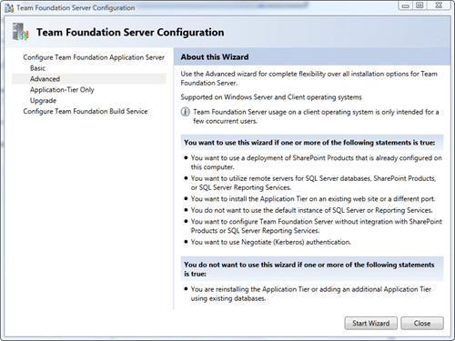
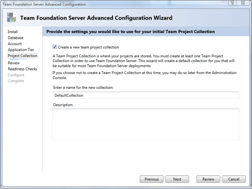
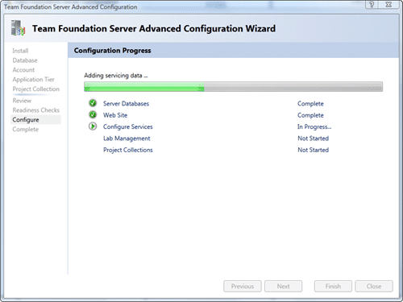
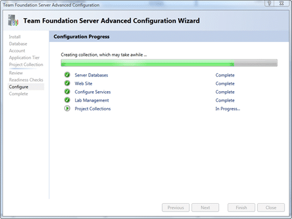
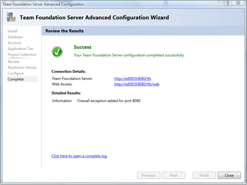

As Microsoft have separated Install with configuration, so I have separated my posts! You will need TFS2010 [installed](http://blog.hinshelwood.com/archive/2009/10/20/configuring-visual-studio-2010-team-foundation-server-on-vista-in.aspx) prior to the steps below.


{ .post-img }

This is my configuration experience...This wizard is excellent. If you had ever tried to install TFS in the past and it taken you a long time (took me 7 days the first time in 2005) Then you need to give this a go...


{ .post-img }

You can pick basic and it is...well...basic. It will install everything to the defaults.


{ .post-img }

I'm picking Advanced because I want to be able to select a pre-existing SQL Express instance...


{ .post-img }


{ .post-img }

You can enter a label if you want to have more than one TFS Configuration database in the same SQL instance.


{ .post-img }

If you are wanting to run on a network, maybe with an externally accessible URL, then you may need to pay attention to the security, but I don't really care for this install... 
{ .post-img }

If you want to ever be able to connect Visual Studio 2005 clients to the server you MUST remove the virtual directory as Team Explorer 2005 will not be able to anything but the default collection.


{ .post-img }

Ok, I have a default collection, but only because I am lazy...

 All done, now to apply it.
{ .post-img }


{ .post-img }

No, wait, we need to check all of the system requirements!


{ .post-img }

Now, usually this is the time to break out a cup of team, and maybe have a siesta. Lets see how long it takes...


{ .post-img }

..30 seconds...


{ .post-img }

...50 seconds...


{ .post-img }

.. 1 minute...


{ .post-img }

..Whoa, that was less than 2 minutes for the whole process.

 Just to prove that this whole process took less than 12 minutes, here is the beginning and end of the log file:
{ .post-img }

```
[Info   @12:06:41.111] ====================================================================
[Info   @12:06:41.183] Team Foundation Server 2010 Administration Log
[Info   @12:06:41.186] Version  : 10.0.21006.1
[Info   @12:06:41.203] DateTime : 10/20/2009 13:06:41
[Info   @12:06:41.203] Type     : Configuration
[Info   @12:06:41.206] Activity : Deploy
[Info   @12:06:41.208] Area     : ApplicationTier
[Info   @12:06:41.216] User     : DOMAINmartihins
[Info   @12:06:41.216] Machine  : ED0919
[Info   @12:06:41.229] System   : Microsoft Windows NT 6.0.6002 Service Pack 2 (AMD64)
[Info   @12:06:41.229] ====================================================================

... shortened ...

[Info   @12:18:28.147] Ending the Install operation on the ApplicationTier tier.
```

Whoa, that was fast! Compared to previous versions I was done before I started, like crossing an international date line. Another one is... no documentation... nope, I didn't look at it once! I would not recommend this approach, at least have a look to make sure you are installing the correct version on the correct URL's and to learn what the terms are.

P.S. Visual Studio 2005 and Visual Studio 2008 any version without the Team Foundation Server 2010 compatibility pack WILL NOT CONNECT! The [Visual Studio Team System 2008 Service Pack 1 Forward Compatibility Update for Team Foundation Server 2010](http://www.microsoft.com/downloads/details.aspx?displaylang=en&FamilyID=cf13ea45-d17b-4edc-8e6c-6c5b208ec54d) is [available](http://www.microsoft.com/downloads/details.aspx?displaylang=en&FamilyID=cf13ea45-d17b-4edc-8e6c-6c5b208ec54d), but 2005 will not be available until RTM.

[Visual Studio Team System 2008 Service Pack 1 Forward Compatibility Update for Team Foundation Server 2010](http://www.microsoft.com/downloads/details.aspx?displaylang=en&FamilyID=cf13ea45-d17b-4edc-8e6c-6c5b208ec54d)

I should note that you should not complain about the limited support for 2005. Microsoft expects the install base to be less than 5% by the time Visual Studio 2010 is released, and they were not going to support it at all. That there is any support at all is due to the lobbying of the Team System MVP community and TAP customers and excelent communication with the product teams...

Technorati Tags: [ALM](http://technorati.com/tags/ALM) [TFS Admin](http://technorati.com/tags/TFS+Admin) [CodeProject](http://technorati.com/tags/CodeProject) [VS 2010](http://technorati.com/tags/VS+2010) [VS 2008](http://technorati.com/tags/VS+2008) [TFS 2010](http://technorati.com/tags/TFS+2010) [TFS](http://technorati.com/tags/TFS) [VS 2005](http://technorati.com/tags/VS+2005)
