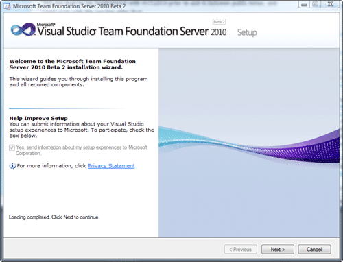
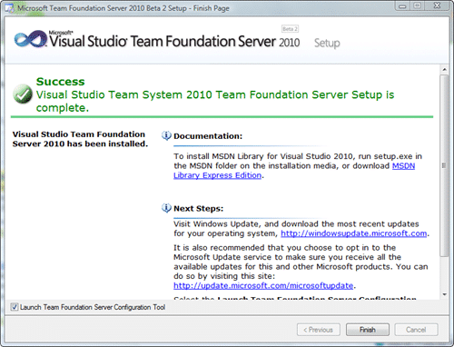

New in Visual Studio 2010 is the ability to install TFS on XP, Vista and Windows 7. You can use SQL 2008 Express, so no large overhead, and the Basic version you use for this does have the reporting and SharePoint requirement that the main install does. That does not mean that you can't upgrade later :)

{ .post-img }

Once you have TFS2010 installed you will need to [configure](http://blog.hinshelwood.com/archive/2009/10/20/configuring-visual-studio-2010-team-foundation-server-on-vista-in.aspx) it...

New logo, new install. Microsoft have changed the, lets face it, horrible install, and split it into two separate pieces. Install and Configuration.

First The Install: The only options are wither you install server and build... nice...

{ .post-img }

{ .post-img }

{ .post-img }

{ .post-img }

{ .post-img }

Total install time: 3 minutes (which includes the time to take these screenshots and save them)

Now that I have TFS2010 installed I will need to [configure](http://blog.hinshelwood.com/archive/2009/10/20/configuring-visual-studio-2010-team-foundation-server-on-vista-in.aspx) it...

Technorati Tags: [CodeProject](http://technorati.com/tags/CodeProject) [ALM](http://technorati.com/tags/ALM) [Visual Studio](http://technorati.com/tags/Visual+Studio) [TFS Admin](http://technorati.com/tags/TFS+Admin) [VS 2010](http://technorati.com/tags/VS+2010) [TFS 2010](http://technorati.com/tags/TFS+2010)
