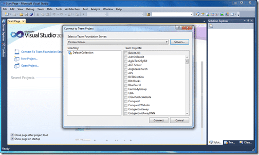

Well, nothing like hitting the ground running, my first job at SSW was to join the TFS Migration Team, it was a fun experience, let me tell you how it went.

Update #1 20th January 2010: Have a look at our [Rules to better TFS2010 Migration](http://sharepoint.ssw.com.au/Standards/TFS/RulesToBetterTFS2010Migration/Pages/default.aspx)

---

Adam put a few guys together:

- [Adam Cogan](http://sharepoint.ssw.com.au/AboutUs/Employees/Pages/Adam.aspx) (Australia) – The team lead who checks everything and makes us follow the [rules to better TFS](https://www.ssw.com.au/ssw/Standards/Rules/RulesToBetterProjectManagementWithTFS.aspx).
- [Eric Phan](http://sharepoint.ssw.com.au/AboutUs/Employees/Pages/Eric.aspx) (Australia) – Created an excellent "Rules to a successful migration from TFS 2008 to TFS 2010 guide”
- [Justin King](http://sharepoint.ssw.com.au/AboutUs/Employees/Pages/Justin.aspx) (Australia) – Justin seems to play the part of devil’s advocate. I looked him up in the company directory and he is a previous employee…I guess you never really leave SSW.
- Me (Scotland) – The implementer
- [Allan Zhou](http://sharepoint.ssw.com.au/AboutUs/Employees/Pages/Allan.aspx) (Beijing) – My co-conspirator for the implementation

We started at 2:30am (GMT+1) on Saturday morning and we did it in 5 major steps:

1. Backed up TFS 2008 databases (Some 14GB of data)
2. Restored databases to new 64 bit server
3. Installed TFS 2010 Beta 2 64 bit
4. Run the Upgrade of 2008 data to 2010 Beta 2
5. Tested the deployment

We completed the migration at 9:15am (GMT+1) on Saturday morning so all in the migration took just less than 7 hours.

[  
{ .post-img }
](http://blog.hinshelwood.com/files/2011/05/GWB-WindowsLiveWriter-SSWGoLivewithVisualStudio2010Beta2_15047-image_2.png)**Figure: Web Access – Working**

[  
{ .post-img }
](http://blog.hinshelwood.com/files/2011/05/GWB-WindowsLiveWriter-SSWGoLivewithVisualStudio2010Beta2_15047-VS2010_2.png)**Figure: Visual Studio - Working**

Well done to the SSW team.

Well done also to the guys involved in the TFS team, the same migration from TFS 2005 to TFS 2008 was a much more painful experience taking days of work, but the guys from SSW made this process easy and straight forward…Preparation does that for a project…

A possible claim to fame: In addition we might have been the first company (SSW is a company of 52 employees and contractors) to migrate. So far I have not seen any blog posts about other companies migrating everything over to Beta 2. I am a TFS MVP and no-one on that list has posted about a migration yet (I can just imagine Justin King having another fit when he finds that out).

