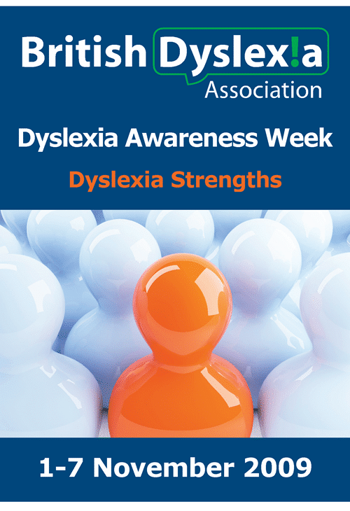

Its "Dyslexia Awareness Week" here in the UK, and as a person that benefits from being a [Dyslexic developer](http://blog.hinshelwood.com/Tags/dyslexia/default.aspx), I thought I should highlight the specific strengths to programmers of being dyslexic...

All of the benefits are due to a neurological difference that presents as a larger right-hemisphere in the brain and many more neural connections are formed than is normally found. While this can make it difficult for others to follow the actual thought process the benefits outweigh the cost of this and the random symbol orientation problems that most dyslexic people suffer from:

- 3-D visualization ability
- creative problem solving skills
- intuitive people skills
- visually interpreting information in 3d while applying a 4th dimension, reasoning. (e.g. value, logic, action, purpose, possibility, personality, emotion, sentiment and action, etc.)

If only our education systems would take advantage of these differences...

{ .post-img }

Technorati Tags: [Dyslexia](http://technorati.com/tags/Dyslexia) [Personal](http://technorati.com/tags/Personal)
