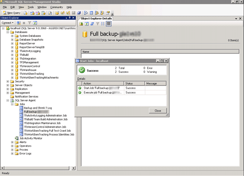
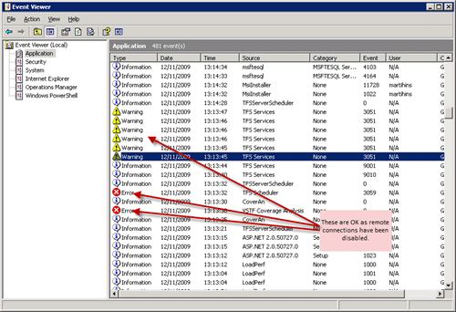

I have been trying since SP1 was released to get it installed at Aggreko, but due to our global, three time zones, development team and release schedules it has been very difficult to get some time set aside for it.

Now that I am leaving, last day is Tuesday 17th November, there was more of an apatite to take the hit on time and get it installed.

While I may be late to the game for SP1, I was conscious that a lot of gotchas around the installation had been reported when it was released.

You can find a full list on [Brian Harry](http://blogs.msdn.com/bharry)'s blog on his [Problems installing TFS SP1 post](http://blogs.msdn.com/bharry/comments/1627061.aspx), but I have to say that I have never had an install, except maybe 2010, go more smoothly. Its always the same when you take lots of precautions for Murphy's Law to rear its head, nothing goes wrong ;).

We have a single virtual server instance of TFS with the only architectural customisation is the link between TFS and our corporate MOSS environment.

### Release Plan

1. Turn off remote access to TFS websites  
    
   { .post-img }
2. Verify access to TFS is not possible remotely  
    
   { .post-img }
3. Run full SQL backup  
    
   { .post-img }
4. Take a snapshot (VM Ware) of the TFS server \[Infrastructure Team\]
5. Install VS2008 SP1 if client installed  
    
   { .post-img }
6. Install TFS2008 Service Pack 1  
    If any problems are encountered refer to Brian Harry’s post on resolving SP1 install issues: [http://blogs.msdn.com/bharry/comments/1627061.aspx](http://blogs.msdn.com/bharry/comments/1627061.aspx)
   { .post-img }
7. Follow test plan
8. If tests fail, follow back out plan
9. Done

### Test Plan

1. Check event log for errors  
    
   { .post-img }
2. Check all services are running  
    
   { .post-img }
3. Test web access  
    
   { .post-img }
4. Test Visual Studio Access  
    
   { .post-img }

### Back out Plan

1\. Restore last snapshot

2\. Start TFS website in IIS

3\. Test TFS Services by connecting through Visual Studio 2005 / 2008

4\. Test Web Access ([http://tfs01.northwind.com](http://tfs01.northwind.com))

### Conclusion

Although there seemed to be a lot of noise around the time that SP1 was released, the great god Murphy left me alone in this instance. It just goes to show, simpler is better...

Technorati Tags: [ALM](http://technorati.com/tags/ALM) [TFS Admin](http://technorati.com/tags/TFS+Admin) [MOSS](http://technorati.com/tags/MOSS) [VS 2008](http://technorati.com/tags/VS+2008) [TFS 2008](http://technorati.com/tags/TFS+2008) [TFS](http://technorati.com/tags/TFS) [SharePoint](http://technorati.com/tags/SharePoint) [VS 2005](http://technorati.com/tags/VS+2005)
