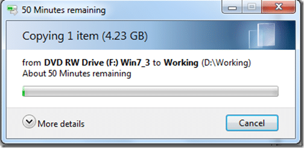
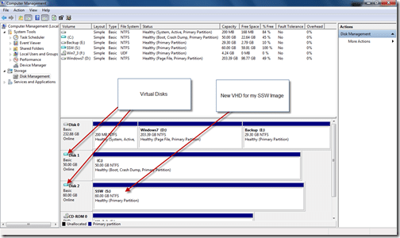
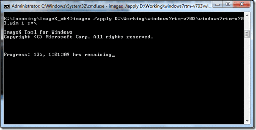
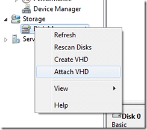
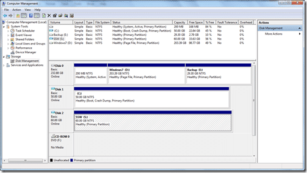

This being my first week at [SSW](http://ssw.com.au "SSW - Sydney's Leading Custom Software Consultants - .NET, SQL Server, Web, Windows and SharePoint and Database Development"), and still waiting for my nice shiny new laptop to arrive, I am sitting here at my Wife’s laptop (which is PINK, a requirement to keep the [WAF](http://en.wikipedia.org/wiki/Woman_acceptance_factor) high), until it arrives.

   
{ .post-img }
Figure: Current workspace…one wall short of working in a cupboard, but it beats trying to work with the kids underfoot.

  
{ .post-img }
Figure: I know its nearly Christmas, but that's a long time between order and delivery!

SSW have sent me a .wim (Windows Image) file in the post and I really want to get a look at it before my new computer arrives.

In order to be able to create a clean install very quickly we need to convert this to a Windows 7 VHD. This way when the new computer arrives we can just move it over :) I also want to be able to reinstall my computer quickly. And what is quicker then mounting a new VHD and rebooting.

In order to achieve this there are a number of things that need done:

1.  **Copy all of the .rar files from the DVD’s**   
    { .post-img }
      
    { .post-img }
    Figure: First disk nearly finished
    
    { .post-img }
    Figure: Third disk is taking a while

2.  **Use WinRar to fit the 3 packages back together**  
       
    { .post-img }
    Figure: Joining the wim file together is going to take a while as well. I don’t want to have to do this more than once!

3.  **Create a new VHD  
     **  
    { .post-img }
    Figure: Showing the physical and Virtual disks on my wife's pink laptop.

4.  **Deploy Image to new VDH**  
    { .post-img }
    In order to do this you will need [imageX](<http://technet.microsoft.com/en-us/library/cc722145(WS.10).aspx>) from the [Windows 7 Automated Installation Kit](http://www.microsoft.com/downloads/details.aspx?familyid=696DD665-9F76-4177-A811-39C26D3B3B34&displaylang=en). Check [http://blogs.technet.com/aviraj/archive/2009/01/18/windows-7-boot-from-vhd-first-impression-part-2.aspx](http://blogs.technet.com/aviraj/archive/2009/01/18/windows-7-boot-from-vhd-first-impression-part-2.aspx "http://blogs.technet.com/aviraj/archive/2009/01/18/windows-7-boot-from-vhd-first-impression-part-2.aspx") for more details and scenarios that will suit you.  
     note: You may look at the [Windows(R) Image to Virtual Hard Disk (WIM2VHD) Converter](http://code.msdn.microsoft.com/wim2vhd) as another solution, but it requires that the Windows 7 Automated Installation Kit be installed locally, where I just downloaded imageX separately and bypassed the 1gb download.  
       
    { .post-img }
    Figure: As usual, this is showing the remaining in “Microsoft Minutes”
    
    { .post-img }
    Figure: So 10% took just over a Minute? What is the rest of the hour for?
    
    { .post-img }
    Figure: All done, I don’t know how long it took because I got on with some other things, but it was a while!

5.  Detach the VHD  
        
    { .post-img }
    Figure: Detaching the VHD will allow us to copy it.

6.  Copy the new VHD  
    { .post-img }
      
    { .post-img }
    Figure: This will allow me to save ssw.vhd for a rainy day, and use the copy as a working install.

7.  Rename the copy to “SSW_001.vhd”
8.  Attach SSW_001.vhd  
       
    { .post-img }
    Figure: Attaching a VHD is very easy
    
    { .post-img }
    Figure:

9.  Add  the new SSW*001.vhd to the boot list using the folowing commands:  
     \*\*\_C:>bcdedit /copy {current} /d "SSW_001"  
     C:>bcdedit /set <guid> device vhd=\[driveletter:\]<directory><vhd filename>  
     C:>bcdedit /set <guid> osdevice vhd=\[driverletter:\]<directory><vhd filename>  
     C:>bcdedit /set <guid> detecthal on  
     *\*\*\*\*Note:\*\*  detecthal is used to force windows to auto detect the Hardware Abstraction Layer.  
       
    { .post-img }
    Figure: Added and configured the new Image…lets try it out…

Although this took a long time with 3 long running processes, it will be a lot faster next time as I can start from step #9…

Technorati Tags: [SSW](http://technorati.com/tags/SSW) [Windows](http://technorati.com/tags/Windows)
