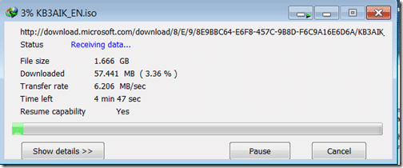
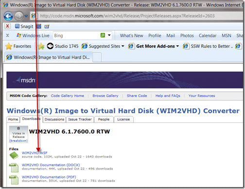
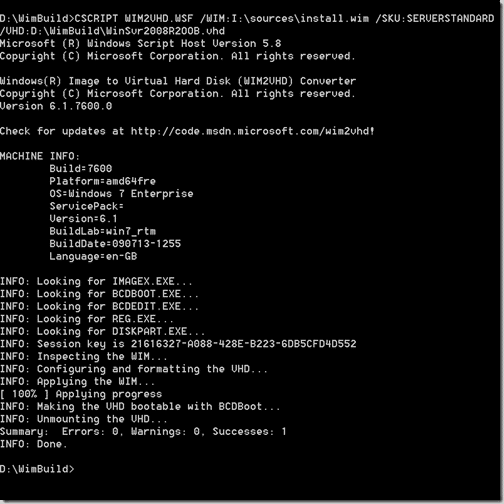

Previously I created this [the manual way](http://blog.hinshelwood.com/archive/2009/12/07/create-a-vhd-from-the-windows-7-image-disk.aspx), but if you have a fast internet connection and can take the 1.6gb download of the AIK, then this is a much easier way of getting started.

This is not really the same as the SSW image that I created before, the SSW image was a lovely slipstreamed beauty with all the application I would ever need already preinstalled.. It was 32GB and took a very long time to setup. This will be sum what faster as it  only require a base Windows Server 2008 Setup…

1. Download [Windows® Automated Installation Kit (AIK)](http://www.microsoft.com/downloads/details.aspx?displaylang=en&FamilyID=696dd665-9f76-4177-a811-39c26d3b3b34)  
      
   { .post-img }
   Figure: Downloading AIK, done in under 5 minutes  
       
   { .post-img }
   Figure: Unpack using WinRAR, don’t burn it as it is a waste of a DVD. Some applications don’t like being run from a Virtual DVD.
2. Install  the AIK onto your local computer.  
      
   { .post-img }
   Figure: Weird setup, but what the heck…
3. Download and Install [Windows(R) Image to Virtual Hard Disk (WIM2VHD) Converter](http://code.msdn.microsoft.com/wim2vhd/)  
      
   { .post-img }
   Figure: Its just a script file that you download. I would prefer if it was a command line app with an optional UI, but you can’t have everything.
4. Mount your Windows 2008 R2 image to a Virtual DVD drive. I am using Virtual Clone Drive.  
      
   { .post-img }
   Figure: Mounted Windows 2008 R2 ready to go…  
      
   { .post-img }
   Figure: Use your favourite Virtual DVD mounting software..
5. Run the script to create your VHD using a command line running as an administrator  
   { .post-img }
   CSCRIPT WIM2VHD.WSF /WIM:I:sourcesinstall.wim /SKU:SERVERSTANDARDCORE /VHD:D:WimBuildWinSvr2008R2OOB.vhd  
     
   { .post-img }

You now have a lovely Out Of Box Windows 2008 R2 VHD. I would keep a copy of this in a nice safe place so you don’t need that coffee break every time.

Whoa there… not so fast..

Did you spot my mistake?

Could it be to do with the little “SERVERSTANDARDCORE” tag?

Could it be the “CORE” bit?

I think so.. I was just wondering why my resultant VHD was only 2.5gb in size!

Doh!

Lets try that properly:

NaN. Run the script to create your VHD using a command line running as an administrator  
{ .post-img }
CSCRIPT WIM2VHD.WSF /WIM:I:sourcesinstall.wim /SKU:SERVERSTANDARD /VHD:D:WimBuildWinSvr2008R2OOB.vhd  
 
{ .post-img }

Make a copy of this file, and attach it to your boot list, and boot…

Technorati Tags: [Windows](http://technorati.com/tags/Windows) [SSW](http://technorati.com/tags/SSW)

