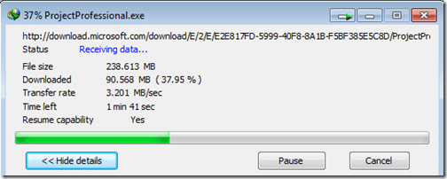
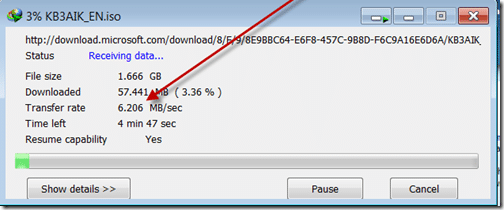

I have been a cable customer in the UK since day one when it was Cable & Wireless.

If you don’t know who they are I am not surprised:

Cable & Wireless –> NTL –> VirginMedia

I received my first cable modem in 1998 (ish) which was 512 kbs.. much better than ye ole Dial-up, but while ADSL has lagged behind, cable have rocketed up to 50mbs this year.

With my new job at [SSW](http://bit.ly/5oZrwI "SSW - Sydney's Leading Custom Software Consultants - .NET, SQL Server, Web, Windows and SharePoint and Database Development"), I needed a faster internet connection. Ever since I moved house 5 years ago it has been a little slow, so I opted for Virgins 50mbit.

Now I thought it would be fast, but OMG:

{ .post-img }

I just downloaded Project 2010 in under 3 minutes… Did you notice the important figure in the image above?

Transfer Rate: 3.201 MB/sec

That's not megabit! that's Megabyte"!

Here is the speed in your flavour of choice:  
\=**25.608** Mbps \[Megabit-per-second\]  
\=**25608** Kbps \[Kilobit-per-second\]  
\=**3.201** MB/sec \[Megabyte-per-second\]  
\=**3201** KB/sec \[Kilobyte-per-second\]

[http://www.mediaroad.com/products/speedcheck/free_tools/unit_convert/](http://bit.ly/5QF2HG "http://www.mediaroad.com/products/speedcheck/free_tools/unit_convert/")

And that's not the fastest it was ripping Project from the Microsoft site, it was just the speed when my PrtScr kicked in… it was up around the 4.xx mark!

**We have come a long way since 56k in such a short time, and I am loving it….**

**(Update 06/12/2009)**

**Before upgrade (was on 20mbs):**

{ .post-img }

**After Upgrade (now on 50mbs):**

 
{ .post-img }

(Update 07/12/2009)

it just gets better and better:

{ .post-img }

Technorati Tags: [Personal](http://technorati.com/tags/Personal) [SSW](http://technorati.com/tags/SSW)
