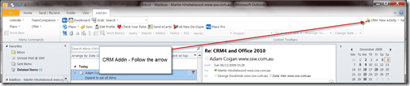
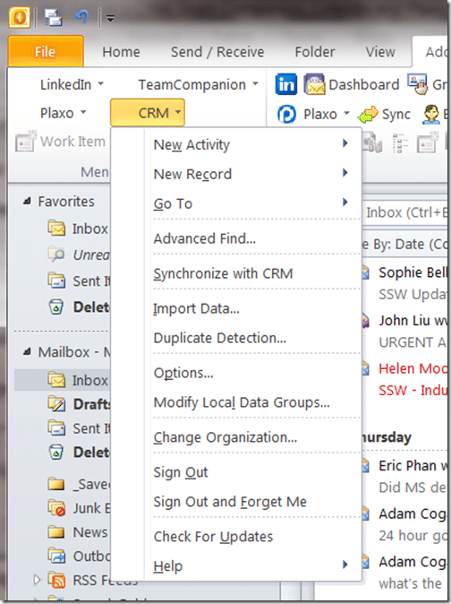
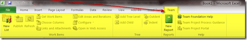

At SSW we are extensive users of Dynamics CRM. I wanted to give Office 2010 a go, but I had to make sure that the Dynamics CRM plug-in, and my other plug-ins worked.

You would think that support for Office 2010 Beta 2 was poor! You would be right and wrong…

I use a number of plug-ins for outlook:

- LinkedIn
- Plaxo
- Team Companion
- Dynamics CRM

All of them work…to an extent…

   
{ .post-img }
Figure: Screenshot of outlook with add-ins

Outlook 2010 put all of the Add-ins into a single tab called “**Add-Ins**” and they just get stacked up, which is bad!

  
{ .post-img }
Figure: Close up of the LinkedIn, Plaxo and Team Companion Add-ins

Can you see the problem? No? Well, the ribbon bar is only so tall, so that makes for 3 and only 3 add-ins. Where is the Dynamics CRM add-in? Can you see it in the first image? No! Let me help you.

   
{ .post-img }
Figure: Where is Wally Dynamics CRM4 Add-in?

This looks useless, and it would be if the same options were not also available as a pull down menu.

  
{ .post-img }
Figure: Dynamics CRM4 pull down menu in Office 2010 have all the bits you need, even if you can’t get to the buttons.

The story is a little better when you open an email. The options for Dynamics CRM are prominent, as are the Team Companion and LinkedIn options.

  
{ .post-img }
Figure: Shows the Team Companion, LinkedIn and CRM options on an email; this is a much better format.

So, what else do you need to know? No 64-bit support yet, so you need to use Outlook 32-bit, and if you need to use Outlook 32-bit then you MUST use Office 32-bit:

1. CRM4 will not Install if Office 2010 is installed  
   Workaround: [http://bovoweb.blogspot.com/2009/10/ms-outlook-2010-and-dynamics-crm.html](http://bit.ly/7SGhlP)
2. If you upgrade Outlook 2007 to Outlook 2010 CRM will work  
   [http://dario.blog.viadis.hr/2009/07/outlook-2010-dynamics-crm-40-client.html](http://bit.ly/4NDqFe)
3. You MUST use the 32bit version of Outlook 2010  
   [http://halo76.wordpress.com/2009/11/24/office-2010-and-crm-4-0-for-outlook-32-bit-only/](http://bit.ly/531VZ7)
4. If you are using Outlook 2010 32bit, the rest of the Office 2010 bits that you install must be of the same bitness  
   [http://blogs.msdn.com/officedevdocs/archive/2009/11/25/developing-outlook-2010-solutions-for-32-bit-and-64-bit-systems.aspx](http://bit.ly/8iJn7N)

This post also answers the question of wither you can move to Office 64-bit now? The answer is yes, unless you have any add-ins that you depend on and that do not work in Outlook 64-bit. If you do, you are in a bit of a pickle… Wait for support, or better yet, pester the Product team that makes your add-in to get it to support 64-bit office.

## To Dynamics CRM Team, Plaxo Team, LinkedIn Team, TeamCompanion Team

Please can you:

1. fix add-in to work with Outlook 64-bit (Team Companion guys are already on the case showing the rest of you up)
2. fix add-in to have a ribbon tab like the Visual Studio ALM Add-in in Excel.  
     
   { .post-img }

Technorati Tags: [Office](http://technorati.com/tags/Office) [ALM](http://technorati.com/tags/ALM) [CRM](http://technorati.com/tags/CRM) [SSW](http://technorati.com/tags/SSW)
