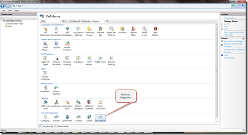

On the project I am currently working on we want to change the nasty [http://northwind.com/products.aspx?ProductId=1](http://northwind.com/products.aspx?ProductId=1) to a nice friendly URL on the website. This is pretty easy and can result in nice URL’s like [http://northwind.com/products/BigGreenTeddyBaresFromParis.aspx](http://northwind.com/products/BigGreenTeddyBaresFromParis.aspx).

See Also – [Solution - SEO permanent redirects for old URL’s?](http://blog.hinshelwood.com/archive/2010/01/04/do-you-know-how-to-maintain-your-google-ranking-while.aspx)

Updated #1 January 5th, 2010: \- As suggested by [Adam Cogan](http://sharepoint.ssw.com.au/AboutUs/Employees/Pages/Adam.aspx), I changed the title and added a link to the Solution post.

---

This has already been implemented by the CMS system that we are using, so what is the problem?

The problem is that Google thinks the URL to “Big Green Teddy Bares from Paris” is [http://northwind.com/products.aspx?ProductId=1](http://northwind.com/products.aspx?ProductId=1) and we need to tell them that it is now [http://northwind.com/products/BigGreenTeddyBaresFromParis.aspx](http://northwind.com/products/BigGreenTeddyBaresFromParis.aspx). The URLs’ are changing for Search Engine Optimisation (SEO) reasons, but we do not want to loose any of the raking accumulated over time on the old URL’s.

We want to use **Rewriting** and not **Routing** because with [rewriting the change is handled before it is passed](http://stackoverflow.com/questions/90112/iis-url-rewriting-vs-url-routing) to ASP.NET.

Rewriting in this case is like _**reverse**_ URL Rewriting and during this process I need to lookup the database to find the new KEY (“BigGreenTeddyBaresFromParis”) and map the URL with the “ProductId” to the new “ProductKey”. If we also return a permanent redirect (301) then Google will learn the new location of the page and keep any ranking data associated with it intact. This is key as we do not want to start from scratch.

There are two official IIS7 rewrite engines that were recommended to me:

- URL Rewrite
- SEO Toolkit

## URL Rewrite

You an install URL Rewrite from the “Web Platform Installer”, and it has very good integration and is easy to configure within IIS. This makes things a lot easier, but does it support 301 redirects?

   
{ .post-img }
Figure: Adds an option right into the IIS interface

  
{ .post-img }
Figure: You can easily add new rules through the integrated UI

   
{ .post-img }
Figure: UI supports 301 redirects, but it does not seam to have any way to load from a database.

Without a way to load from the database there is no way it will solve the problem, and a quick Google shows that it does not support it. The closest it can get is using a key value pair mapping file, but with 30,000 entries I do not think that will perform well.

If you look at [Developing Rule Template for URL Rewrite Module](http://learn.iis.net/page.aspx/519/developing-rule-template-for-url-rewrite-module/ "Developing Rule Template for URL Rewrite Module") you will see that you can only work within the set of options that are provided by the core functionality and can’t create a new feature, like loading the mappings from the database.

## SEO Toolkit

Having looked at the [bumph for the SEO Toolkit](http://www.iis.net/expand/SEOToolkit "SEO Toolkit"), it does not look like it provides any of the functionality required.

## Conclusion

The conclusion is that neither the SEO Toolkit, nor the URL Rewrite Module are of any use in this case. There are now two options, I can roll my own rewriting framework or use another one that already exists that supports extensibility. One such URL rewriting framework that spring to mind is [UrlRewritingNet.UrlRewrite](http://www.urlrewriting.net "UrlRewritingNet.UrlRewrite") which I have used before, but it has not been updated since April 2009. I have emailed the guys to ask them is they are still using/ working on it.

Even though it has not been updated since April 2009, I think this is the best option. The source code is provided on the site, and I am familiar with the component. It supports a rule provider model that will allow me to achieve the goal I am aiming for and is very easy to setup.

Technorati Tags: [.NET](http://technorati.com/tags/.NET) [SSW](http://technorati.com/tags/SSW) [Software Development](http://technorati.com/tags/Software+Development) [SP 2010](http://technorati.com/tags/SP+2010) [SharePoint](http://technorati.com/tags/SharePoint)
