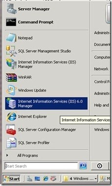
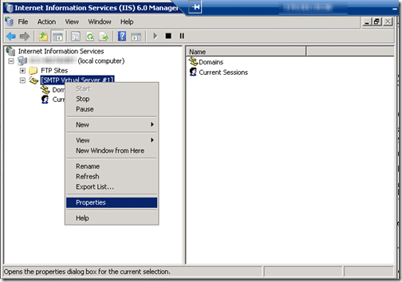
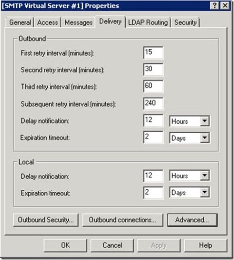
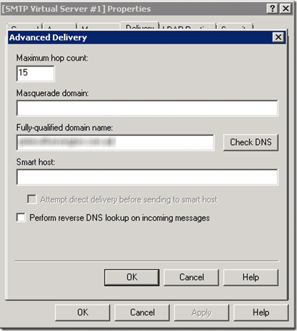

We had a small problem today with a new site we were going live with. It was refusing to send emails in 90% of cases. Problems like these are always difficult to identify, but your first step is always to enable logging.

```
#Software: Microsoft Internet Information Services 7.0
#Version: 1.0
#Date: 2010-01-09 18:49:30
#Fields: c-ip cs-username s-sitename s-computername s-ip s-port cs-method cs-uri-query sc-win32-status cs-bytes cs-version cs(User-Agent) cs(Referer)
127.0.0.1 MYHOST-MYSERVER SMTPSVC1 MYHOST-MYSERVER 127.0.0.1 0 EHLO +ServerName 0 18 SMTP - -
127.0.0.1 MYHOST-MYSERVER SMTPSVC1 MYHOST-MYSERVER 127.0.0.1 0 MAIL +FROM:enquiries@company.com 0 47 SMTP - -
127.0.0.1 MYHOST-MYSERVER SMTPSVC1 MYHOST-MYSERVER 127.0.0.1 0 RCPT +TO:&lt;martin@hinshelwood.com&gt; 0 32 SMTP - -
127.0.0.1 MYHOST-MYSERVER SMTPSVC1 MYHOST-MYSERVER 127.0.0.1 0 DATA &lt;MYHOST-MYSERVERVoMDrx0000015e@MYHOST-MYSERVER&gt; 0 2560 SMTP - -
216.146.33.4 OutboundConnectionResponse SMTPSVC1 MYHOST-MYSERVER - 25 - 220+mx1.mailhop.org+ESMTP+MailHop+by+DynDNS.com 0 0 SMTP - -
216.146.33.4 OutboundConnectionCommand SMTPSVC1 MYHOST-MYSERVER - 25 EHLO MYHOST-MYSERVER 0 0 SMTP - -
216.146.33.4 OutboundConnectionResponse SMTPSVC1 MYHOST-MYSERVER - 25 - 250-mx1.mailhop.org 0 0 SMTP - -
216.146.33.4 OutboundConnectionCommand SMTPSVC1 MYHOST-MYSERVER - 25 MAIL FROM:&lt;enquiries@company.com&gt;+SIZE=2884 0 0 SMTP - -
216.146.33.4 OutboundConnectionResponse SMTPSVC1 MYHOST-MYSERVER - 25 - 250+2.1.0+Ok 0 0 SMTP - -
216.146.33.4 OutboundConnectionCommand SMTPSVC1 MYHOST-MYSERVER - 25 RCPT TO:&lt;martin@hinshelwood.com&gt; 0 0 SMTP - -
216.146.33.4 OutboundConnectionResponse SMTPSVC1 MYHOST-MYSERVER - 25 - 504+5.5.2+&lt;MYHOST-MYSERVER&gt;:+Helo+command+rejected:+need+fully-qualified+hostname 0 0 SMTP - -
216.146.33.4 OutboundConnectionCommand SMTPSVC1 MYHOST-MYSERVER - 25 RSET - 0 0 SMTP - -
216.146.33.3 OutboundConnectionResponse SMTPSVC1 MYHOST-MYSERVER - 25 - 220+mx1.mailhop.org+ESMTP+MailHop+by+DynDNS.com 0 0 SMTP - -
216.146.33.3 OutboundConnectionCommand SMTPSVC1 MYHOST-MYSERVER - 25 EHLO MYHOST-MYSERVER 0 0 SMTP - -
216.146.33.3 OutboundConnectionResponse SMTPSVC1 MYHOST-MYSERVER - 25 - 250-mx1.mailhop.org 0 0 SMTP - -
216.146.33.3 OutboundConnectionCommand SMTPSVC1 MYHOST-MYSERVER - 25 MAIL FROM:&lt;enquiries@company.com&gt;+SIZE=2884 0 0 SMTP - -
216.146.33.3 OutboundConnectionResponse SMTPSVC1 MYHOST-MYSERVER - 25 - 250+2.1.0+Ok 0 0 SMTP - -
216.146.33.3 OutboundConnectionCommand SMTPSVC1 MYHOST-MYSERVER - 25 RSET - 0 0 SMTP - -
216.146.33.3 OutboundConnectionResponse SMTPSVC1 MYHOST-MYSERVER - 25 - 250+2.0.0+Ok 0 0 SMTP - -
216.146.33.3 OutboundConnectionCommand SMTPSVC1 MYHOST-MYSERVER - 25 QUIT - 0 0 SMTP - -
216.146.33.3 OutboundConnectionResponse SMTPSVC1 MYHOST-MYSERVER - 25 - 221+2.0.0+Bye 0 0 SMTP - -
```

Figure: The log shows the source of the problem.


“5.5.2 rejected: need fully qualified hostname” tends to be destination server specific and relates to the server name that the mail is sent **from** which is different from the email from name. Most mail servers will reject mail from a name that they cannot lookup in DNS as an anti-spam measure.

To fix:

1. I opened “**Internet Information Services (IIS) 6.0 Manager**” on the server.  
    
   { .post-img }
2. Expanded and then right click on “**\[SMTP Virtual Server #1\]**” and select “**Properties**”  
     
   { .post-img }
3. Select the “**Delivery**” Tab and then “**Advanced**”  
    
   { .post-img }
4. Enter “**_company.com_**” in the “**fully-qualified domain name**” field.  
     
   { .post-img }
5. Click “ok” and then “ok” to save the changes

You should now be able to send emails from your site without any problems.

Technorati Tags: [.NET](http://technorati.com/tags/.NET) [Windows](http://technorati.com/tags/Windows)
