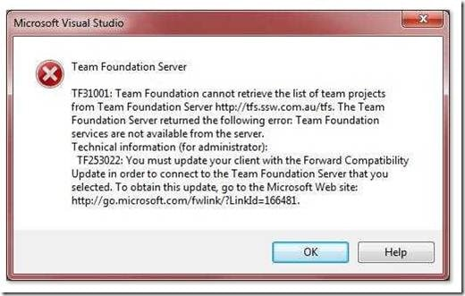
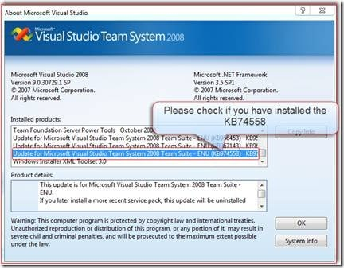

Visual Studio Team Foundation Server 2010 RC was released yesterday on MSDN. I am happy to report that today we successfully completed upgrading our production TFS 2010 Beta 2 server, to the new TFS 2010 RC. wow.

Updated: 11th February 2010– Added link to Brian Harry’s post  
Updated: 12th February 2010 – Adam Cogan was not clear that there were two problems with snapshoting running servers.

---

The upgrade was smooth, let me tell you the steps:

note: If you are upgrading from TFS 2008 you can follow our [Rules to better TFS 2010 Migration](http://sharepoint.ssw.com.au/Standards/TFS/RulesToBetterTFS2010Migration/Pages/default.aspx)

1. **Snapshot the hyper-v server**   
   There are two reasons why you should never do this while the server is running:
   1. It’s Slow - Make sure you turn off your server before you take a snapshot. It took 15 minutes to get to 2% while the server was running, but turning it off had the whole operation completed in under 30 seconds. I think of this as very like the feature of Linux that let you recompile the kernel on the fly to avoid rebooting when adding drivers: Nice to have, but only if you have 10 hours to spare.
   2. It’s Dangerous - Brian Harry has an even better reason why you should [never snapshot a running server](http://blogs.msdn.com/bharry/archive/2010/02/10/a-tfs-2010-upgrade-success-story.aspx).
2. **Uninstall Visual Studio Team Explorer 2010 Beta 2**   
   You will need to uninstall all of the Visual Studio 2010 Beta 2 client bits that you have on the server. That's a no brainer, but you can remove them early to streamline your installation process
3. **Uninstall TFS 2010 Beta 2**
4. **Install TFS 2010 RC**
5. **Configure TFS 2010 RC**  
   Pick the Upgrade option and point it at your existing “tfs_Configuration” database to load all of the existing settings
6. **Test the server**

All of our 52 developers are now up and running on TFS 2010 RC. Well…almost all. A couple of guys reported this problem even though they had previously connected to TFS 2010 Beta 2:

1.  If you get this error on the VS 2008 client after the upgrade, you should check whether you have KB74558 installed, if not you can [download it manually](http://www.microsoft.com/downloads/details.aspx?displaylang=en&FamilyID=cf13ea45-d17b-4edc-8e6c-6c5b208ec54d) or [run diagnostics](http://www.ssw.com.au/ssw/Diagnostics/Default.aspx) to ensure your entire system is up to date.  
       
    { .post-img }
    Figure: Error TF31001 or TF253022, but why is that link not clickable.
    
    { .post-img }
    Figure:  Check that you have the update so you can connect to TFS 2010 via “Help | About Microsoft Visual Studio”

I will be ironing out any other kinks tomorrow…

Next steps includes upgrading our build servers and moving all 52 developers over to Visual Studio 2010.

We were the [first company on Beta 2 in production](http://blog.hinshelwood.com/archive/2009/10/25/deploying-visual-studio-2010-team-foundation-server-beta-2.aspx) and I believe we are first on RC in production.

---

## Need Help?

{ .post-img }

[SSW](http://www.ssw.com.au) was the first company in the world outside of Microsoft to deploy Visual Studio 2010 Team Foundation Server to production, not [once](http://blog.hinshelwood.com/archive/2009/10/25/deploying-visual-studio-2010-team-foundation-server-beta-2.aspx), but [twice](http://blog.hinshelwood.com/archive/2010/02/10/upgrading-from-tfs-2010-beta-2-to-tfs-2010-rc.aspx).

### Team Foundation Server

 SSW provides expert Visual Studio ALM guidance including [installation, configuration and customisation](http://www.ssw.com.au/ssw/Company/SourceControl.aspx) through our four Microsoft Visual Studio ALM MVP’s in three countries; Australia, Beijing and the UK. They have experience deploying to small development shops all the way through to large blue chips.
{ .post-img }

### Professional Scrum Developer Training

 SSW has six [Professional Scrum Developer Trainers](http://www.ssw.com.au/ssw/Events/Scrum-Training-Course.aspx) who specialise in training your developers in implementing Scrum with Microsoft's Visual Studio ALM tools.
{ .post-img }

Technorati Tags: [ALM](http://technorati.com/tags/ALM) [TFS Admin](http://technorati.com/tags/TFS+Admin) [SSW](http://technorati.com/tags/SSW) [Scrum](http://technorati.com/tags/Scrum) [VS 2010](http://technorati.com/tags/VS+2010) [VS 2008](http://technorati.com/tags/VS+2008) [TFS 2010](http://technorati.com/tags/TFS+2010) [TFS 2008](http://technorati.com/tags/TFS+2008) [SP 2010](http://technorati.com/tags/SP+2010) [TFS](http://technorati.com/tags/TFS) [SharePoint](http://technorati.com/tags/SharePoint)
