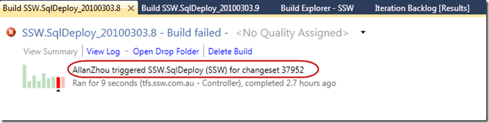
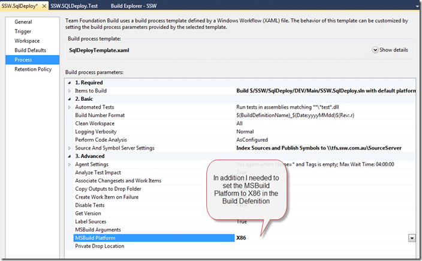

This is SSW’s first time using Team Build 2010 to automatically create a Silverlight application. In the past the guys have used Cruse Control, but we want to move to a pure TFS 2010 solution. When one of our developers ([Allan](http://sharepoint.ssw.com.au/AboutUs/Employees/Pages/Allan.aspx)) added a Silverlight 3 project to the Solution our build server spat it out.

  
{ .post-img }
**Figure: Build SSW.SqlDeploy_20100303.8 failed when trying to build a Silverlight application.**

Usually the person who broke the build should now be the one responsible for babysitting it until the next person breaks the build. In this case we had not agreed that as part of our project prep so I think I will need to wait until the retrospective at the end of our current, and first for this project, sprint.

### Problem 1: First time for Silverlight compile on the Build Server.

Because Allan added the first Silverlight 3 application to the Solution the build server hiccupped as only the Silverlight 2 SDK was installed on it and it was a Silverlight 3 project. I have highlighted below where the problem was located.

  
{ .post-img }
**Figure: The Silverlight targets file was not found on the build server.**

I downloaded and installed the [Silverlight 3 SDK](http://www.microsoft.com/downloads/details.aspx?FamilyID=1ea49236-0de7-41b1-81c8-a126ff39975bWn8hmhweA) from Microsoft, and hoped all would be well.

But the build failed again…

  
{ .post-img }
**Figure: SSW.SqlDeploy_20100303.10 failed still trying to find targets.**

### Problem 2: This was due to the web targets not being installed.

At this point I got fed up and copied the contents of my local directory “C:Program Files (x86)MSBuildMicrosoftVisualStudiov10.0” to the same folder on the build server.

  
{ .post-img }
Figure: MSBuild could not find the web targets.

But the build failed again…

  
{ .post-img }
**Figure: SSW.SqlDeploy_20100303.11 failed again trying to build Silverlight.**

### Problem 3: Can’t build Silverlight 3 projects with MSBuild 64-bit (the default)

There is a nasty [bug in the Silverlight SDK](http://weblogs.asp.net/andresv/archive/2009/11/05/build-silverlight-2-0-or-3-0-projects-with-an-x64-tfs-2010-build-agent.aspx) that means that you can’t build using the MSBuild 64-bit process. But on a 64-bit OS, the 64-bit MSBuild is used by default… so how to change it.

  
{ .post-img }
**Figure: Why is it saying that the SDK is not installed… oh, a bug.**

This is an easy fix, but a hard to find solution. if you Open up your “build process definition” and expand the Advanced tree you will see that there is a MSBuild Platform option that is set to “Auto”, change this to “X86”.

  
{ .post-img }
**Figure: You MUST set the MSBuild Platform to X86 to build a Silverlight project,**

And the build failed again…

  
{ .post-img }
**Figure: SSW.SqlDeploy_20100304.04 failed again trying to do code analysis.**  
Note: This was only run 20 or so minutes after the last build, but my build server happens to be in Australia :)

### Problem 4: Can’t run Code Analysis on Build Server

Now I get Code Analysis errors…

  
{ .post-img }
Figure: Why would I be getting code analysis errors? Could it be that it is not installed?

To fix this one I just bit the bullet and installed Visual Studio 2010 onto the Build server, and…

  
{ .post-img }
Figure: Successful builds give me a warm fuzzy feeling…

### Conclusion

The things that should be installed on the build server are:

- Team Foundation Build Services 2010 or 2008 or 2005
- Visual Studio 2010/2008/2005
- Add-on’s for TFS or Visual Studio that may be required to execute the build.

The options you should set for any Build that has 32-bit dependencies that are causing a problem:

- You MUST set the MSBuild Platform to X86 to build a project that can’t be built in 64-bit MSBuild.

---

## Need Help?

{ .post-img }

[SSW](http://www.ssw.com.au) was the first company in the world outside of Microsoft to deploy Visual Studio 2010 Team Foundation Server to production, not [once](http://blog.hinshelwood.com/archive/2009/10/25/deploying-visual-studio-2010-team-foundation-server-beta-2.aspx), but [twice](http://blog.hinshelwood.com/archive/2010/02/10/upgrading-from-tfs-2010-beta-2-to-tfs-2010-rc.aspx).

### Team Foundation Server

 SSW provides expert Visual Studio ALM guidance including [installation, configuration and customisation](http://www.ssw.com.au/ssw/Company/SourceControl.aspx) through our four Microsoft Visual Studio ALM MVP’s in three countries; Australia, Beijing and the UK. They have experience deploying to small development shops all the way through to large blue chips.
{ .post-img }

### Professional Scrum Developer Training

 SSW has six [Professional Scrum Developer Trainers](http://www.ssw.com.au/ssw/Events/Scrum-Training-Course.aspx) who specialise in training your developers in implementing Scrum with Microsoft's Visual Studio ALM tools.
{ .post-img }

Technorati Tags: [TFBS](http://technorati.com/tags/TFBS) [ALM](http://technorati.com/tags/ALM) [Silverlight](http://technorati.com/tags/Silverlight) [.NET](http://technorati.com/tags/.NET) [CodeProject](http://technorati.com/tags/CodeProject) [TFS 2010](http://technorati.com/tags/TFS+2010) [SSW](http://technorati.com/tags/SSW) [Scrum](http://technorati.com/tags/Scrum) [VS 2010](http://technorati.com/tags/VS+2010) [SP 2010](http://technorati.com/tags/SP+2010) [TFS](http://technorati.com/tags/TFS) [SharePoint](http://technorati.com/tags/SharePoint)
