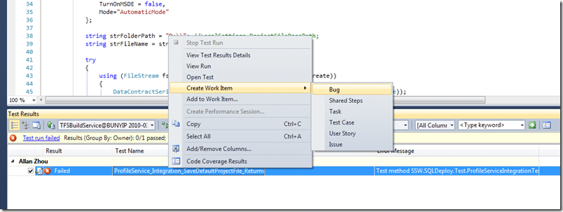

Now that I have the Build failing because of a genuine bug and not just because of a test framework failure, lets see if we can trace through to finding why the first test in our new application failed. Lets look at the build and see if we can see why there is a red cross on it.

First, lets open that build list. On Team Explorer Expand your Team Project Collection | Team Project and then Builds. Double click the offending build.

  
{ .post-img }
Figure: Opening the Build list is a key way to see what the current state of your software is.

  
{ .post-img }
**Figure: A test is failing, but we can now view the Test Results to find the problem**

    
{ .post-img }
**Figure: You can quite clearly see that the test has failed with “The device is not ready”.**

To me the “The Device is not ready” smacks of a System.IO exception, but it passed on my local computer, so why not on the build server?

Its a FaultException so it is most likely coming from the Service and not the client, so lets take a look at the client method that the test is calling:

```
bool IProfileService.SaveDefaultProjectFile(string strComputerName)
{
    ProjectFile file = new ProjectFile()
    {
        ProjectFileName = strComputerName + "_" + System.DateTime.Now.ToString("yyyyMMddhhmmsss") + ".xml",
        ConnectionString = "persist security info=False; pooling=False; data source=(local); application name=SSW.SQLDeploy.vshost.exe; integrated security=SSPI; initial catalog=SSWSQLDeployNorthwindSample",
        DateCreated = System.DateTime.Now,
        DateUpdated = System.DateTime.Now,
        FolderPath = @"C:Program FilesSSW SQL DeploySampleData",
        IsComplete=false,
        Version = "1.3",
        NewDatabase = true,
        TimeOut = 5,
        TurnOnMSDE = false,
        Mode="AutomaticMode"
    };

    string strFolderPath = "D:"; //LocalSettings.ProjectFileBasePath;
    string strFileName = strFolderPath + file.ProjectFileName;

    try
    {
        using (FileStream fs = new FileStream(strFileName, FileMode.Create))
        {
            DataContractSerializer serializer = new DataContractSerializer(typeof(ProjectFile));
            using (XmlDictionaryWriter writer = XmlDictionaryWriter.CreateTextWriter(fs))
            {
                serializer.WriteObject(writer, file);
            }
        }
    }
    catch (Exception ex)
    {
        //TODO: Log the exception
        throw ex;
        return false;
    }

    return true;
}
```

**Figure: You can see on lines 9 and 18 that there are calls being made to specific folders and disks.**

What is wrong with this code? What assumptions mistakes could the developer have made to make this look OK:

1. That every install would be to “C:Program FilesSSW SQL Deploy”
2. That every computer would have a “D:”
3. That checking in code at 6pm because the had to go home was a good idea.

lets solve each of these problems:

1. We are in a web service… lets store data within the web root. So we can call “Server.MapPath(“~/App_Data/SSW SQL DeploySampleData”) instead.
2. Never reference an explicit path. If you need some storage for your application use IsolatedStorage.
3. Shelve your code instead.

What else could have been done?

1. Code review before check-in – The developer should have shelved their code and asked another dev to look at it.
2. Use Defensive programming – Make sure that any code that has the possibility of failing has checks.

**Any more options?**

_Let me know and I will add them._

### What do we do?

The correct things to do is to add a Bug to the backlog, but as this is probably going to be fixed in sprint, I will add it directly to the sprint backlog.

1. Right click on the failing test Select “Create Work Item | Bug”  
      
   { .post-img }
   **Figure: Create an associated bug to add to the backlog.**

2. Set the values for the Bug making sure that it goes into the right sprint and Area. Make your steps to reproduce as explicit as possible, but “See test” is valid under these circumstances.  
       
   { .post-img }
   Figure: Add it to the correct Area and set the Iteration to the Area name or the Sprint if you think it will be fixed in Sprint and make sure you bring it up at the next Scrum Meeting.  
    Note: make sure you leave the “Assigned To” field blank as in Scrum team members sign up for work, you do not give it to them. The developer who broke the test will most likely either sign up for the bug, or say that they are stuck and need help.  
    Note: Visual Studio has taken care of associating the failing test with the Bug.

3. Save…

---

## Need Help?


{ .post-img }

[SSW](http://www.ssw.com.au) was the first company in the world outside of Microsoft to deploy Visual Studio 2010 Team Foundation Server to production, not [once](http://blog.hinshelwood.com/archive/2009/10/25/deploying-visual-studio-2010-team-foundation-server-beta-2.aspx), but [twice](http://blog.hinshelwood.com/archive/2010/02/10/upgrading-from-tfs-2010-beta-2-to-tfs-2010-rc.aspx).

### Team Foundation Server

 SSW provides expert Visual Studio ALM guidance including [installation, configuration and customisation](http://www.ssw.com.au/ssw/Company/SourceControl.aspx) through our four Microsoft Visual Studio ALM MVP’s in three countries; Australia, Beijing and the UK. They have experience deploying to small development shops all the way through to large blue chips.
{ .post-img }

### Professional Scrum Developer Training

 SSW has six [Professional Scrum Developer Trainers](http://www.ssw.com.au/ssw/Events/Scrum-Training-Course.aspx) who specialise in training your developers in implementing Scrum with Microsoft's Visual Studio ALM tools.
{ .post-img }

Technorati Tags: [TFBS](http://technorati.com/tags/TFBS) [Design](http://technorati.com/tags/Design) [Developing](http://technorati.com/tags/Developing) [Testing](http://technorati.com/tags/Testing) [.NET](http://technorati.com/tags/.NET) [WCF](http://technorati.com/tags/WCF) [SSW](http://technorati.com/tags/SSW) [Scrum](http://technorati.com/tags/Scrum) [VS 2010](http://technorati.com/tags/VS+2010) [TFS](http://technorati.com/tags/TFS)
