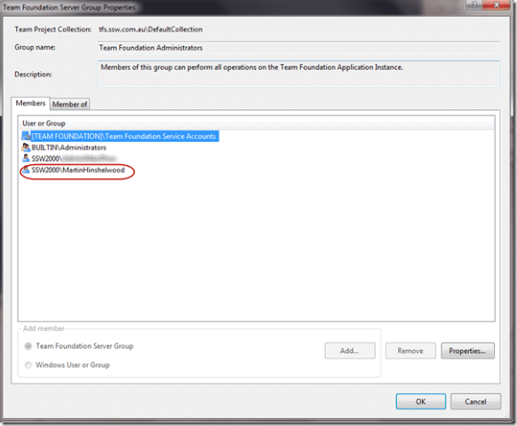

I recently had a fun time trying to debug a permission issue I ran into using TFS 2010’s TfsConfig.

Update 5th March 2010 – In its style of true excellence my company has added rant to its “[Suggestions for Better TFS](http://www.ssw.com.au/ssw/Standards/BetterSoftwareSuggestions/TeamFoundationServer.aspx#PermissionIssues)”.

* * *

<rant>

I was trying to run the TfsConfig tool and I kept getting the message:

> “TF55038: You don't have sufficient privileges to run this tool. Contact your Team Foundation system administrator."

This message made me think that it was something to do with the Install permissions as it is always recommended to use a single account to do every install of TFS. I did not install the original TFS on our network and my account was not used to do the TFS2010 install. But I did do the upgrade from 2010 beta 2 to 2010 RC with my current account.

So I proceeded to do some checking:

- Am I in the administrators group on the server?  
      
    **Figure: Yes, I am in the administrators group on the server  
    **
- Am I in the Administration Console users list?  
      
    **Figure: Yes, I am in** **the Administration Console users list**
- Have I reapplied the permissions in the Administration Console users list ticking all the options?  
      
    **Figure: Make sure you check all of the boxed if you want to have all the admin options  
    **  
    **  
    Figure: Yes, I have made sure that all my options are correct.**  
     
- Am I in the Team Foundation administrators group?  
      
    **Figure: Yes, I am in the Team Foundation Administrators group  
    **
- Is my account explicitly SysAdmin on the Database server?  
      
    **Figure: Yes, I do have explicit SysAdmin on the database**

Can you guess what the problem was?

**_The command line window was not running as the administrator!_**

As with most other applications there should be an explicit error message that states:

> _"You are not currently running in administrator mode; please restart the command line with elevated privileges!"_

This would have saved me 30 minutes, although I agree that I should change my name to Muppet and just be done with it.

</rant>

Technorati Tags: [ALM](http://technorati.com/tags/ALM) [TFS Admin](http://technorati.com/tags/TFS+Admin) [SSW](http://technorati.com/tags/SSW) [TFS 2010](http://technorati.com/tags/TFS+2010)

