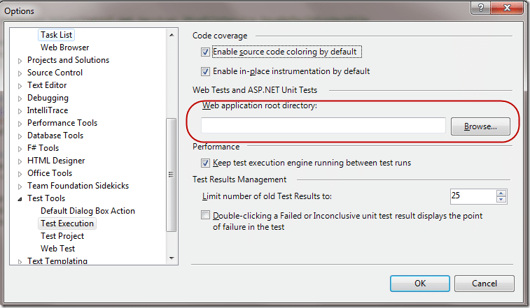

Guess what. About 20 minutes after I fixed the build, Allan broke it again!


{ .post-img }

Update: 4th March 2010 – After having huge problems getting this working I read [Billy Wang’s post](http://billwg.blogspot.com/2009/06/testing-wcf-web-services.html) which showed me the light.

---

The problem here is that even though the test passes locally it will not during an Automated Build. When you send your tests to the build server it does not understand that you want to spin up the web site and run tests against that! When you run the test in Visual Studio it spins up the web site anyway, but would you expect your test to pass if you told the website not to spin up? Of course not. So, when you send the code to the build server you need to tell it what to spin up.

First, the best way to get the parameters you need is to right click on the method you want to test and select “Create Unit Test”. This will detect wither you are running in IIS or ASP.NET Development Server or None, and create the relevant tags.

![clip_image002[4]](images/2faeb3370980_F4FC-clip_image0024_-2-2.jpg)
{ .post-img }

Figure: Right clicking on “SaveDefaultProjectFile” will produce a context menu with “Create Unit tests…” on it.

If you use this option it will AutoDetect most of the Attributes that are required.

```
/// <summary>
///A test for SSW.SQLDeploy.SilverlightUI.Web.Services.IProfileService.SaveDefaultProjectFile
///</summary>
// TODO: Ensure that the UrlToTest attribute specifies a URL to an ASP.NET page (for example,
// http://.../Default.aspx). This is necessary for the unit test to be executed on the web server,
// whether you are testing a page, web service, or a WCF service.
[TestMethod()]
[HostType("ASP.NET")]
[AspNetDevelopmentServerHost("D:WorkspacesSSWSSWSqlDeployDEVMainSSW.SQLDeploy.SilverlightUI.Web", "/")]
[UrlToTest("http://localhost:3100/")]
[DeploymentItem("SSW.SQLDeploy.SilverlightUI.Web.dll")]
public void SaveDefaultProjectFileTest()
{
    IProfileService target = new ProfileService(); // TODO: Initialize to an appropriate value
    string strComputerName = string.Empty; // TODO: Initialize to an appropriate value
    bool expected = false; // TODO: Initialize to an appropriate value
    bool actual;
    actual = target.SaveDefaultProjectFile(strComputerName);
    Assert.AreEqual(expected, actual);
    Assert.Inconclusive("Verify the correctness of this test method.");
}
```

**Figure: Auto created code that shows the attributes required to run correctly in IIS or in this case ASP.NET Development Server**

If you are a purist and don’t like creating unit tests like this then you just need to add the three attributes manually.

- **HostType** – This attribute specified what host to use. Its an extensibility point, so you could write your own. Or you could just use “ASP.NET”.
- **UrlToTest** – This specifies the start URL. For most tests it does not matter which page you call, as long as it is a valid page otherwise your test may not run on the server, but may pass anyway.
- **AspNetDevelopmentServerHost** – This is a nasty one, it is only used if you are using ASP.NET Development Host and is unnecessary if you are using IIS. This sets the host settings and the first value MUST be the physical path to the root of your web application.

OK, so all that was rubbish and I could not get anything working using the MSDN documentation. Google provided very little help until I ran into [Billy Wang’s post](http://billwg.blogspot.com/2009/06/testing-wcf-web-services.html)  and I heard that heavenly music that all developers hear when understanding dawns that what they have been doing up until now is just plain stupid.

I am sure that the above will work when I am doing Web Unit Tests, but there is a much easier way when doing web services.

You need to add the AspNetDevelopmentServer attribute to your code. This will tell MSTest to spin up an ASP.NET Development server to host the service. Specify the path to the web application you want to use.

```
[AspNetDevelopmentServer("WebApp1", "D:WorkspacesSSWSSWSqlDeployDEVMainSSW.SQLDeploy.SilverlightUI.Web")]
[DeploymentItem("SSW.SQLDeploy.SilverlightUI.Web.dll")]
[TestMethod]
public void ProfileService_Integration_SaveDefaultProjectFile_Returns_True()
{
    ProfileServiceClient target = new ProfileServiceClient();

    bool isTrue = target.SaveDefaultProjectFile("Mav");

    Assert.AreEqual(true, isTrue);
}
```

**Figure: This AspNetDevelopmentServer will make sure that the specified web application is launched.**

Now we can run the test and have it pass, but if the dynamically assigned ASP.NET Development server port changes what happens to the details in your app.config that was generated when creating a reference to the web service? Well, it would be wrong and the test would fail.

This is where Billy’s helper method comes in. Once you have created an instance of your service call, and it has loaded the config, but before you make any calls to it you need to go in and dynamically set the Endpoint address to the same address as your dynamically hosted Web Application.

```
using System;
using System.Collections.Generic;
using System.Linq;
using System.Text;
using Microsoft.VisualStudio.TestTools.UnitTesting;
using System.Reflection;
using System.ServiceModel.Description;
using System.ServiceModel;

namespace SSW.SQLDeploy.Test
{
    class WcfWebServiceHelper
    {

        public static bool TryUrlRedirection(object client, TestContext context, string identifier)
        {
            bool result = true;
            try {
                PropertyInfo property = client.GetType().GetProperty("Endpoint");
                string webServer = context.Properties[string.Format("AspNetDevelopmentServer.{0}", identifier)].ToString();
                Uri webServerUri = new Uri(webServer);
                ServiceEndpoint endpoint = (ServiceEndpoint)property.GetValue(client, null);
                EndpointAddressBuilder builder = new EndpointAddressBuilder(endpoint.Address);
                builder.Uri = new Uri(endpoint.Address.Uri.OriginalString.Replace(endpoint.Address.Uri.Authority, webServerUri.Authority));
                endpoint.Address = builder.ToEndpointAddress();
            }
            catch (Exception e) {
                context.WriteLine(e.Message); result = false;
            }
            return result;
        }
    }
}
```

**Figure: This fixes a problem with the URL in your web.config not being the same as the dynamically hosted ASP.NET Development server port.**

We can now add a call to this method after we created the Proxy object and change the Endpoint for the Service to the correct one. This process is wrapped in an assert as if it fails there is no point in continuing.

```
[AspNetDevelopmentServer("WebApp1", D:WorkspacesSSWSSWSqlDeployDEVMainSSW.SQLDeploy.SilverlightUI.Web")]
[DeploymentItem("SSW.SQLDeploy.SilverlightUI.Web.dll")]
[TestMethod]
public void ProfileService_Integration_SaveDefaultProjectFile_Returns_True()
{
    ProfileServiceClient target = new ProfileServiceClient();
    Assert.IsTrue(WcfWebServiceHelper.TryUrlRedirection(target, TestContext, "WebApp1"));

    bool isTrue = target.SaveDefaultProjectFile("Mav");

    Assert.AreEqual(true, isTrue);
}
```

**Figure: Editing the Endpoint from the app.config on the fly to match the dynamically hosted ASP.NET Development Server URL and port is now easy.**

As you can imagine AspNetDevelopmentServer poses some problems of you have multiple developers. What are the chances of everyone using the same location to store the source? What about if you are using a build server, how do you tell MSTest where to look for the files?

To the rescue is a property called" “%PathToWebRoot%” which is always right on the build server. It will always point to your build drop folder for your solutions web sites. Which will be “tfs.ssw.com.auBuildDrop\[BuildName\]Debug_PrecompiledWeb” or whatever your build drop location is. So lets change the code above to add this.

```
[AspNetDevelopmentServer("WebApp1", "%PathToWebRoot%SSW.SQLDeploy.SilverlightUI.Web")]
[DeploymentItem("SSW.SQLDeploy.SilverlightUI.Web.dll")]
[TestMethod]
public void ProfileService_Integration_SaveDefaultProjectFile_Returns_True()
{
    ProfileServiceClient target = new ProfileServiceClient();
    Assert.IsTrue(WcfWebServiceHelper.TryUrlRedirection(target, TestContext, "WebApp1"));

    bool isTrue = target.SaveDefaultProjectFile("Mav");

    Assert.AreEqual(true, isTrue);
}
```

**Figure: Adding %PathToWebRoot% to the AspNetDevelopmentServer path makes it work everywhere.**

Now we have another problem… this will ONLY run on the build server and will fail locally as %PathToWebRoot%’s default value is “C:Users\[profile\]DocumentsVisual Studio 2010Projects”. Well this sucks… How do we get the test to run on any build server **_and_** any developer laptop.

Open “Tools | Options | Test Tools | Test Execution” in Visual Studio and you will see a field called “Web application root directory”. This is where you override that default above.

  
{ .post-img }
**Figure: You can override the default website location for tests.**

In my case I would put in “D:WorkspacesSSWSSWSqlDeployDEVMain” and all the developers working with this branch would put in the folder that they have mapped.

### Can you see a problem?

What is I create a “$/SSW/SqlDeploy/DEV/34567” branch from Main and I want to run tests in there. Well… I would have to change the value above. This is not ideal, but as you can put your projects anywhere on a computer, it has to be done.

### Conclusion

Although this looks convoluted and complicated there are real problems being solved here that mean that you have a test ANYWHERE solution. Any build server, any Developer workstation.

### Resources:

[http://billwg.blogspot.com/2009/06/testing-wcf-web-services.html](http://billwg.blogspot.com/2009/06/testing-wcf-web-services.html "http://billwg.blogspot.com/2009/06/testing-wcf-web-services.html")

[http://tough-to-find.blogspot.com/2008/04/testing-asmx-web-services-in-visual.html](http://tough-to-find.blogspot.com/2008/04/testing-asmx-web-services-in-visual.html "http://tough-to-find.blogspot.com/2008/04/testing-asmx-web-services-in-visual.html")

[http://msdn.microsoft.com/en-us/library/ms243399(VS.100).aspx](<http://msdn.microsoft.com/en-us/library/ms243399(VS.100).aspx> "http://msdn.microsoft.com/en-us/library/ms243399(VS.100).aspx")

[http://blogs.msdn.com/dscruggs/archive/2008/09/29/web-tests-unit-tests-the-asp-net-development-server-and-code-coverage.aspx](http://blogs.msdn.com/dscruggs/archive/2008/09/29/web-tests-unit-tests-the-asp-net-development-server-and-code-coverage.aspx "http://blogs.msdn.com/dscruggs/archive/2008/09/29/web-tests-unit-tests-the-asp-net-development-server-and-code-coverage.aspx")

[http://www.5z5.com/News/?543f8bc8b36b174f](http://www.5z5.com/News/?543f8bc8b36b174f "http://www.5z5.com/News/?543f8bc8b36b174f")

---

## Need Help?


{ .post-img }

[SSW](http://www.ssw.com.au) was the first company in the world outside of Microsoft to deploy Visual Studio 2010 Team Foundation Server to production, not [once](http://blog.hinshelwood.com/archive/2009/10/25/deploying-visual-studio-2010-team-foundation-server-beta-2.aspx), but [twice](http://blog.hinshelwood.com/archive/2010/02/10/upgrading-from-tfs-2010-beta-2-to-tfs-2010-rc.aspx).

### Team Foundation Server

 SSW provides expert Visual Studio ALM guidance including [installation, configuration and customisation](http://www.ssw.com.au/ssw/Company/SourceControl.aspx) through our four Microsoft Visual Studio ALM MVP’s in three countries; Australia, Beijing and the UK. They have experience deploying to small development shops all the way through to large blue chips.
{ .post-img }

### Professional Scrum Developer Training

 SSW has six [Professional Scrum Developer Trainers](http://www.ssw.com.au/ssw/Events/Scrum-Training-Course.aspx) who specialise in training your developers in implementing Scrum with Microsoft's Visual Studio ALM tools.
{ .post-img }

Technorati Tags: [ALM](http://technorati.com/tags/ALM) [TFBS](http://technorati.com/tags/TFBS) [Visual Studio](http://technorati.com/tags/Visual+Studio) [SSW](http://technorati.com/tags/SSW) [Testing](http://technorati.com/tags/Testing) [TFS 2010](http://technorati.com/tags/TFS+2010) [WCF](http://technorati.com/tags/WCF) [Silverlight](http://technorati.com/tags/Silverlight) [Scrum](http://technorati.com/tags/Scrum) [VS 2010](http://technorati.com/tags/VS+2010) [TFS](http://technorati.com/tags/TFS)
