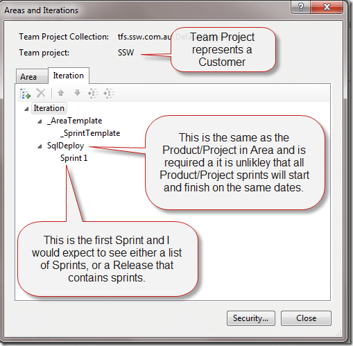
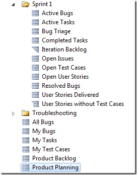

Well, it depends… If you are a small company that creates a finite number of internal projects then you will find it easier to create a single project for each of your products and have TFS do the heavy lifting with reporting, SharePoint sites and Version Control.

But what if you are not…

[Update - 14th August 2012 - Superseded](#update20120814)

I have updated this as [One Team Project for Visual Studio 2012](http://blog.hinshelwood.com/one-team-project/ "One Team Project with Visual Studio 2012").

[Update - 13th April 2010 - feedback incorporated](#update20120413-3)

[Paul Neumeyer](http://sharepoint.ssw.com.au/AboutUs/Employees/Pages/Paul.aspx) – I asked Paul for a comment, and true to form he wrote an essay and with an evening with Sam Guckenheimer firing his blood it’s a good un’..

[Update - 13th April 2010 - Content update](#update20120413-2)

[Eric Phan](http://sharepoint.ssw.com.au/AboutUs/Employees/Pages/Eric.aspx), [Paul Neumeyer](http://sharepoint.ssw.com.au/AboutUs/Employees/Pages/Paul.aspx) – After having long discussions with Eric and Paul I have added strategy for Migration to new process templates and of archiving old projects.

[Update - 13th April 2010 - Content update](#update20120413-1)

I ran into the problem of not being able to find a build called “Build” and had to search through 172 projects to find it. With Areas there would be substantially less projects to search. A good naming convention would also work 
{ .post-img }

[Update - 8th April 2010 - Content update](#update20120408)

[Ognjen Bajic](http://ognjenbajic.com/blog) – Ognjen from Ekobit who make [Team Companion](http://www.ekobit.com/productsdetailview.aspx?id=1) made some comments that I found useful, which I have added.

[Update - 11th March 2010 - Content update](#update20120311)

[Adam Cogan](http://adamcogan.com/) – Adam suggested I get our disagreement out in the open, improve the proposed solution description with some visual cues and move the Pros and Cons to the top. Last but not least, to plug out custom TFS template :)

[Update - 9th March 2010 - feedback incorporated](#update20120309-3)

[Ewald Hofman](http://www.ewaldhofman.nl/) gave me a couple of Cons, and maybe a few more soon. Ewald’s company, Avanade, currently uses Areas, but it looks like the manual management is getting too much and the project is getting cluttered.

[Update - 9th March 2010 - feedback incorporated](#update20120309-2)

[Michael Fourie](http://www.freetodev.com/) gave me some feedback which I have integrated.

[Update - 9th March 2010 - feedback incorporated](#update20120309-1)

[Ed Blankenship](http://www.edsquared.com) via [@edblankenship](http://twitter.com/edblankenship/status/10221184645) offered encouragement and a nice quote.

---

What if you are likely to have hundreds of projects, possibly with a multitude of internal and external projects? You might have 1 project for a customer or 10. This is the situation that most consultancies find themselves in and thus they need a more sustainable and maintainable option. What I am advocating is that we should have 1 “Team Project” per customer, and use areas to create “sub projects” within that single “Team Project”.

> "_What you describe is what we generally do internally and what we recommend. We make very heavy use of area path to categorize the work within a larger project_."  
> \- **[Brian Harry](http://blogs.msdn.com/bharry/)**, Microsoft Technical Fellow & Product Unit Manager for Team Foundation Server

This post has an ulterior motive as I am having this debate with my boss, Adam Cogan, and we both decided that we wanted to find out what the community at large thinks of this approach to managing projects in TFS. Adam thinks this is a bad idea as it is not supported “out-of-the-box”, and I think that a lot of things are not supported “out-of-the-box” in TFS which never the less, are a good idea, including this one.

> I’ve been a big advocate of using a single project per client for years because from experience a client will want to merge products or  have their name changed, a component form their existing project code base a client will want to ‘spin-off’ as a separate product with a different team without losing any work items or history, and there are always tasks that development teams can’t decide where to put when there are multiple, but related products in separate TFS projects.  All of that is easier with a  single project per client and using Areas.  Last night I spent an evening with Sam Guckenheimer and it is clear his vision of TFS was always targeted at a lot more that source control and a task tracking, TFS is a flexible application lifecycle management (ALM) system that if setup with Areas can streamline the decade+ lifecycle of interaction between developers and the guys with budget that is the reality we live in.  
> \-[Dr Paul Neumeyer](http://sharepoint.ssw.com.au/AboutUs/Employees/Pages/Paul.aspx), Ph.D Parallel Processes, ScrumMaster and SSW Solution Architect

> Using areas in existing team project instead of creating a new team project (a.k.a. “prefer small number of big team projects over large number of small team projects”) has been established best practice for long time. Microsoft works that way internally and they recommend everyone should. We use it internally and all of our partners have been thought to use it as well.  
> [**Ognjen Bajic**](http://ognjenbajic.com/blog), Visual Studio ALM MVP, Ekobit

> "_We tend to use areas to segregate multiple projects in the same team project and it works well_."  
> \- **[Tiago Pascoal](http://agilior.pt/blogs/tiago.pascoal/)**, Visual Studio ALM MVP

> _"In general, I believe this approach provides consistency \[to multi-product engagements\] and lowers the administration and maintenance costs. All good."  
> _\- [**Michael Fourie**](http://www.freetodev.com/), Visual Studio ALM MVP

> “_@\_\_MrHinsh_ _BTW, I'm very much a fan of very large, if not huge, team projects in TFS. Just FYI :) Use Areas & Iterations.”_  
> [**Ed Blankenship**](http://www.edsquared.com), Visual Studio ALM MVP

I am proposing that SSW change from over 70 internal team projects:

- SSW.CodeAuditor
- SSW.SQLAuditor
- SSW.SQLDeploy
- etc

To 1 internal team project:

- SSW.Agile5
  - CodeAuditor
  - SQLAuditor
  - SQLDeploy
  - etc

Note: The single Team Project called “SSW.Agile5” would contain all of our internal projects and consequently all of the Areas and Iteration move down one hierarchy to accommodate this. Where we would have had “SSWSprint 1” we now have “SSWSqlDeploySprint1” with “SqlDeploy” being our internal project. At the moment SSW has over 70 internal projects and more than 170 total projects in TFS.

This method has long term benefits that help to simplify the support model for companies that often have limited internal support time and many projects. But, there are implications as TFS does not provide this model “out-of-the-box”. These implications stretch across Areas, Iterations, Queries, Project Portal and Version Control.

Michael made a good comment, he said:

> _I agree with your approach, assuming that in a multi-product engagement with a client, they are happy to adopt the same process template across all products. If they are not, then it’ll either be easy to convince them or there is a valid reason for having a different template_  
> \- [Michael Fourie](http://www.freetodev.com/), Visual Studio ALM MVP

At SSW we have a standard [SSW Agile](http://www.ssw.com.au/ssw/AgileTemplate/) process template that we use and this is applied across the board, to all of our projects. We even apply any changes to the core process template to all of our existing projects as well. If you have multiple projects for the same clients on multiple templates and you want to keep it that way, then this approach will not work for you. However, if you want to standardise as we have at SSW then this approach may benefit you as well.

#### Pros

- **You only have one project to upgrade when a process template changes** – After going through an upgrade of over 170 project prior to the changes in the RC I can tell you that that many projects is no fun.
- **Standardises your Process Template** – You will always have the same Process implementation across projects/products without exception
- **You get tighter control over the permissions –** Yes, you can do this on a standard Team Project, but it gets a lot easier with practice.
- **You can “move” work items from one “product” to another** – Have we not always wanted to do that.
- **You can rename your projects** – Wahoo: everyone wants to do this, now you can.
- **One set of Reporting Services reports to manage** – You set an area and iteration to run reports anyway, so you may as well set both.
- **Simplified Check-In Policies**– There is only one set of check-in policies per client. This simplifies administration of policies.
- **Simplified Alerts** – As alerts are applied across multiple projects this simplifies your alert rules as per client.
- **Process Template Upgrades** – When a new process template is released, like “Agile6” we can create a “SSW.Agile6” project and move Area Projects ad-hock into it as we use them. This way we keep the history of the work items in tact and are able to properly upgrade to the new process template.
- **Archiving** – We would be able to archive old unused projects by leaving them behind with history and source intact in the old “SSW.Agile5” project and then using the Project Collection splitting process to only keep active projects on TFS while keeping the database available if it is needed in the future.
- **Find all builds** – You need to open a project to query builds, so you will be able to see all builds in one project.

#### Cons

All of these cons could be mitigated by a custom tool that helps automate creation of “Sub-projects” within Team Projects. This custom tool could create areas, Iteration, permissions, SharePoint and queries. It just does not exist yet :)

- **You need to configure the Areas and Iterations** – This is just like you would do for Sprints/Iterations and for functional areas of your application, but with 1 extra level at the top of the tree.
- **You need to configure the permissions** – This I guess is the main configuration point. It is possible to create the same permissions as a Team Project at this level, but that would be a bit of configuration work.
- **You may need to configure sub sites for SharePoint** (depends on your requirement) – If you have two projects/products in the same Team Project then you will not see the burn down for each one out-of-the-box, but rather a cumulative for the Team Project. This is not really that much of a problem as you would have to configure your burndown graphs for your current iteration anyway.  
   _note: When you create a sub site to a TFS linked portal it will inherit the settings of its parent site :) This is fantastic as it means that you can easily create sub sites and then set the Area and Iteration path in each of the reports to be the correct one._
- **Every team wants their own customization** (via [Ewald Hofman](http://www.ewaldhofman.nl/)) - small teams of 2 persons against teams of 30 – or even outsourcing – need their own process, you cannot allow that because everybody gets the same work item types.  
   _note: Luckily at SSW this is not a problem as our template is standardised across all projects and customers._
- **Large list of builds** (via [Ewald Hofman](http://www.ewaldhofman.nl/)) – As the build list in Team Explorer is just a flat list it can get very cluttered.  
   _note: I would mitigate this by removing any build that has not been run in over 30 days. The build template and workflow will still be available in version control, but it will clean the list._

### Implications around Areas

Areas should be used for topological classification/isolation of work items. You can think of this as architecture areas, organisational areas or even the main features of your application. In our scenario there is an additional top level item that represents the Project / Product that we want to chop our Team Project into.

  
{ .post-img }
**Figure: Creating a sub area to represent a product/project is easy.**

Becomes:

### Implications around Iterations

Iterations should be used for chronological classification/isolation of work items. This could include isolated time boxes, milestones or release timelines and really depends on the logical flow of your project or projects. Due to the new level in Area we need to add the same level to Iteration. This is primarily because it is unlikely that the sprints in each of your projects/products will start and end at the same time. This is just a reality of managing multiple projects.

  
{ .post-img }
**Figure: Adding the same Area value to Iteration as the top level item adds flexibility to Iteration.**

> Sprint 1

Or

> Release 1Sprint 1

Becomes:

> Sprint 1

Or

> Release 1Sprint 1

### Implications around Queries

Queries are used to filter your work items based on a specified level of granularity. There are a number of queries that are built into a project created using the MSF Agile 5.0 template, but we now have multiple projects and it would be a pain to have to edit all of the work items every time we changed project, and that would only allow one team to work on one project at a time.

   
{ .post-img }
**Figure: The Queries that are created in a normal MSF Agile 5.0 project do not quite suit our new needs.**

In order for project contributors to be able to query based on their project we need a couple of things. The first thing I did was to create an “\_Area Template” folder that has a copy of the project layout with all the queries setup to filter based on the “\_Area Template” Area and the “\_Sprint template” you can see in the Area and Iteration views.

  
{ .post-img }
**Figure: The template is currently easily drag and drop, but you then need to edit the queries to point at the right Area and Iteration. This needs a tool.**

I then created an “Areas” folder to hold all of the area specific queries. So, when you go to create a new TFS Sub-Project you just drag “\_Area Template” while holding “Ctrl” and drop it onto “Areas”. There is a little setup here. That said I managed it in around 10 minutes which is not so bad, and I can imagine it being quite easy to build a tool to create these queries

  
{ .post-img }
**Figure: These new queries can be configured in around 10 minutes, which includes setting up the Area and Iteration as well.**

### Version Control

What about your source code? Well, that is the easiest of the lot. Just create a sub folder for each of your projects/products.

  
{ .post-img }
**Figure: Creating sub folders in source control is easy as “Right click | Create new folder”.**

> DEVMain

Becomes:

> DEVMain

### Conclusion

I think it is up to each company to make a call on how you want to configure your Team Projects and it depends completely on how many projects/products you are going to have for each customer including yourself.

If we decide to utilise this route it will require some configuration to get our 170+ projects into this format, and I will probably be writing some tools to help.

#### Feedback

Now that I have explained this method, what do you think?

- **What other pros and cons can you see?**
- **What do you think of this approach?**
- **Will you be using it?**
- **What tools would you like to support you?**

Technorati Tags: [ALM](http://technorati.com/tags/ALM) [TFS Admin](http://technorati.com/tags/TFS+Admin) [TFBS](http://technorati.com/tags/TFBS) [TFS Custom](http://technorati.com/tags/TFS+Custom) [WIT](http://technorati.com/tags/WIT) [CodeProject](http://technorati.com/tags/CodeProject) [SSW](http://technorati.com/tags/SSW) [Scrum](http://technorati.com/tags/Scrum) [SP 2010](http://technorati.com/tags/SP+2010) [SharePoint](http://technorati.com/tags/SharePoint)
