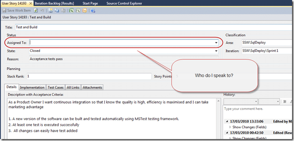

When you are building complicated software and working with customers it is always nice for them to have some idea on who to speak to about a particular story during a sprint.
{ .post-img }

Update 14th April 2010

- Rule added to [Rules to better Scrum with TFS](http://sharepoint.ssw.com.au/Standards/Management/RulesToBetterScrumUsingTFS/)

---

In order to achieve this one of the Team takes responsibility for “looking after” a story” a story and manages it to completion. They will collect all of the [“Done” emails](http://www.ssw.com.au/ssw/Standards/Rules/RulesToBetterEmail.aspx#ReplyAndDelete) and make sure that everyone follows the Done criteria identified by the team as well as answering any Product Owner queries.

  
{ .post-img }
**Figure: Bad example, the product owner is not sure who to speak to.**

  
{ .post-img }
**Figure: Good example, the product owner can now see who he should speak to and developers know where to send done emails.**

Technorati Tags: [SSW](http://technorati.com/tags/SSW) [Scrum](http://technorati.com/tags/Scrum) [SSW Rules](http://technorati.com/tags/SSW+Rules) [SP 2010](http://technorati.com/tags/SP+2010) [SharePoint](http://technorati.com/tags/SharePoint)
