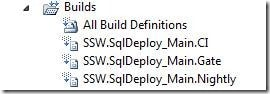
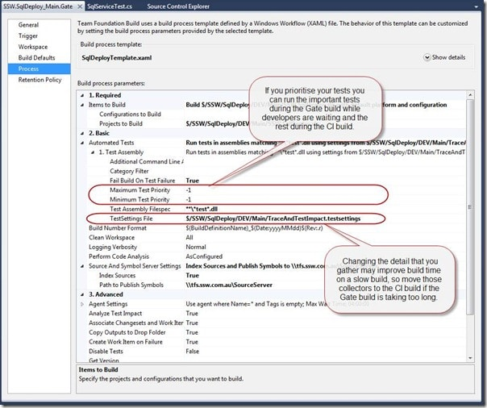
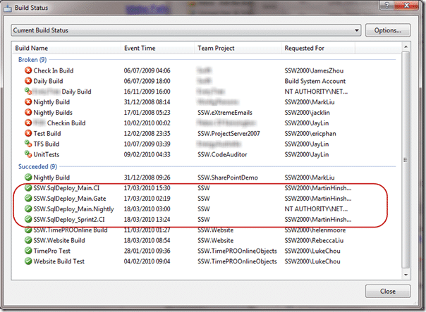

{ .post-img }

When creating projects one of the only ways that you have of proving that it works and is a viable solution is to build it. This is easy when you only have one developer and that developer will be the only one using a solution. But what if you have 2 developers? How do you prove that one developers code works with the other? The answer is build servers. These build servers take specific code away to another computer and build it there.

Updated 29th March 2010: I was missing an intro for this one.

---

You should always have three builds on your team project. These should be setup and tested using an empty solution before you write any code at all.

  
{ .post-img }
**Figure: Three builds named in the format \[TeamProject\].\[AreaPath\]\_\[Branch\].\[Gate|CI|Nightly\] for every branch.**

These builds should use the same XAML build workflow; however you may set them up to run a different set of tests depending on the time it takes to run a full build.

- **Gate** – Only needs to run the smallest set of tests, but should run most if not all of the Unit Test. This is run before developers are allowed to check-in
- **CI** – This should run all Unit Tests and all of the automated UI tests. It is run after a developer check-in.
- **Nightly** – The Nightly build should run all of the Unit Tests, all of the Automated UI tests and all of the Load and Performance tests. The nightly build is time consuming and will run but once a night. Packaging of your Product for testing the next day may be done at this stage as well.

  
{ .post-img }
**Figure: You can control what tests are run and what data is collected while they are running.**

Note: We do not run all the tests every time because of the time consuming nature of running some tests, but ALL tests should be run overnight.

Note: If you had a really large project with thousands of tests including long running Load tests you may need to add a Weekly build to the mix.

  
{ .post-img }
**Figure: Bad example, you can’t tell what these builds do if they are in a larger list**

  
{ .post-img }
**Figure: Good example, you know exactly what project, branch and type of build these are for.**

Technorati Tags: [SSW](http://technorati.com/tags/SSW) [SSW Rules](http://technorati.com/tags/SSW+Rules) [ALM](http://technorati.com/tags/ALM) [TFBS](http://technorati.com/tags/TFBS) [VS 2010](http://technorati.com/tags/VS+2010)
