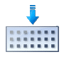
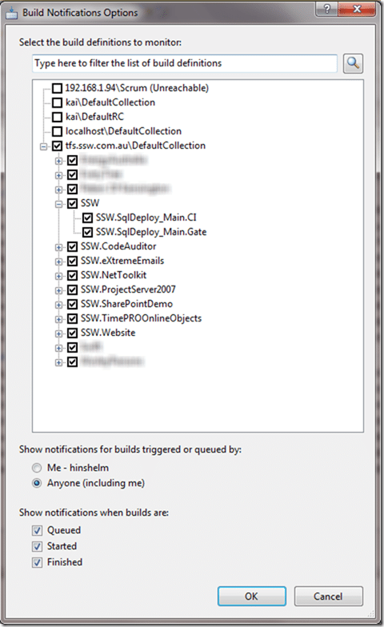
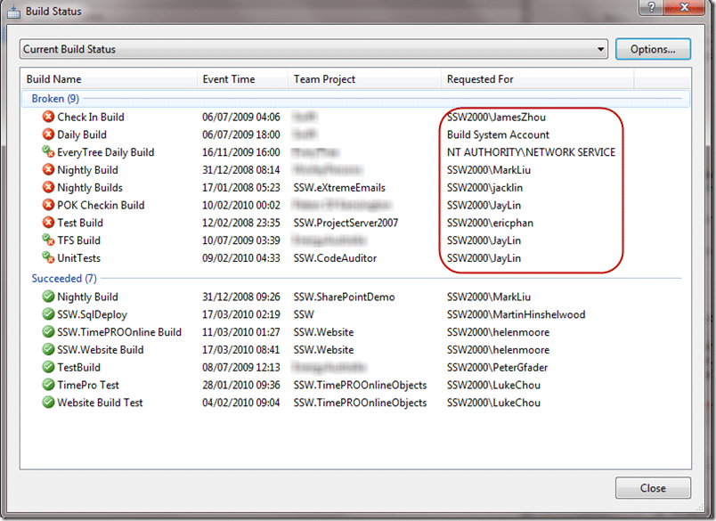
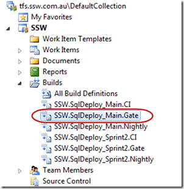
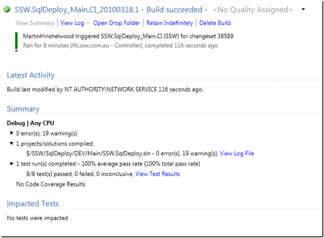
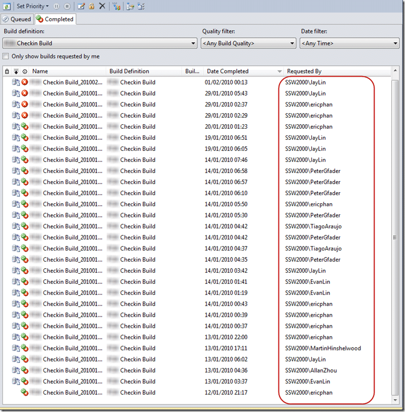

{ .post-img }

I recently sent round a list of broken builds at SSW and asked for them to be fixed or deleted if they are not being used. My colleague [Peter](http://sharepoint.ssw.com.au/AboutUs/Employees/Pages/Peter.aspx) came back with a couple of questions which I love as it tells me that at least one person reads my email 
{ .post-img }

I think first we need to answer a couple of other questions related to builds in general.

Why do we want the build to pass?

1. Any developer can pick up a project and build it
2. Standards can be enforced
3. Constant quality is maintained
4. Problems in code are identified early

What could a failed build signify?

1. Developers have not built and tested their code properly before checking in.
2. Something added depends on a local resource that is not under version control or does not exist on the target computer.
3. Developers are not writing tests to cover common problems.
4. There are not enough tests to cover problems.

Now we know why, lets answer Peters questions:

### Where is this list? (can we see it somehow)

You can normally only see the builds listed for each project. But, you have a little application called “Build Notifications” on your computer. It is installed when you install Visual Studio 2010.

  
{ .post-img }
**Figure: Staring the build notification application on Windows 7.**

Once you have it open (it may disappear into your system tray) you should click “Options” and select all the projects you are involved in.

This application only lists projects that have builds, so don’t worry if it is not listed. This just means you are about to setup a build, right?

I just selected ALL projects that have builds.

  
{ .post-img }
**Figure: All builds are listed here**

In addition to seeing the list you will also get toast notification of build failure’s.

### How can we get more info on **what** broke the build? (who is interesting too, to point the finger  but more important is what)

{ .post-img }

The only thing worse than breaking the build, is continuing to develop on a broken build!

  
{ .post-img }
**Figure: I have highlighted the users who either are bad for braking the build, or very bad for not fixing it.**

To find out what is wrong with a build you need to open the build definition. You can open a web version by double clicking the build in the image above, or you can open it from “Team Explorer”.

Just connect to your project and open out the “Builds” tree. Then Open the build by double clicking on it.

  
{ .post-img }
**Figure: Opening a build is easy, but double click it and then open a build run from the list.**

  
{ .post-img }
**Figure: Good example, the build and tests have passed**

  
{ .post-img }
**Figure: Bad example, there are 133 errors preventing POK from being built on the build server.**

For identifying failures see:

1. [Solution: Getting Silverlight to build on Team Build 2010 RC](http://blog.hinshelwood.com/archive/2010/03/03/solution-getting-silverlight-to-build-on-team-build-2010-rc.aspx)
2. [Solution: Testing Web Services with MSTest on Team Build](http://blog.hinshelwood.com/archive/2010/03/04/solution-testing-web-services-with-mstest-on-team-build.aspx)
3. [Finding the problem on a partially succeeded build](http://blog.hinshelwood.com/archive/2010/03/04/finding-the-problem-on-a-partially-succeeded-build.aspx)

So, Peter asked about blame, let’s have a look and see:

  
{ .post-img }
**Figure: The build has been broken for so long I have no idea when it was broken, but everyone on this list is to blame (I am there too)**

The rest of the history is lost in the sands of time, there is no way to tell when the build was originally broken, or by whom, or even if it ever worked in the first place. Build should be protected by the team that uses them and the only way to do that is to have them own them. It is fine for me to go in and setup a build, but the ownership for a build should always reside with the person who broke it last.

### Conclusion

This is an example of a pointless build. Lets be honest, if you have a system like [TFS](http://msdn2.microsoft.com/en-us/teamsystem/aa718934.aspx "Team Foundation Server") in place and builds are constantly left broken, or not added to projects then your developers don’t yet understand the value. I have found that adding a Gated Check-in helps instil that understanding of value. If you prevent them from checking in without passing that basic quality gate of “your code builds on another computer” then it makes them look more closely at why they can’t check-in.

I have had builds fail because one developer had a “d” drive, but the build server did not. That is what they are there to catch.

If you want to know what builds to create and why I wrote a post on “[Do you know the minimum builds to create on any branch?](http://blog.hinshelwood.com/archive/2010/03/18/do-you-know-the-minimum-builds-to-create-on-any.aspx)”

Technorati Tags: [TFS 2010](http://technorati.com/tags/TFS+2010) [ALM](http://technorati.com/tags/ALM) [VS 2010](http://technorati.com/tags/VS+2010) [TFBS](http://technorati.com/tags/TFBS) [Silverlight](http://technorati.com/tags/Silverlight) [SSW](http://technorati.com/tags/SSW) [SP 2010](http://technorati.com/tags/SP+2010) [SharePoint](http://technorati.com/tags/SharePoint)
