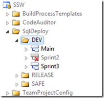

There are a lot of developers using version control these days, but a feature of version control called branching is very poorly understood and remains unused by most developers in favour of Labels. Most developers think that branching is hard and complicated. Its not!

What is hard and complicated is a bad branching strategy. Just like a bad software architecture a bad branch architecture, or one that is not adhered to can prove fatal to a project. We I was at Aggreko we had a fairly successful Feature branching strategy (although the developers hated it) that meant that we could have multiple feature teams working at the same time without impacting each other. Now, this had to be carefully orchestrated as it was a Business Intelligence team and many of the BI artefacts do not lend themselves to merging.

Today at SSW I am working on a Scrum team delivering a product that will be used by many hundreds of developers. SSW SQL Deploy takes much of the pain out of upgrading production databases when you are not using the Database projects in Visual Studio.

With Scrum each Scrum Team works for a fixed period of time on a single sprint. You can have one or more Scrum Teams involved in delivering a product, but all the work must be merged and tested, ready to be shown to the Product Owner at the the Sprint Review meeting at the end of the current Sprint.

So, what does this mean for a branching strategy?

We have been using a “Main” (sometimes called “Trunk”) line and doing a branch for each sprint. It’s like Feature Branching, but with only ONE feature in operation at any one time, so no conflicts 
{ .post-img }

  
{ .post-img }
**Figure: DEV folder containing the Development branches.**

I know that some folks advocate applying a Label at the start of each Sprint and then rolling back if you need to, but I have always preferred the security of a branch.

Like:

- being able to create a release from Main that has Sprint3 code even while Sprint4 is being worked on.
- being sure I can always create a stable build on request.
- Being able to guarantee a version (labels are not auditable)
- Be able to abandon the sprint without having to delete the code (rare I know, but would be a mess if it happened)
- Being able to see the flow of change sets through to a safe release
- It helps you find invalid dependencies when merging to Main as there may be some file that is in everyone’s Sprint branch, but never got checked in. (We had this at the merge of Sprint2)
- If you are always operating in this way as a standard it makes it easier to then add more scrum teams in the future. Muscle memory of this way of working.

Don’t Like:

- Additional DB space for the branches
- Baseless merging between sprint branches when changes are directly ported  
   Note: I do not think we will ever attempt this!
- Maybe a bit tougher to see the history between sprint branches since the changes go up through Main and down to another sprint branch  
   Note: What you would have to do is see which Sprint the changes were made in and then check the history he same file in that Sprint. A little bit of added complexity that you would have to do anyway with multiple teams.
- Over time, you can end up with a lot of old unused sprint branches. Perhaps destroy with /keephistory can help in this case.  
   Note: We ALWAYS delete the Sprint branch after it has been merged into Main. That is the theory anyway, and as you can see from the images Sprint2 has already been deleted.

**Why take the chance of having a problem rolling back or wanting to keep some of the code, when you can just abandon a branch and start a new one?**

It just seems easier and less painful to use a branch to me! What do you think?

Technorati Tags: [Scrum](http://technorati.com/tags/Scrum) [SSW](http://technorati.com/tags/SSW) [TFS 2008](http://technorati.com/tags/TFS+2008) [TFS 2010](http://technorati.com/tags/TFS+2010) [ALM](http://technorati.com/tags/ALM) [Branching](http://technorati.com/tags/Branching) [Version Control](http://technorati.com/tags/Version+Control)
