Today is the big day, with the Launch of Visual Studio 2010 already done in Asia, and rolling around the world towards us, we are getting ready for the RTM.
{ .post-img }

We have had TFS 2010 Beta 2 and RC in Production for nearly 6 months and have had only joy, so moving to the RTM on launch day gives me warm and fuzzy feelings.

Update 12th April 2010

- [Adam Cogan](http://adamcogan.com/) – Adam suggested I get our disagreement out in the open, improve the proposed solution description with some visual cues and move the Pros and Cons to the top.
- Added Scott Hanselman’s tweet about the MSDN download release time.
- Added – Testing TFS to make sure it is working.
- Added – Configured build services.

Updated 13th March 2010

- [Adam Cogan](http://adamcogan.com/) pointed out that I had not followed the rule “[Do you use Microsoft Word's spelling and grammar checker to make your web content professional?](http://www.ssw.com.au/ssw/Standards/Rules/RulesToBetterWebsitesLayout.aspx#WordSpellingAndGrammarChecker "http://www.ssw.com.au/ssw/Standards/Rules/RulesToBetterWebsitesLayout.aspx#WordSpellingAndGrammarChecker")” – Done
- [Tatham Oddie](http://blog.tatham.oddie.com.au/) suggested making the bullet list clearer as the strikethrough made it less readable, and he wondered why the product key was not pre-pidded (Key included) like most MSDN downloads. Well this is because I did not get it from MSDN 
  { .post-img }

Updated 13th September 2010

- [Adam Cogan](http://adamcogan.com/) asked for a couple of grammatical and phrasing changes and I have implemented the ones that I liked.

---

[SSW](http://www.ssw.com.au) was the first company in the world outside of Microsoft to deploy Visual Studio 2010 Team Foundation Server to production, not [once](http://blog.hinshelwood.com/archive/2009/10/25/deploying-visual-studio-2010-team-foundation-server-beta-2.aspx), but [twice](http://blog.hinshelwood.com/archive/2010/02/10/upgrading-from-tfs-2010-beta-2-to-tfs-2010-rc.aspx). I am hoping to make it 3 in a row, but with all the hype around the new version, and with it being a production release and not just a go-live, I think there will be a lot of competition.

> _Developers: MSDN will be updated with_ [_#vs2010_](http://twitter.com/search?q=%23vs2010) _downloads and details at 10am PST \*today\*!_[@shanselman](http://twitter.com/shanselman) _- Scott Hanselman_
> { .post-img }

If you are upgrading from TFS 2008 to TFS2010 you can follow our [Rules To Better TFS 2010 Migration](http://sharepoint.ssw.com.au/Standards/TFS/RulesToBetterTFS2010Migration/Pages/default.aspx "Rules To Better TFS 2010 Migration") and read my [post](http://blog.hinshelwood.com/archive/2009/10/25/deploying-visual-studio-2010-team-foundation-server-beta-2.aspx) on our successes.

I already had the RC live, so lets look at how this went today:

## Summary

First I checked my backups, then same as [before](http://blog.hinshelwood.com/archive/2010/02/10/upgrading-from-tfs-2010-beta-2-to-tfs-2010-rc.aspx), I needed to Uninstall 2010 RC and install 2010 RTM. The installer takes care of all the complexity of actually upgrading any schema changes.

I checked source control was working and then got the SharePoint 2007 Portal going.

## More Information:

We run TFS 2010 in a Hyper-V virtual environment, so we have the advantage of running a snapshot as well as taking a DB backup.

1. **Done - Snapshot the hyper-v server**  
   Microsoft does not support taking a snapshot of a running server, for very good reason, and Brian Harry wrote a post after my last upgrade with the reason why you should [never snapshot a running server](http://blogs.msdn.com/bharry/archive/2010/02/10/a-tfs-2010-upgrade-success-story.aspx).
2. **Done - Uninstall Visual Studio Team Explorer 2010 RC**  
   You will need to uninstall all of the Visual Studio 2010 RC client bits that you have on the server.
3. **Done - Uninstall TFS 2010 RC**
4. **Done - Install TFS 2010 RTM**
5. **Done - Configure TFS 2010 RTM**  
   Pick the Upgrade option and point it at your existing “tfs_Configuration” database to load all of the existing settings
6. **Done - Upgrade the SharePoint Extensions**
7. **Done - Upgrade Build Servers**
8. **Done - Test the server**

The back out plan, and you should always have one, is to restore the snapshot.

## Upgrading to Team Foundation Server 2010 – Done

The first thing you need to do is off the TFS server and then log into the Hyper-v server and create a snapshot.

ary  
{ .post-img }
**Figure: Make sure you turn the server off and delete all old snapshots before you take a new one  
**

I noticed that the snapshot that was taken before the Beta 2 to RC upgrade was still there. You should really delete old snapshots before you create a new one, but in this case the SysAdmin (who is currently tucked up in bed) asked me not to. I guess he is worried about a developer messing up his server 
{ .post-img }

Turn your server on and wait for it to boot in anticipation of all the nice shiny RTM’ness that is coming next. The upgrade procedure for TFS2010 is to uninstall the old version and install the new one.

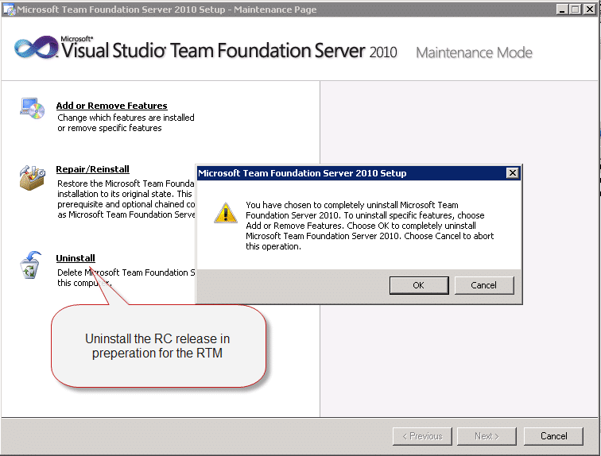  
{ .post-img }
**Figure: Remove Visual Studio 2010 Team Foundation Server RC from the system.**

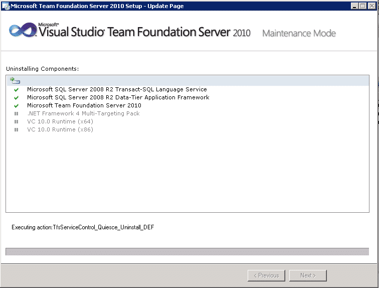  
{ .post-img }
**Figure: Most of the heavy lifting is done by the Uninstaller, but make sure you have removed any of the client bits first. Specifically Visual Studio 2010 or Team Explorer 2010.**

Once the uninstall is complete, this took around 5 minutes for me, you can begin the install of the RTM. Running the 64 bit OS will allow the application to use more than 2GB RAM, which while not common may be of use in heavy load situations.

  
{ .post-img }
**Figure: It is always recommended to install the 64bit version of a server application where possible. I do not think it is likely, with SharePoint 2010 and Exchange 2010  and even Windows Server 2008 R2 being 64 bit only, I do not think there will be another release of a server app that is 32bit.**

You then need to choose what it is you want to install. This depends on how you are running TFS and on how many servers. In our case we run TFS and the Team Foundation Build Service (controller only) on out TFS server along with Analysis services and Reporting Services. But our SharePoint server lives elsewhere.

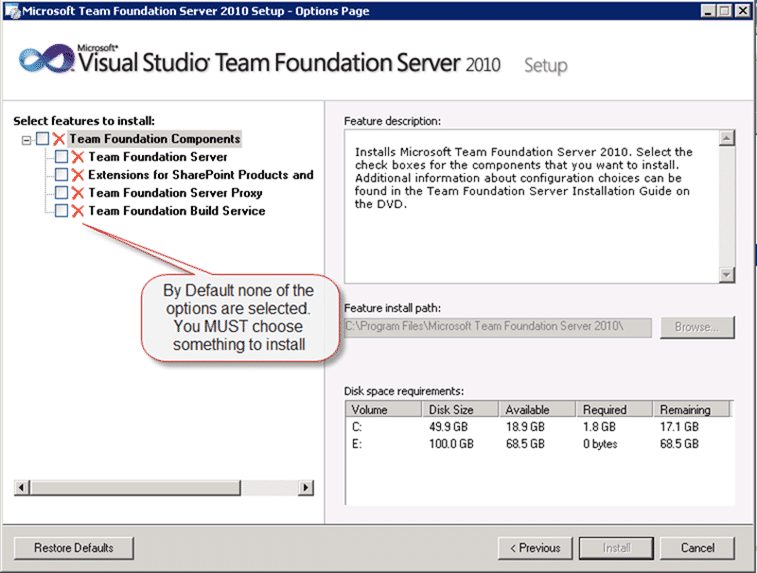  
{ .post-img }
**Figure: This always confuses people, but in reality it makes sense. Don’t install what you do not need. Every extra you install has an impact of performance.**

If you are integrating with SharePoint you will need to run this install on every Front end server in your farm and don’t forget to upgrade your Build servers and proxy servers later.

  
{ .post-img }
**Figure: Selecting only Team Foundation Server (TFS) and Team Foundation Build Services (TFBS)**

It is worth noting that if you have a lot of builds kicking off, and hence a lot of get operations against your TFS server, you can use a proxy server to cache the source control on another server in between your TFS server and your build servers.

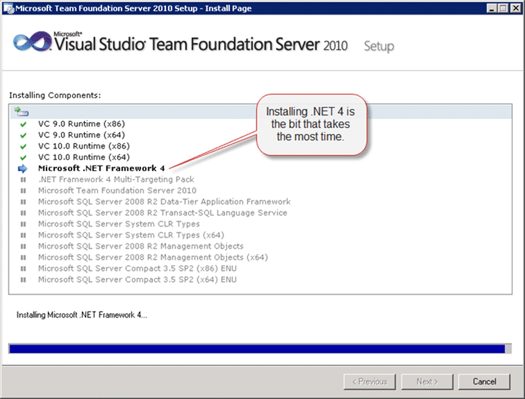  
{ .post-img }
**Figure: Installing Microsoft .NET Framework 4 takes the most time.**

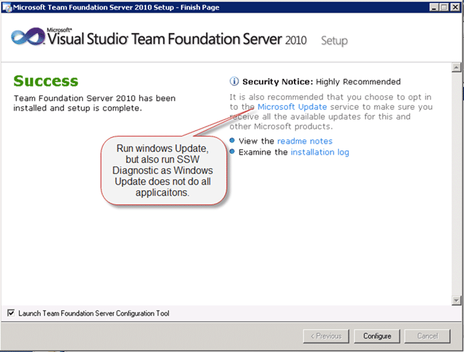  
{ .post-img }
**Figure: Now run Windows Update, and [SSW Diagnostic](http://www.ssw.com.au/ssw/Diagnostics/Default.aspx) to make sure all your bits and bobs are up to date.**  
Note: [SSW Diagnostic](http://www.ssw.com.au/ssw/Diagnostics/Default.aspx) will check your Power Tools, Add-on’s, Check in Policies and other bits as well.

## Configure Team Foundation Server 2010 – Done

Now you can configure the server. If you have no key you will need to pick “Install a Trial License”, but it is only £500, or free with a MSDN subscription. Anyway, if you pick Trial you get 90 days to get your key.  
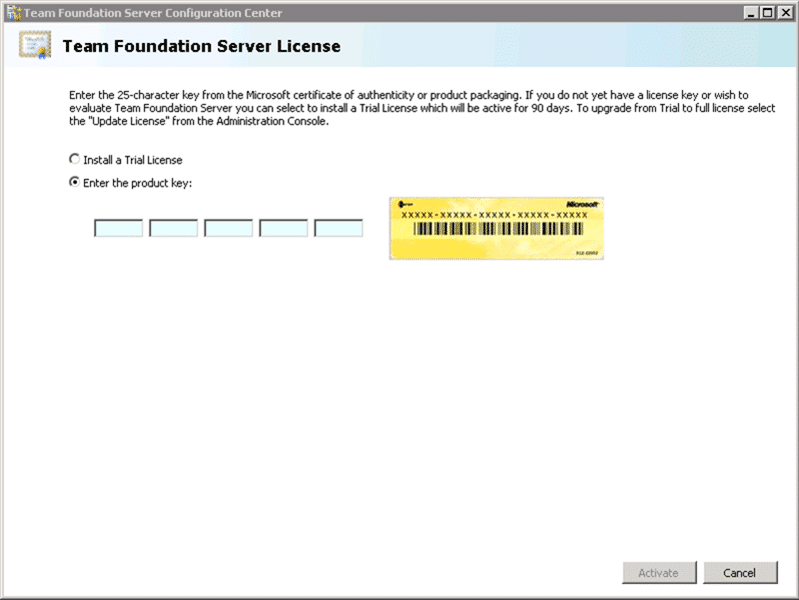  
{ .post-img }
**Figure: You can pick trial and add your key later using the TFS Server Admin.**

Here is where the real choices happen. We are doing an Upgrade from a previous version, so I will pick Upgrade the same as all you folks that are using the RC or TFS 2008.

  
{ .post-img }
**Figure: The upgrade wizard takes your existing 2010 or 2008 databases and upgraded them to the release.**

Once you have entered your database server name you can click “List available databases” and it will show what it can upgrade.

  
{ .post-img }
**Figure: Select your database from the list and at this point, make sure you have a valid backup. At this point you have not made ANY changes to the databases.**

At this point the configuration wizard will load configuration from your existing database if you have one. If you are upgrading TFS 2008 refer to [Rules To Better TFS 2010 Migration](http://sharepoint.ssw.com.au/Standards/TFS/RulesToBetterTFS2010Migration/Pages/default.aspx "Rules To Better TFS 2010 Migration").

Mostly during the wizard the default values will suffice, but depending on the configuration you want you can pick different options.

  
{ .post-img }
**Figure: Set the application tier account and Authentication method to use. We use NTLM to keep things simple as we host our TFS server externally for our remote developers.**

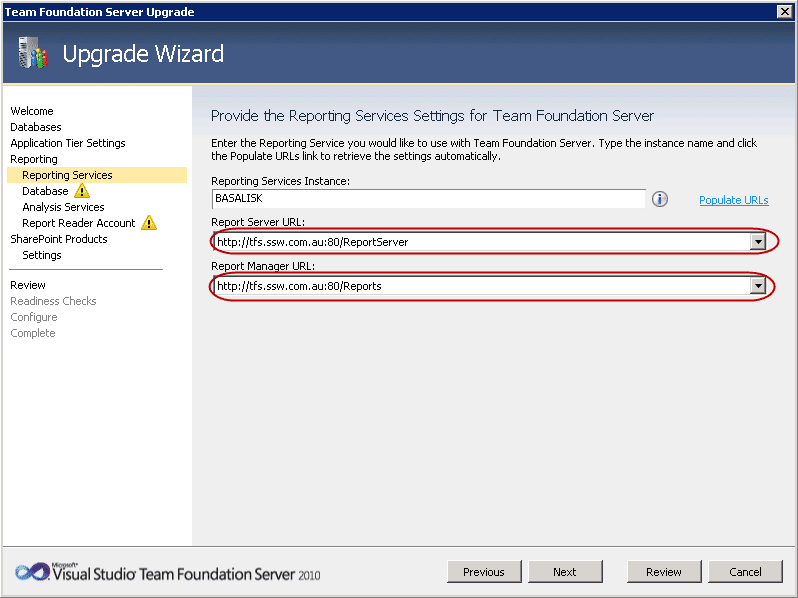  
{ .post-img }
**Figure: Setting your TFS server URL’s to be the remote URL’s allows the reports to be accessed without using VPN. Very handy for those remote developers.**

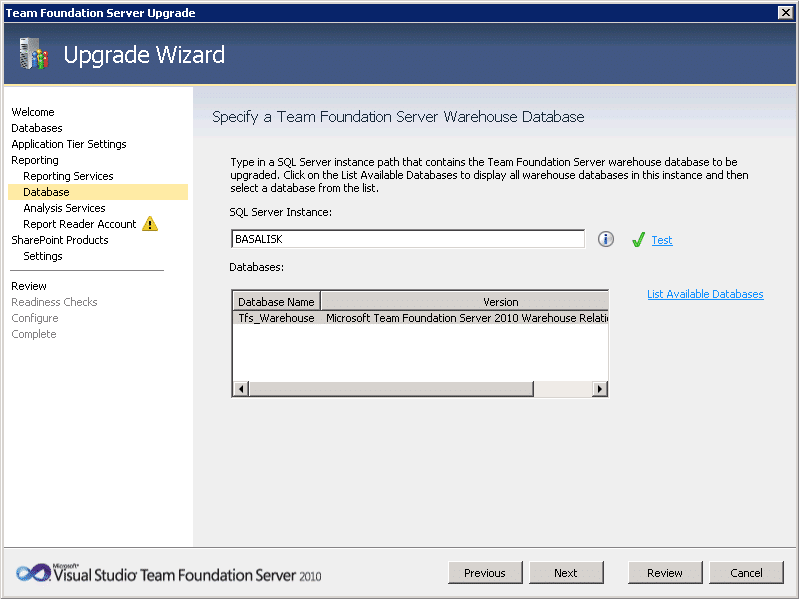  
{ .post-img }
**Figure: Detected the existing Warehouse no problem.  
**  
{ .post-img }
**Figure: Again we love green ticks. It gives us a warm fuzzy feeling.**

  
{ .post-img }
**Figure: The username for connecting to Reporting services should be a domain account (if you are on a domain that is).  
**  
{ .post-img }
**Figure: Setup the SharePoint integration to connect to your external SharePoint server. You can take the option to connect later.**

You then need to run all of your readiness checks. These checks can save your life! it will check all of the settings that you have entered as well as checking all the external services are configures and running properly. There are two reasons that TFS 2010 is so easy and painless to install where previous versions were not. Microsoft changes the install to two steps, Install and configuration. The second reason is that they have pulled out all of the stops in making the install run all the checks necessary to make sure that once you start the install that it will complete. if you find any errors I recommend that you report them on [http://connect.microsoft.com](http://connect.microsoft.com) so everyone can benefit from your misery. 
{ .post-img }

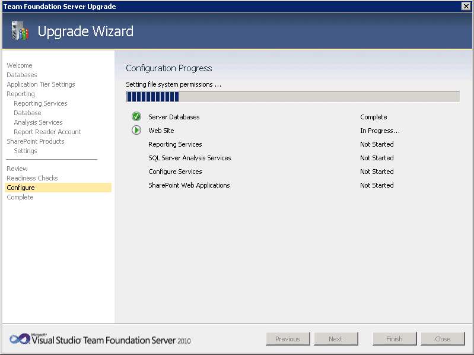  
{ .post-img }
**Figure: Took a while on the “Web site” stage for some point, but zipped though after that.**

  
{ .post-img }
**Figure: Now we have everything setup the configuration wizard can do its work.**

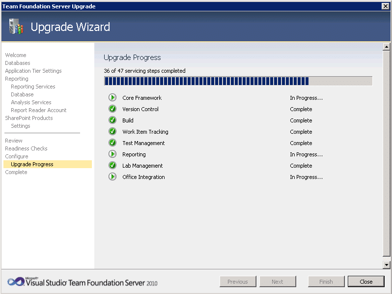
{ .post-img }

**Figure: last wee bit. TFS Needs to do a little tinkering with the data to complete the upgrade.**

  
{ .post-img }
**Figure: All upgraded. I am not worried about the yellow triangle as SharePoint was being a little silly**

> Exception Message: TF254021: The account name or password that you specified is not valid. (type TfsAdminException)
>
> Exception Stack Trace:    at Microsoft.TeamFoundation.Management.Controls.WizardCommon.AccountSelectionControl.TestLogon(String connectionString)  
>    at System.ComponentModel.BackgroundWorker.WorkerThreadStart(Object argument)
>
> \[Info   @16:10:16.307\] Benign exception caught as part of verify:  
> Exception Message: TF255329: The following site could not be accessed: [http://projects.ssw.com.au/](http://projects.ssw.com.au/). The server that you specified did not return the expected response. Either you have not installed the Team Foundation Server Extensions for SharePoint Products on this server, or a firewall is blocking access to the specified site or the SharePoint Central Administration site. For more information, see the Microsoft Web site ([http://go.microsoft.com/fwlink/?LinkId=161206)](http://go.microsoft.com/fwlink/?LinkId=161206)). (type TeamFoundationServerException)
>
> Exception Stack Trace:    at Microsoft.TeamFoundation.Client.SharePoint.WssUtilities.VerifyTeamFoundationSharePointExtensions(ICredentials credentials, Uri url)  
>    at Microsoft.TeamFoundation.Admin.VerifySharePointSitesUrl.Verify()
>
> Inner Exception Details:
>
> Exception Message: TF249064: The following Web service returned an response that is not valid: [http://projects.ssw.com.au/\_vti_bin/TeamFoundationIntegrationService.asmx](http://projects.ssw.com.au/_vti_bin/TeamFoundationIntegrationService.asmx). This Web service is used for the Team Foundation Server Extensions for SharePoint Products. Either the extensions are not installed, the request resulted in HTML being returned, or there is a problem with the URL. Verify that the following URL points to a valid SharePoint Web application and that the application is available: [http://projects.ssw.com.au](http://projects.ssw.com.au). If the URL is correct and the Web application is operating normally, verify that a firewall is not blocking access to the Web application. (type TeamFoundationServerInvalidResponseException)  
> Exception Data Dictionary:  
> ResponseStatusCode = InternalServerError

I’ll look at SharePoint after, probably the SharePoint box just needs a restart or a kick  If there is a problem with SharePoint it will come out in testing, But I will defiantly be passing this on to Microsoft.
{ .post-img }

## Upgrading the SharePoint connector to TFS 2010

You will need to upgrade the Extensions for SharePoint Products and Technologies on all of your SharePoint farm front end servers. To do this uninstall  the TFS 2010 RC from it in the same way as the server, and then install just the RTM Extensions.

  
{ .post-img }
**Figure: Only install the SharePoint Extensions on your SharePoint front end servers. TFS 2010 supports both SharePoint 2007 and SharePoint 2010.**

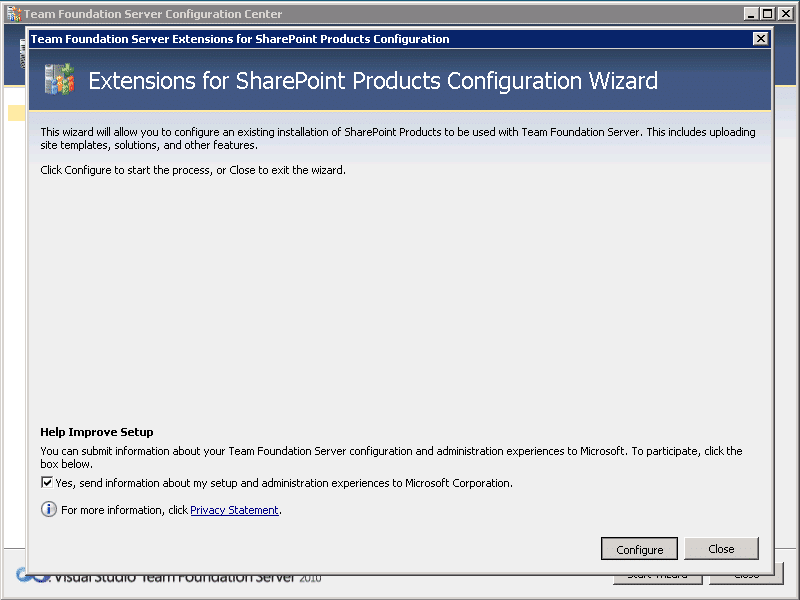  
{ .post-img }
**Figure: When you configure SharePoint it uploads all of the solutions and templates.**

  
{ .post-img }
**Figure: Everything is uploaded successfully.**

  
{ .post-img }
**Figure: TFS even remembered the settings from the previous installation, fantastic.**

## Upgrading the Team Foundation Build Servers to TFS 2010

Just like on the SharePoint servers you will need to upgrade the Build Server to the RTM. Just uninstall TFS 2010 RC and then install only the Team Foundation Build Services component. Unlike on the SharePoint server you will probably have some version of Visual Studio installed. You will need to remove this as well.

  
{ .post-img }
**Figure: You only need to install the Team Foundation Build Service.**

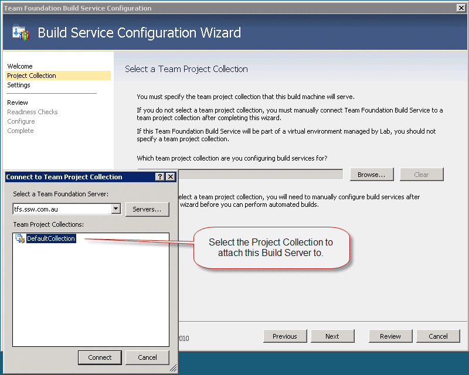   
{ .post-img }
**Figure: Team Build Services only work with one Team Project Collection so you need to select one.  
**  
{ .post-img }
**Figure: Now that you have selected a Project Collection, you can choose a Controller.**

You should only have more than one Build Agent running if you have more processors and lots of RAM.

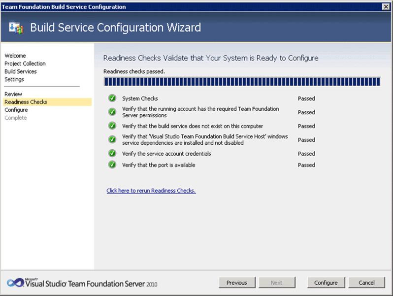  
{ .post-img }
**Figure: All checks passed**

  
{ .post-img }
**Figure: Configuration complete.**

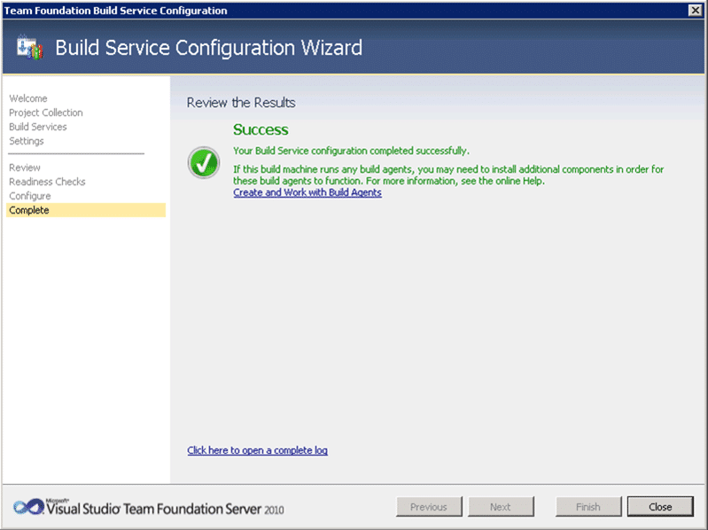  
{ .post-img }
**Figure: Lots of little green ticks makes on big one!**

## Testing the Team Foundation Server

{ .post-img }

**Figure: Team Web Access is working**

  
{ .post-img }
**Figure: VS2010 RC connecting to TFS2010 RTM**

## Connecting Visual Studio 2010 / 2008 / 2005 and Eclipse to TFS2010

You will have no problems connecting to TFS2010 from VS2010 RC or VS2010 RTM, but what about legacy versions of Visual Studio or developers working with Java?

If you have developers still on Visual Studio 2005 or 2008 you will need do download the respective compatibility pack:

- [Visual Studio Team System 2005 Service Pack 1 Forward Compatibility Update for Team Foundation Server 2010](http://www.microsoft.com/downloads/details.aspx?FamilyID=22215e4c-af6f-4e2f-96df-20e94d762689&displaylang=en "http://www.microsoft.com/downloads/details.aspx?FamilyID=22215e4c-af6f-4e2f-96df-20e94d762689&displaylang=en")
- [Visual Studio Team System 2008 Service Pack 1 Forward Compatibility Update for Team Foundation Server 2010](http://www.microsoft.com/downloads/details.aspx?familyid=CF13EA45-D17B-4EDC-8E6C-6C5B208EC54D&displaylang=en)

If you are using Eclipse you can download the new [Team Explorer Everywhere](http://www.microsoft.com/downloads/details.aspx?displaylang=en&FamilyID=3c9454e0-523a-4ee1-b436-5c6fc2110b34) install for connecting to TFS.

Get your developers to check that you have the latest version of your applications with [SSW Diagnostic](http://www.google.co.uk/url?sa=t&source=web&ct=res&cd=1&ved=0CAgQFjAA&url=http%3A%2F%2Fwww.ssw.com.au%2Fssw%2FDiagnostics%2FDefault.aspx&rct=j&q=SSW+diagnostic&ei=bwLDS-DUD8n3-Qam0KDJCA&mk=0&mb=2&usg=AFQjCNH8Q1imMZTTiqT544Zf7wmLd_lj2A&sig2=SC4YIDhaN5qEfUdR3ygcVQ) which will check for Service Packs and hot fixes to Visual Studio as well.

Technorati Tags: [TFS 2010](http://technorati.com/tags/TFS+2010) [ALM](http://technorati.com/tags/ALM) [TFBS](http://technorati.com/tags/TFBS) [SSW](http://technorati.com/tags/SSW) [VS 2010](http://technorati.com/tags/VS+2010) [TFS 2008](http://technorati.com/tags/TFS+2008) [SP 2010](http://technorati.com/tags/SP+2010) [TFS](http://technorati.com/tags/TFS) [SharePoint](http://technorati.com/tags/SharePoint) [VS 2005](http://technorati.com/tags/VS+2005)
