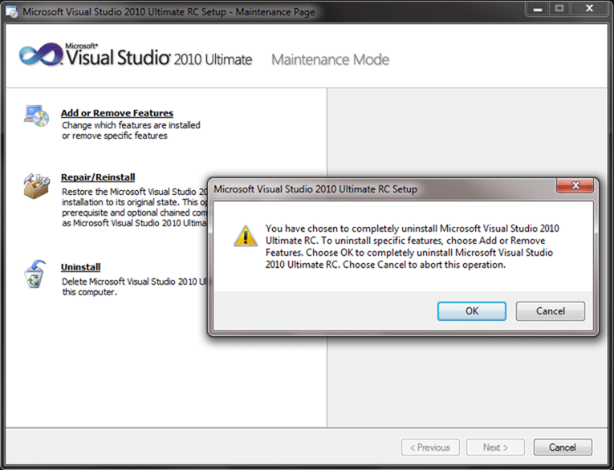
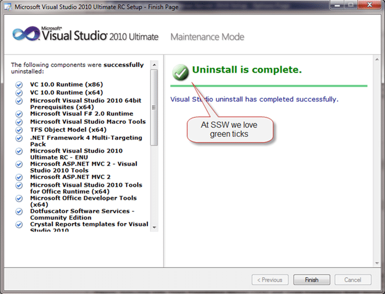

I have been running Visual Studio 2010 as my main development studio on my development computer since the RC was released. I need to upgrade that to the RTM, but first I need to remove it. Microsoft have done a lot of work to make this easy, and it works. Its as easy as uninstalling from the control panel.
{ .post-img }

I have had may previous versions of Visual Studio 2010 on this same computer with no need to rebuild to remove all the bits.

  
{ .post-img }
**Figure: Run the uninstall from the control panel to remove Visual Studio 2010 RC**

  
{ .post-img }
**Figure: The uninstall removes everything for you.**

  
{ .post-img }
**Figure: A green tick means the everything went OK. If you get a red cross, try installing the RTM anyway and it should warn you with what was not uninstalled properly and you can remove it manually.**

Once you have VS2010 RC uninstalled installing should be a breeze. The install for 2010 is much faster than 2008. Which could take all day, and then some on slower computers. This takes around 20 minutes even on my small laptop. I always do a full install as although I have to do c# I sometimes get to use a proper programming language  VB.NET. Seriously, there is nothing worse than trying to open a project and the other developer has used something you don't have. Its not their fault. Its yours! Save yourself the angst and install Fully, its only 5.9GB.
{ .post-img }

  
{ .post-img }
**Figure: I always select all of the options.**

If you have just uninstalled the .NET 4 RC then you will probably be asked to restart  But it is a necessary evil.
{ .post-img }

**Now go forth and develop! Preferably in VB.NET…**

Technorati Tags: [VS 2010](http://technorati.com/tags/VS+2010) [Visual Studio](http://technorati.com/tags/Visual+Studio)
