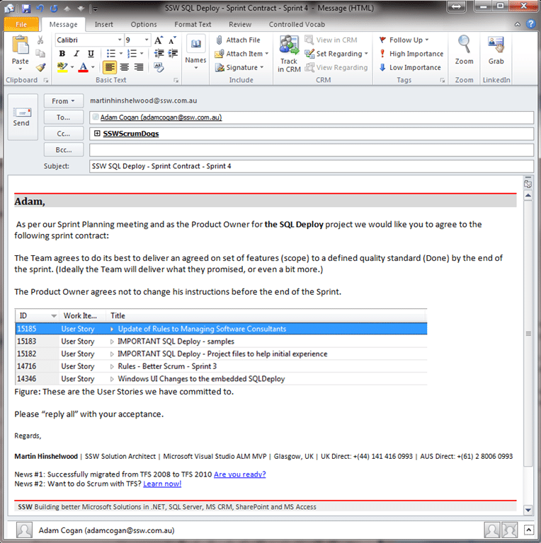

Working in Scrum it is useful to define a Sprint Contract between the Product Owner (PO) and the implementation Team. Doing this helps to improve common understanding in, and sometimes to enforce, the relationship between the PO and the Team.
{ .post-img }

Update 14th April 2010

- Rule added to [Rules to better Scrum with TFS](http://sharepoint.ssw.com.au/Standards/Management/RulesToBetterScrumUsingTFS/Pages/default.aspx)

---

This is simply an agreement between the PO for one Sprint and is not really a commercial contract and should be confirmed via an e-mail at the beginning of every Sprint.

> “The implementation team agrees to do its best to deliver an agreed on set of features (scope) to a defined quality standard by the end of the sprint. (Ideally they deliver what they promised, or even a bit more.) The Product Owner agrees not to change his instructions before the end of the Sprint.”  
> \- Agile Project management ([http://agilesoftwaredevelopment.com/blog/peterstev/10-agile-contracts#Sprint](http://agilesoftwaredevelopment.com/blog/peterstev/10-agile-contracts#Sprint))

Each of the Sprints in a Scrum project can be considered a mini-project that has Time (Sprint Length), Scope (Sprint Backlog), Quality (Definition of Done) and Cost (Team Size\*Sprint Length). Only the scope can vary and this is measured every sprint.

{ .post-img }

**Figure: Good Example, the product owner should reply to the team and commit to the contract**

Technorati Tags: [SSW](http://technorati.com/tags/SSW) [Scrum](http://technorati.com/tags/Scrum) [SSW Rules](http://technorati.com/tags/SSW+Rules) [SP 2010](http://technorati.com/tags/SP+2010) [SharePoint](http://technorati.com/tags/SharePoint)
