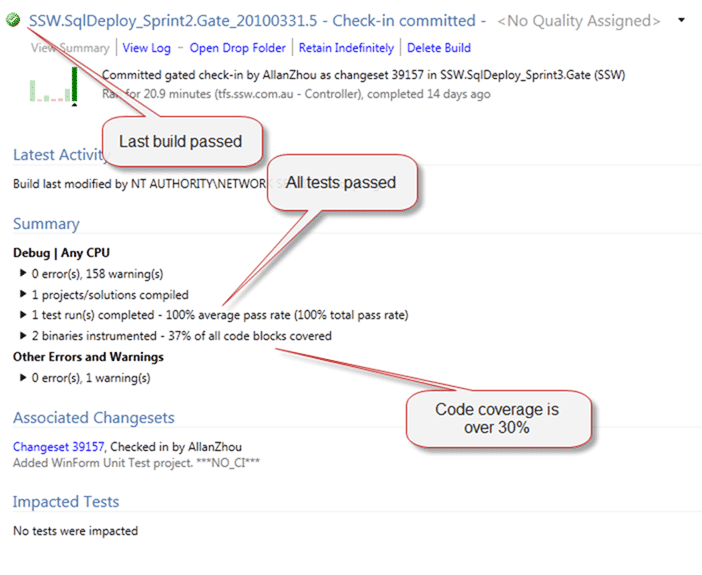

At SSW we have always sent done emails to the owner/requestor to let them know that it is done. Others who are dependent on that tasks are CC’ed so they know they can proceed. But how does that fit into Scrum?
{ .post-img }

Update 14th April 2010

- Rule added to [Rules to better Scrum with TFS](http://sharepoint.ssw.com.au/Standards/Management/RulesToBetterScrumUsingTFS/Pages/default.aspx)

---

## If you are working on a task:

When you complete a Task that is part of a User Story you need to send a done email to the [Owner of that Story](http://sharepoint.ssw.com.au/Standards/Management/RulesToBetterScrumUsingTFS/Pages/OwnerForEveryUserStory.aspx).

You only need to add the Task #, Summary and link to the item in WIWA. Remember that all your tasks should be [under 4 hours](http://sharepoint.ssw.com.au/Standards/Management/RulesToBetterScrumUsingTFS/Pages/BreakLargeTasks.aspx), do spending lots of time on a [Done Email](http://www.ssw.com.au/ssw/Standards/Rules/RulesToBetterEmail.aspx#ReplyAndDelete) for a Task would be counter productive. Add more information if required, for example you may have completed the task a different way than previously discussed.

Make sure that [every User Story has an Owner](http://sharepoint.ssw.com.au/Standards/Management/RulesToBetterScrumUsingTFS/Pages/OwnerForEveryUserStory.aspx) as per the rules.

## If you are the owner of a story:

When you complete a story you should send a [comprehensive done email](http://www.ssw.com.au/ssw/Standards/Rules/RulesToBetterEmail.aspx#ReplyAndDelete) as per the rules when the story had been completed. Make sure you add a list of all of the Tasks that were completed as part of the story and the Done criteria that you completed.

If your done criteria says:

1. Built Successfully
2. 30% Code Coverage
3. All tests passed

Then add an illustration to show this.

  
{ .post-img }
**Figure: Show that you have met your Done criteria where possible.**

This is all designed to help you Scrum Team members (Product Owner, ScrumMaster and Team) validate the quality of the work that has been completed. Remember that you are not DONE until your team says you are done.

Technorati Tags: [SSW](http://technorati.com/tags/SSW) [Scrum](http://technorati.com/tags/Scrum) [SSW Rules](http://technorati.com/tags/SSW+Rules) [SP 2010](http://technorati.com/tags/SP+2010) [SharePoint](http://technorati.com/tags/SharePoint)
