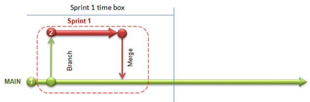
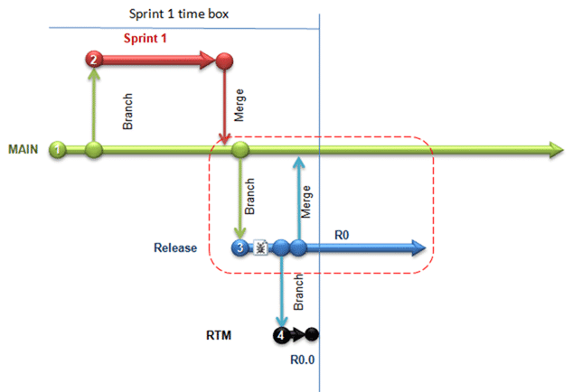
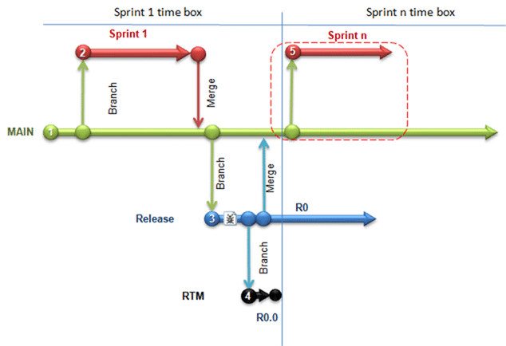
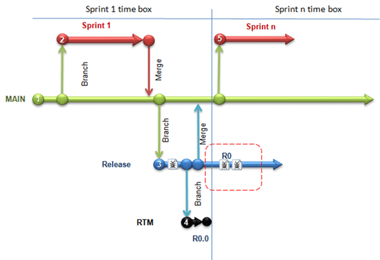
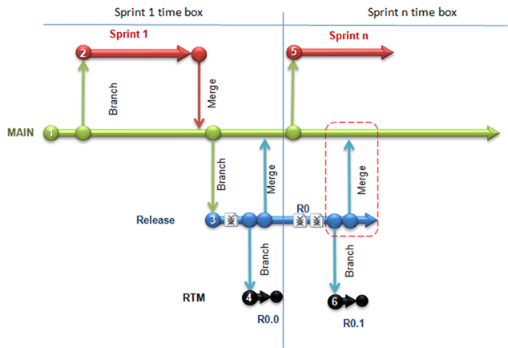
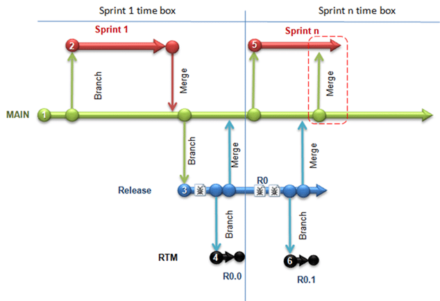

Having a good branching strategy will save your bacon, or at least your code. Be careful when deviating from your branching strategy because if you do, you may be worse off than when you started!
{ .post-img }

This is one possible branching strategy for Scrum teams and I will not be going in depth with Scrum but you can find out more about Scrum by reading the [Scrum Guide](http://www.scrum.org/scrumguides/) and you can even assess your Scrum knowledge by having a go at the [Scrum Open Assessment](http://www.scrum.org/scrumopen/). You can also read SSW’s [Rules to Better Scrum using TFS](http://sharepoint.ssw.com.au/Standards/Management/RulesToBetterScrumUsingTFS/Pages/default.aspx) which have been developed during our own Scrum implementations.

Acknowledgements

- [Bill Heys](http://blogs.msdn.com/billheys/) – Bill offered some good feedback on this post and helped soften the language.  
    Note: Bill is a [VS ALM Ranger](http://msdn.microsoft.com/en-us/vstudio/ee358786.aspx) and co-wrote the [Branching Guidance](http://tfsbranchingguideiii.codeplex.com/) for TFS 2010
- [Willy-Peter Schaub](http://blogs.msdn.com/willy-peter_schaub/) – Willy-Peter is an ex Visual Studio ALM MVP turned blue badge and has been involved in most of the guidance including the [Branching Guidance](http://tfsbranchingguideiii.codeplex.com/) for TFS 2010
- [Chris Birmele](http://blogs.msdn.com/chrisbirmele/) – Chris wrote some of the early TFS [Branching and Merging Guidance](http://msdn.microsoft.com/en-us/library/aa730834(VS.80).aspx).
- [Dr Paul Neumeyer](http://sharepoint.ssw.com.au/AboutUs/Employees/Pages/Paul.aspx), Ph.D Parallel Processes, ScrumMaster and SSW Solution Architect – Paul wanted to have feature branches coming from the release branch as well. We agreed that this is really a spin-off that needs own project, backlog, budget and Team.  
    Scenario: A product is developed RTM 1.0 is released and gets great sales.  Extra features are demanded but the new version will have double to price to pay to recover costs, work is approved by the guys with budget and a few sprints later RTM 2.0 is released.  Sales a very low due to the pricing strategy. There are lots of clients on RTM 1.0 calling out for patches.

As I keep getting Reverse Integration and Forward Integration mixed up and Bill keeps slapping my wrists I thought I should have a reminder:

> _You still seemed to use reverse and/or forward integration in the wrong context. I would recommend reviewing your document at the end to ensure that it agrees with the common understanding of these terms merge (forward integration) from parent to child (same direction as the branch), and merge  (reverse integration) from child to parent (the reverse direction of the branch).  
> \- one of my many slaps on the wrist from [Bill Heys](http://blogs.msdn.com/billheys/)._

Updates 15th April 2010

- [Ian Ceicys](http://blogs.msdn.com/iceicys/) – Ian provided some corrections and clarity improvements as well as some good discussion on wither you should delete a sprint once it is complete. This I think is a preference thing as deleting a branch does not remove the history, just the future.

Update 17th May 2010 – We are currently trialling running a single Sprint branch to improve our history.

* * *

As I [mentioned previously](http://blog.hinshelwood.com/archive/2010/04/08/creating-a-branch-for-every-sprint.aspx "Create a branch for every sprint") we are using a single feature branching strategy in our current project.

The **single biggest mistake** developers make is developing against the “Main” or “Trunk” line. This ultimately leads to messy code as things are added and never finished. Your only alternative is to NEVER check in unless your code is 100%, but this does not work in practice, even with a single developer. Your ADD will kick in and your half-finished code will be finished enough to pass the build and the tests. You do [use builds](http://blog.hinshelwood.com/archive/2010/03/18/do-you-know-the-minimum-builds-to-create-on-any.aspx "Do you know the minimum builds to create on any branch?") don’t you?

> _Sadly, this is a very common scenario and I have had people argue that branching merely adds complexity. Then again I have seen the other side of the universe ... branching  structures from he... We should somehow convince everyone that there is a happy between no-branching and too-much-branching.  
> \- [**Willy-Peter Schaub**](http://blogs.msdn.com/willy-peter_schaub/), VS ALM Ranger, Microsoft_

> _A key benefit of branching for development is to isolate changes from the stable Main branch. Branching adds sanity more than it adds complexity. We do try to stress in our guidance that it is important to justify a branch, by doing a cost benefit analysis. The primary cost is the effort to do merges and resolve conflicts. A key benefit is that you have a stable code base in Main and accept changes into Main only after they pass quality gates, etc.  
> \- [**Bill Heys**](http://blogs.msdn.com/billheys/), VS ALM Ranger & TFS Branching Lead, Microsoft_

The **second biggest mistake** developers make is branching anything other than the WHOLE “Main” line. If you branch parts of your code and not others it gets out of sync and can make integration a nightmare. You should have your Source, Assets, Build scripts deployment scripts and dependencies inside the “Main” folder and branch the whole thing. Some departments within MSFT even go as far as to add the environments used to develop the product in there as well; although I would not recommend that unless you have a massive SQL cluster to house your source code.

> _We tried the “add environment” back in South-Africa and while it was “phenomenal”, especially when having to switch between environments, the disk storage and processing requirements killed us. We opted for virtualization to skin this cat of keeping a ready-to-go environment handy.  
> \- [**Willy-Peter Schaub**](http://blogs.msdn.com/willy-peter_schaub/), VS ALM Ranger, Microsoft_

> _I think people often think that you should have separate branches for separate environments (e.g. Dev, Test, Integration Test, QA, etc.). I prefer to think of deploying to environments (such as from Main to QA) rather than branching for QA).  
> \- [**Bill Heys**](http://blogs.msdn.com/billheys/), VS ALM Ranger & TFS Branching Lead, Microsoft_

You can read about SSW’s [Rules to better Source Control](http://www.ssw.com.au/ssw/Standards/Rules/RulesToBetterSourceControlwithTFS.aspx "http://www.ssw.com.au/ssw/Standards/Rules/RulesToBetterSourceControlwithTFS.aspx") for some additional information on what Source Control to use and how to use it.

There are also a number of branching Anti-Patterns that should be avoided at all costs:

> You know you are on the wrong track if you experience one or more of the following symptoms in your development environment:
> 
> - **Merge Paranoia**—avoiding merging at all cost, usually because of a fear of the consequences.
> - **Merge Mania**—spending too much time merging software assets instead of developing them.
> - **Big Bang Merge**—deferring branch merging to the end of the development effort and attempting to merge all branches simultaneously.
> - **Never-Ending Merge**—continuous merging activity because there is always more to merge.
> - **Wrong-Way Merge**—merging a software asset version with an earlier version.
> - **Branch Mania**—creating many branches for no apparent reason.
> - **Cascading Branches**—branching but never merging back to the main line.
> - **Mysterious Branches**—branching for no apparent reason.
> - **Temporary Branches**—branching for changing reasons, so the branch becomes a permanent temporary workspace.
> - **Volatile Branches**—branching with unstable software assets shared by other branches or merged into another branch.  
>     **Note**   Branches are volatile most of the time while they exist as independent branches. That is the point of having them. The difference is that you should not share or merge branches while they are in an unstable state.
> - **Development Freeze**—stopping all development activities while branching, merging, and building new base lines.
> - **Berlin Wall**—using branches to divide the development team members, instead of dividing the work they are performing.
> 
> \-[Branching and Merging Primer](http://msdn.microsoft.com/en-us/library/aa730834(VS.80).aspx) by Chris Birmele - Developer Tools Technical Specialist at Microsoft Pty Ltd in Australia

> _In fact, this can result in a merge exercise no-one wants to be involved in, merging hundreds of thousands of change sets and trying to get a consolidated build. Again, we need to find a happy medium.  
> \- [**Willy-Peter Schaub**](http://blogs.msdn.com/willy-peter_schaub/) on **Merge Paranoia**_

> _Merge conflicts are generally the result of making changes to the same file in both the target and source branch. If you create merge conflicts, you will eventually need to resolve them. Often the resolution is manual. Merging more frequently allows you to resolve these conflicts close to when they happen, making the resolution clearer. Waiting weeks or months to resolve them, the Big Bang approach, means you are more likely to resolve conflicts incorrectly.  
> \- [**Bill Heys**](http://blogs.msdn.com/billheys/), VS ALM Ranger & TFS Branching Lead, Microsoft_

  
{ .post-img }
**Figure: Main line, this is where your stable code lives and where any build has known entities, always passes and has a happy test that passes as well?**

Many development projects consist of, a single “Main” line of source and artifacts. This is good; at least there is source control . There are however a couple of issues that need to be considered.
{ .post-img }

What happens if:

- you and your team are working on a new set of features and the customer wants a change to his current version?
- you are working on two features and the customer decides to abandon one of them?
- you have two teams working on different feature sets and their changes start interfering with each other?
- I just use labels instead of branches?

That's a lot of “what if’s”, but there is a simple way of preventing this. Branching…

> _In TFS, labels are not immutable. This does not mean they are not useful. But labels do not provide a very good development isolation mechanism. Branching allows separate code sets to evolve separately (e.g. Current with hotfixes, and vNext with new development). I don’t see how labels work here.  
> \- [**Bill Heys**](http://blogs.msdn.com/billheys/), VS ALM Ranger & TFS Branching Lead, Microsoft_

  

{ .post-img }

**Figure: Creating a single feature branch means you can isolate the development work on that branch.**

Its standard practice for large projects with lots of developers to use Feature branching and you can check the [Branching Guidance](http://tfsbranchingguideiii.codeplex.com/) for the latest recommendations from the Visual Studio ALM Rangers for other methods.

In the diagram above you can see my recommendation for branching when using Scrum development with TFS 2010. It consists of a single Sprint branch to contain all the changes for the current sprint. The main branch has the permissions changes so contributors to the project can only Branch and Merge with “Main”. This will prevent accidental check-ins or checkouts of the “Main” line that would contaminate the code. The developers continue to develop on sprint one until the completion of the sprint.

Note: In the real world, starting a new Greenfield project, this process starts at Sprint 2 as at the start of Sprint 1 you would not have artifacts in version control and no need for isolation.

   
{ .post-img }
**Figure: Once the sprint is complete the Sprint 1 code can then be merged back into the Main line.**

There are always good practices to follow, and one is to always do a Forward Integration from Main into Sprint 1 before you do a Reverse Integration from Sprint 1 back into Main. In this case it may seem superfluous, but this builds good muscle memory into your developer’s work ethic and means that no bad habits are learned that would interfere with additional Scrum Teams being added to the Product.

The process of completing your sprint development:

1. The Team completes their work according to their definition of done.
2. Merge from “Main” into “Sprint1” (Forward Integration)
3. Stabilize your code with any changes coming from other Scrum Teams working on the same product. If you have one Scrum Team this should be quick, but there may have been bug fixes in the Release branches. (we will talk about release branches later)
4. Merge from “Sprint1” into “Main” to commit your changes. (Reverse Integration)
5. Check-in
6. Delete the Sprint1 branch  
    Note: The Sprint 1 branch is no longer required as its useful life has been concluded.  
    Note: In TFS deleting the Sprint 1 branch does not remove access to the to the history it just removes a future for that branch.  
    Note: If you do not like this option you can lock the files on the branch or change it to read only.
7. Check-in
8. Done

But you are not yet done with the Sprint. The goal in Scrum is to have a “potentially shippable product” at the end of every Sprint, and we do not have that yet, we only have finished code.

   
{ .post-img }
**Figure: With Sprint 1 merged you can create a Release branch and run your final packaging and testing**

> _In 99% of all projects I have been involved in or watched, a “shippable product” only happens towards the end of the overall lifecycle, especially when sprints are short. The in-between releases are great demonstration releases, but not shippable. Perhaps it comes from my 80’s brain washing that we only ship when we reach the agreed quality and business feature bar.  
> \- [**Willy-Peter Schaub**](http://blogs.msdn.com/willy-peter_schaub/), VS ALM Ranger, Microsoft_

Although you should have been testing and packaging your code all the way through your Sprint 1 development, preferably using an automated process, you still need to test and package with stable unchanging code. This is where you do what at SSW we call a “Test Please”. This is first an internal test of the product to make sure it meets the needs of the customer and you generally use a resource external to your Team. Then a “Test Please” is conducted with the Product Owner to make sure he is happy with the output.

You can read about how to conduct a Test Please on our [Rules to Successful Projects](http://www.ssw.com.au/ssw/Standards/Rules/RulestoSuccessfulProjects.aspx):

- [Do you conduct an internal "test please" prior to releasing a version to a client?](http://www.ssw.com.au/ssw/Standards/Rules/RulestoSuccessfulProjects.aspx#TestPlease "http://www.ssw.com.au/ssw/Standards/Rules/RulestoSuccessfulProjects.aspx#TestPlease")

   
{ .post-img }
**Figure: If you find a deviation from the expected result you fix it on the Release branch.**

If during your final testing or your “Test Please” you find there are issues or bugs then you should fix them on the release branch. If you can’t fix them within the time box of your Sprint, then you will need to create a Bug and put it onto the backlog for prioritization by the Product owner. Make sure you leave plenty of time between your merge from the development branch to find and fix any problems that are uncovered.

This process is commonly called Stabilization and should always be conducted once you have completed all of your User Stories and integrated all of your branches. Even once you have stabilized and released, you should not delete the release branch as you would with the Sprint branch. It has a usefulness for servicing that may extend well beyond the limited life you expect of it.

Note: Don't get forced by the business into adding features into a Release branch instead that indicates the unspoken requirement is that they are asking for a product spin-off. In this case you can create a new Team Project and branch from the required Release branch to create a new Main branch for that product. And you create a whole new backlog to work from.

   
{ .post-img }
**Figure: When the Team decides it is happy with the product you can create a RTM branch.**

Once you have fixed all the bugs you can, and added any you can’t to the Product Backlog, and you Team is happy with the result you can create a Release. This would consist of doing the final Build and Packaging it up ready for your Sprint Review meeting.

You would then create a read-only branch that represents the code you “shipped”, commonly referred to as RTM(Released to Market). This is really an Audit trail branch that is optional, but is good practice.This is really an Audit trail branch that is optional, but is good practice.

You could use a Label, but Labels are not Auditable and if a dispute was raised by the customer you can produce a verifiable version of the source code for an independent party to check. Rare I know, but you do not want to be at the wrong end of a legal battle. Like the Release branch the RTM branch should never be deleted, or only deleted according to your companies legal policy, which in the UK is usually 7 years.

   
{ .post-img }
**Figure: If you have made any changes in the Release you will need to merge back up to Main in order to finalise the changes.**

Nothing is really ever done done until it is in Main. (see common misconceptions of done [here](http://www.scrumalliance.org/articles/150-beware-of-the-evil--done) and [here](http://edgehopper.com/is-it-donedone-the-elusive-potentially-shippable-product-increment/)). You need to do a Reverse Integration merge from the Release Branch into Main to carry the bug fixes over into the next sprint.

Your Sprint is now nearly complete, and you can have a Sprint Review meeting knowing that you have made every effort and taken every precaution to protect your customer’s investment.

Note: In order to really achieve protection for both you and your client you would add Automated Builds, Automated Tests, Automated Acceptance tests, Acceptance test tracking, Unit Tests, Load tests, Web test and all the other good engineering practices that help produce reliable software.

> After branching Main to Release, we generally recommend not doing any subsequent merging (FI) from Main into the release branch.
> 
> In our guidance we suggest that once you are ready to release your code, you would branch Main to Release (making the vCurrent). This allows you to open Main for vNext development and stabilization.
> 
> If you later decide to merge hotfixes or service pack changes from Release to Main, you should be careful how you do this. It would probably NOT be a good idea to follow the same pattern we recommend for development (do one last FI from Main to Dev before doing the RI from Dev to Main). Doing one last FI from Main to Release would risk bringing vNext changes into Release.
> 
> Note – vNext might mean sprintNext, but I think the same considerations apply. For vCurrent, especially after doing some hotfixes, the Release branch should be at a higher level of quality and stability than the Main branch. You don’t want to bring vNext code into the vCurrent Release branch any more than you want to bring vNext Feature code from Dev to Main before it passes quality gates in the Feature branch.
> 
> \- [**Bill Heys**](http://blogs.msdn.com/billheys/), VS ALM Ranger & TFS Branching Lead, Microsoft

Bill’s comments are quite pertinent here as you may think it is a good idea to do another forward integration to bring new features from Main into an existing Release. You can do it, its not recommended, but be very very careful.

   
{ .post-img }
**Figure: After the Sprint Planning meeting the process begins again.**

Where the Sprint Review and Retrospective meetings mark the end of the Sprint, the Sprint Planning meeting marks the beginning. After you have completed your Sprint Planning and you know what you are trying to achieve in Sprint 2 you can create your new Branch to develop in.

  
 

* * *

## How do we handle a bug(s) in production that can’t wait?

Although in Scrum the only work done should be on the backlog there should be a little buffer added to the Sprint Planning for contingencies. One of these contingencies is a bug in the current release that can’t wait for the Sprint to finish. But how do you handle that?

[**Willy-Peter Schaub**](http://blogs.msdn.com/willy-peter_schaub/) asked an excellent question on the release activities:

> _In reality Sprint 2 starts when sprint 1 ends + weekend. Should we not cater for a possible parallelism between Sprint 2 and the release activities of sprint 1? It would introduce FI’s from main to sprint 2, I guess. Your “_**Figure: Merging Sprint 2 back into Main.**_” covers, what I tend to believe to be reality in most cases.  
> \- [**Willy-Peter Schaub**](http://blogs.msdn.com/willy-peter_schaub/), VS ALM Ranger, Microsoft_

I agree, and if you have a single Scrum team then your resources are limited. The Scrum Team is responsible for packaging and release, so at least one run at stabilization, package and release should be included in the Sprint time box. If more are needed on the current production release during the Sprint 2 time box then resource needs to be pulled from Sprint 2.

The Product Owner and the Team have four choices (in order of disruption/cost):

1. **Backlog**: Add the bug to the backlog and fix it in the next Sprint
2. **Buffer Time**: Use any buffer time included in the current Sprint to fix the bug quickly
3. **Make time**: Remove a Story from the current Sprint that is of equal value to the time lost fixing the bug(s) and releasing.  
    Note: The Team must agree that it can still meet the Sprint Goal.
4. **Cancel Sprint**: Cancel the sprint and concentrate all resource on fixing the bug(s)  
    Note: This can be a very costly if the current sprint has already had a lot of work completed as it will be lost.

The choice will depend on the complexity and severity of the bug(s) and both the Product Owner and the Team need to agree. In this case we will go with option #2 or #3 as they are uncomplicated but severe bugs.

{ .post-img }

**Figure: Real world issue where a bug needs fixed in the current release.**

If the bug(s) is urgent enough then then your only option is to fix it in place. You can edit the release branch to find and fix the bug, hopefully creating a test so it can’t happen again. Follow the prior process and conduct an internal and customer “Test Please” before releasing.

You can read about how to conduct a Test Please on our [Rules to Successful Projects](http://www.ssw.com.au/ssw/Standards/Rules/RulestoSuccessfulProjects.aspx):

- [Do you conduct an internal "test please" prior to releasing a version to a client?](http://www.ssw.com.au/ssw/Standards/Rules/RulestoSuccessfulProjects.aspx#TestPlease "http://www.ssw.com.au/ssw/Standards/Rules/RulestoSuccessfulProjects.aspx#TestPlease")  
     

  
 

   
{ .post-img }
**Figure: After you have fixed the bug you need to ship again.**

You then need to again create an RTM branch to hold the version of the code you released in escrow.

   
{ .post-img }
**Figure: Main is now out of sync with your Release.**

We now need to get these new changes back up into the Main branch. Do a reverse and then forward merge again to get the new code into Main. But what about the branch, are developers not working on Sprint 2? Does Sprint 2 now have changes that are not in Main and Main now have changes that are not in Sprint 2? Well, yes… and this is part of the hit you take doing branching. But would this scenario even have been possible without branching?

  
 

   
{ .post-img }
**Figure: Getting the changes in Main into Sprint 2 is very important.**

The Team now needs to do a Forward Integration merge into their Sprint and resolve any conflicts that occur. Maybe the bug has already been fixed in Sprint 2, maybe the bug no longer exists! This needs to be identified and resolved by the developers before they continue to get further out of Sync with Main.

Note: Avoid the “[Big bang merge](http://msdn.microsoft.com/en-us/library/aa730834(VS.80).aspx#branchandmerge_antipatterns)” at all costs.

   
{ .post-img }
**Figure: Merging Sprint 2 back into Main, the Forward Integration, and R0 terminates.**

Sprint 2 now merges (Reverse Integration) back into Main following the procedures we have already established.

   
{ .post-img }
**Figure: The logical conclusion.**

This then allows the creation of the next release.

  
By now you should be getting the big picture and hopefully you learned something useful from this post. I know I have enjoyed writing it as I find these exploratory posts coupled with real world experience really help harden my understanding. 

Branching is a tool; it is not a silver bullet. Don’t over use it, and avoid “Anti-Patterns” where possible. Although the diagram above looks complicated I hope showing you how it is formed simplifies it as much as possible.

> Both branches and workspaces (i.e. single branch) allow you to ‘isolate’ code – a branch isolates code on the ‘server side’, a workspace isolates code on the ‘client side’.  Yes it’s true code is isolated only as long s it lives in your workspace, so you might break the build once the code is checked in.  But the same is true for branches.  A branch is not used by individuals but typically by entire teams so the likelihood of conflicts exists just the same, but now you also have the potential of merge conflicts.
> 
> There are good reasons to use branches (for example if you have the need to maintain multiple releases) but in many cases there is no real need.   Whether or not you have conflicts has a lot to do with your system architecture or work practices.  Changes made to a poorly architected solution will ripple through your solution and affect other team members, no matter how elaborate your branching structure is.  If multiple team members modify the same components it inevitable to have lots of broken builds.  The solution is not to create a fancy branching structure, but to restructure your team around the components and/or improve the system architecture (if possible of course).
> 
> The question should not be “what is the most appropriate branching structure?”, but what is the best way to minimize code conflicts.  Branching is ONE option to achieve this.  
> \-[Chris Birmele](http://blogs.msdn.com/chrisbirmele/), Visual Studio ALM Ranger, Microsoft

Technorati Tags: [Branching](http://technorati.com/tags/Branching) [Scrum](http://technorati.com/tags/Scrum) [ALM](http://technorati.com/tags/ALM) [TFS 2010](http://technorati.com/tags/TFS+2010) [VS 2010](http://technorati.com/tags/VS+2010) [SSW](http://technorati.com/tags/SSW) [SP 2010](http://technorati.com/tags/SP+2010) [TFS](http://technorati.com/tags/TFS) [SharePoint](http://technorati.com/tags/SharePoint)

