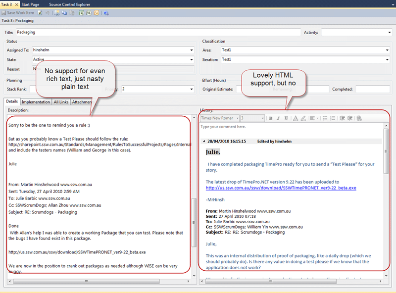

Often you will receive rich information from your Product Owner (Customer) about tasks. That information can be in the form of Word documents, HTML Emails and Pictures, but you generally receive them in the context of an Email.
{ .post-img }

You need to keep these so your Team can refer to it later, and so you can send a “done” when the task has been completed. This preserves the “history” of the task and allows you to keep relevant partied included in any future conversation.

---

At SSW we keep the original email so that we can r[eply Done and delete the email](http://www.ssw.com.au/ssw/Standards/Rules/RulesToBetterEmail.aspx#ReplyAndDelete).

But keeping it in your email does not help other members of the team if they complete the task and need to send the “done”.

Worse yet, the description field in Team Foundation Server 2010 (TFS 2010) does not support HTML and images, nor does the default task template support an “interested parties” or CC field. You can attach this content manually, but it can be time consuming.

  
{ .post-img }
**Figure: Description only supports plain text, and History supports HTML with no images**

**What should we do?**

At SSW we always follow the rules, and it just so happened that we have rules to both achieve this, and to make it easier.

You should follow the existing [Rules to Better Project Management](http://projects.ssw.com.au/tfs/SSW/SqlDeploy/Team%20Wiki/Scrum%20Dogs%20Practices.aspx)  and attach the email to your task so you can refer to and reply to it later when you close the task:

- [Do you know what Outlook add-ins you need?](http://www.ssw.com.au/ssw/Standards/Rules/#OutlookAddin)
- [Describe the work item request in an email](http://www.ssw.com.au/ssw/Standards/Rules/#WorkItemEmail)
- [Use Outlook Add-in to move the email to a TFS Work Item](http://www.ssw.com.au/ssw/Standards/Rules/#TeamCompanionWorkItem)

When replying to an email with “done” you should follow:

- [Do you update Team Companion template, so the email "subject" doesn't change?](http://www.ssw.com.au/ssw/Standards/Rules/#KeepConsistentName)
- [Do you update Team Companion template, so you can generate a proper "done" mail?](http://www.ssw.com.au/ssw/Standards/Rules/#EmailTemplate)

Following these simple rules will help your Product Owner understand you better, and allow your teams to more effectively collaborate with each other.

An added bonus is that as we are keeping the email history in sync with TFS. When you “reply all” to the email all of the interested partied to the Task are also included. This notified those that may have been blocked by your task to keep up to date with its status.

_This has been published as_ [_Do you know to ensure that relevant emails are attached to tasks_](http://sharepoint.ssw.com.au/Standards/Management/RulesToBetterScrumUsingTFS/Pages/EnsureRelevantEmails.aspx) _in our_ [_Rules to Better Scrum using TFS_](http://sharepoint.ssw.com.au/Standards/Management/RulesToBetterScrumUsingTFS/Pages/default.aspx)_._

**What could we do better?**

I would like to see this process automated so that we capture the information correctly in the task without the need to use email. This would require a change to the process template in Team Foundation Server to add an “Interested Parties” field.

Each reply to the email would need to be automatically processed into a Work Item. This could be done by adding a task identifier as the first item in the “Relates to” email header, and copying in an email address that you watch. This would then parse out the relevant information and add the new message to the history, update the “Interested parties” field and attach the Images.

Upon reflection, it may even be possible, but more difficult to do this using ONLY the History field and including some of the header information in there to the build a done email with history.

This would not currently deal with email “forks” well, but I think it would be adequate for our needs.

It would be nice if we could find time to implement this, but currently it is but a pipe dream. Maybe Microsoft could implement something in the next version of Team Foundation Server, and in the mean time we have a process that works well.

Technorati Tags: [Scrum](http://technorati.com/tags/Scrum) [SSW Rules](http://technorati.com/tags/SSW+Rules) [SSW](http://technorati.com/tags/SSW) [TFS 2010](http://technorati.com/tags/TFS+2010) [TFS 2008](http://technorati.com/tags/TFS+2008) [SP 2010](http://technorati.com/tags/SP+2010) [TFS](http://technorati.com/tags/TFS) [SharePoint](http://technorati.com/tags/SharePoint)
