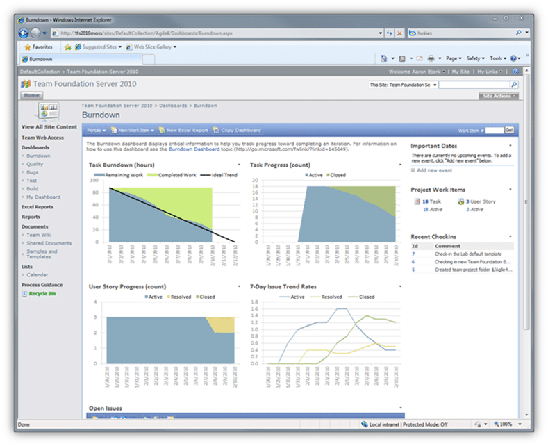
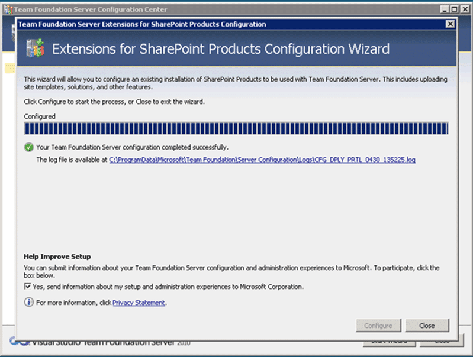
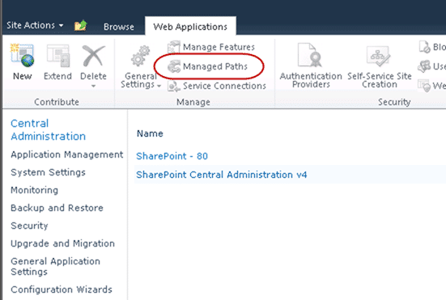
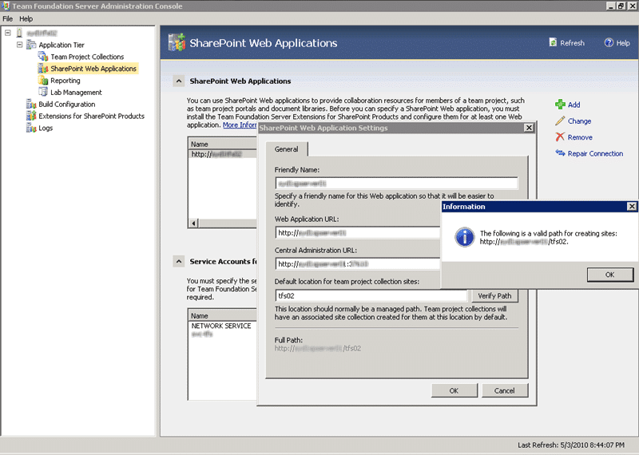
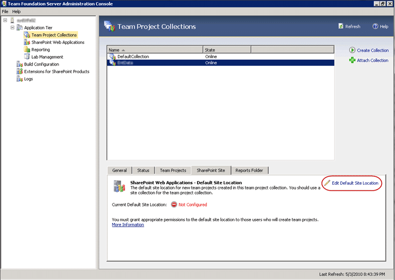
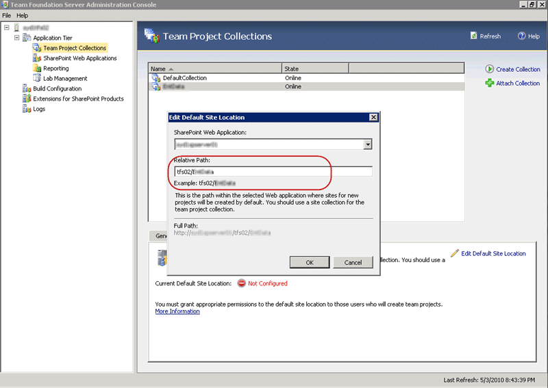

Our client is using a brand new shiny installation of SharePoint 2010, so now we need to integrate SharePoint 2010 our upgraded Team Foundation Server 2010 instance into it.

In order to do that you need to run the Team Foundation Server 2010 install on the SharePoint 2010 server and choose to install only the “Extensions for SharePoint Products and Technologies”. We want out [upgraded Team Project Collection](http://blog.hinshelwood.com/archive/2010/05/03/upgrading-team-foundation-server-2008-to-2010.aspx) to create any new portal in this SharePoint 2010 server farm.

- Update 25th September 2012 - Superseded by [Integrate SharePoint 2013 with Team Foundation Server 2012](http://blog.hinshelwood.com/integrate-sharepoint-2013-with-team-foundation-server-2012/)
- Update 4th May 2010 - [Nilesh Deshpande](http://lightspeedit.com.au) from LightSpeedIT in Sydney was asking how he configures SharePoint integration when he has TFS installed on Windows 7. The answer is easy, if not one he will like. You can’t. When you install on Windows 7 you can only do a basic install and the Admin options you would need to configure SharePoint are not available. You will need to move you ProjectCollection to a TFS instance running on a Server OS to be able to do this.

There a number of goodies above and beyond a solution file that requires the install, with the main one being the TFS2010 client API. These goodies allow proper integration with the creation and viewing of Work Items from SharePoint a new feature with TFS 2010. This works in both SharePoint 2007 and SharePoint 2010 with the level of integration dependant on the version of SharePoint that you are running. There are three levels of integration with “SharePoint Services 3.0” or “SharePoint Foundation 2010” being the lowest. This level only offers reporting services framed integration for reporting along with Work Item Integration and document management. The highest is Microsoft Office SharePoint Services (MOSS) Enterprise with Excel Services integration providing some lovely dashboards.

  
{ .post-img }
**Figure: Dashboards take the guessing out of Project Planning and estimation. Plus writing these reports would be boring!**

The Extensions that you need are on the same installation media as the main TFS install and the only difference is the options you pick during the install.

  
{ .post-img }
**Figure: Installing the TFS 2010 Extensions for SharePoint Products and Technologies onto SharePoint 2010**

Annoyingly you may need to reboot a couple of times, but on this server the process was MUCH smother than on our internal server. I think this was mostly to do with this being a clean install.

Once it is installed you need to run the configuration. This will add all of the Solution and Templates that are needed for SharePoint to work properly with TFS.

  
{ .post-img }
**Figure: This is where all the TFS 2010 goodies are added to your SharePoint 2010 server and the TFS 2010 object model is installed.**

  
{ .post-img }
**Figure: All done, you have everything installed, but you still need to configure it**

Now that we have the TFS 2010 SharePoint Extensions installed on our SharePoint 2010 server we need to configure them both so that they will talk happily to each other.

### Configuring the SharePoint 2010 Managed path for Team Foundation Server 2010

In order for TFS to automatically create your project portals you need a wildcard managed path setup. This is where TFS will create the portal during the creation of a new Team project.

To find the managed paths page for any application you need to first select the “Managed web applications”  link from the SharePoint 2010 Central Administration screen.

  
{ .post-img }
**Figure: Find the “Manage web applications” link under the “Application Management” section.**

On you are there you will see that the “Managed Paths” are there, they are just greyed out and selecting one of the applications will enable it to be clicked.

  
{ .post-img }
**Figure: You need to select an application for the SharePoint 2010 ribbon to activate.**

  
{ .post-img }
**Figure: You need to select an application before you can get to the Managed Paths for that application.**

Now we need to add a managed path for TFS 2010 to create its portals under. I have gone for the obvious option of just calling the managed path “TFS02” as the TFS 2010 server is the second TFS server that the client has installed, TFS 2008 being the first. This links the location to the server name, and as you can’t have two projects of the same name in two separate project collections there is unlikely to be any conflicts.

  
{ .post-img }
**Figure: Add a “tfs02” wildcard inclusion path to your SharePoint site.  
**

### Configure the Team Foundation Server 2010 connection to SharePoint 2010

In order to have you new TFS 2010 Server talk to and create sites in SharePoint 2010 you need to tell the TFS server where to put them. As this TFS 2010 server was installed in out-of-the-box mode it has a SharePoint Services 3.0 (the free one) server running on the same box. But we want to change that so we can use the external SharePoint 2010 instance. Just open the “Team Foundation Server Administration Console” and navigate to the “SharePoint Web Applications” section. Here you click “Add” and enter the details for the Managed path we just created.

  
{ .post-img }
**Figure: If you have special permissions on your SharePoint you may need to add accounts to the “Service Accounts” section.**

Before we can se this new SharePoint 2010 instance to be the default for our upgraded Team Project Collection we need to configure SharePoint to take instructions from our TFS server.

### Configure SharePoint 2010 to connect to Team Foundation Server 2010

On your SharePoint 2010 server open the Team Foundation Server Administration Console and select the “Extensions for SharePoint Products and Technologies” node. Here we need to “grant access” for our TFS 2010 server to create sites. Click the “Grant access” link and  fill out the full URL to the  TFS server, for example [http://servername.domain.com:8080/tfs](http://servername.domain.com:8080/tfs), and if need be restrict the path that TFS sites can be created on. Remember that when the users create a new team project they can change the default and point it anywhere they like as long as it is an authorised SharePoint location.

  
{ .post-img }
**Figure: Grant access for your TFS 2010 server to create sites in SharePoint 2010**

Now that we have an authorised location for our team project portals to be created we need to tell our Team Project Collection that this is where it should stick sites by default for any new Team Projects created.

### Configure the Team Foundation Server 2010 Team Project Collection to create new sites in SharePoint 2010

Back on out TFS 2010 server we need to setup the defaults for our upgraded Team Project Collection to the new SharePoint 2010 integration we have just set up. On the TFS 2010 server open up the “Team Foundation Server Administration Console” again and navigate to the “Team Project Collections” node. Once you are there you will see a list of all of your TPC’s and in our case we have a DefaultCollection as well as out named and Upgraded collection for TFS 2008.

If you select the “SharePoint Site” tab we can see that it is not currently configured.

  
{ .post-img }
**Figure: Our new Upgrade TFS2008 Team Project Collection does not have SharePoint configured**

Select to “Edit Default Site Location” and select the new integration point that we just set up for SharePoint 2010. Once you have selected the “SharePoint Web Application” (the thing we just configured) then it will give you an example based on that configuration point and the name of the Team Project Collection that we are configuring.

  
{ .post-img }
**Figure: Set the default location for new Team Project Portals to be created for this Team Project Collection**

This is where the reason for configuring the Extensions on the SharePoint 2010 server before doing this last bit becomes apparent. TFS 2010 is going to create a site at our [http://sharepointserver/tfs02/](http://sharepointserver/tfs02/) location called [http://sharepointserver/tfs02/\[TeamProjectCollection](http://sharepointserver/tfs02/[TeamProjectCollection)\], or whatever we had specified, and it would have had difficulty doing this if we had not given it permission first.

  
{ .post-img }
**Figure: If there is no Team Project Collection site at this location the TFS 2010 server is going to create one**

This will create a nice Team Project Collection parent site to contain the Portals for any new Team Projects that are created. It is with noting that it will not create portals for existing Team Projects as this process is run during the Team Project Creation wizard.

  
{ .post-img }
**Figure: Just a basic parent site to host all of your new Team Project Portals as sub sites**

You will need to add all of the users that will be creating Team Projects to be Administrators of this site so that they will not get an error during the Project Creation Wizard. You may also want to customise this as a proper portal to your projects if you are going to be having lots of them, but it is really just a default placeholder so you have a top level site that you can backup and point at.

**You have now integrated SharePoint 2010 and team Foundation Server 2010!**

You can now go forth and multiple your Team Projects for this Team Project Collection or you can continue to add portals to your other Collections.

_\-Are you having trouble integrating TFS with Sharepoint? Northwest Cadence can help you integrate these two systems together. Contact [info@nwcadence.com](mailto:info@nwcadence.com)_ _today to find out how we can help you…_
