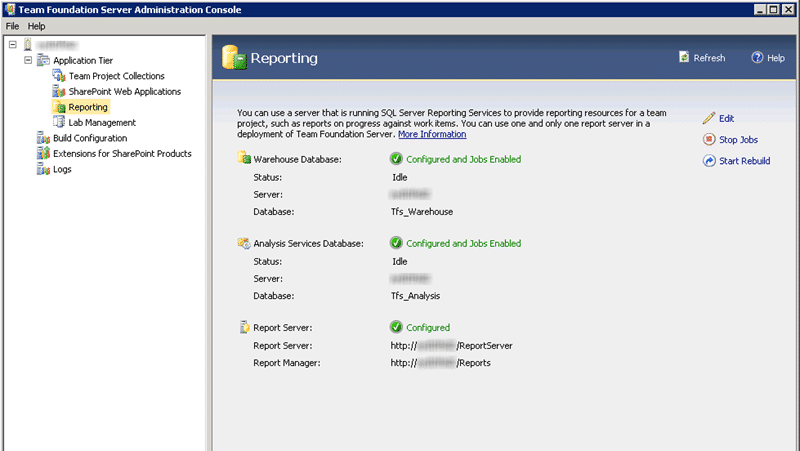
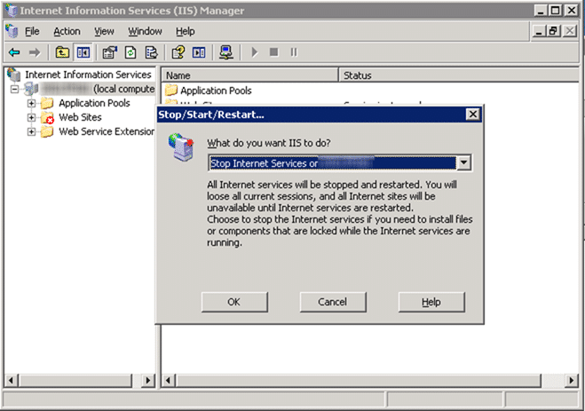
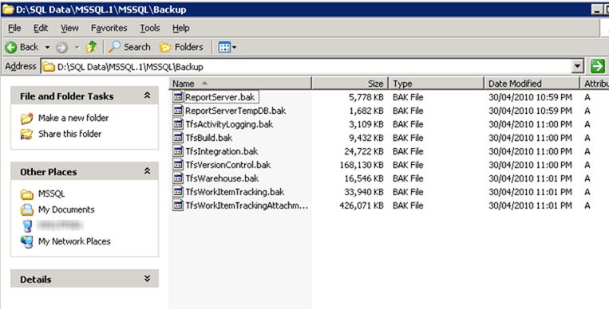
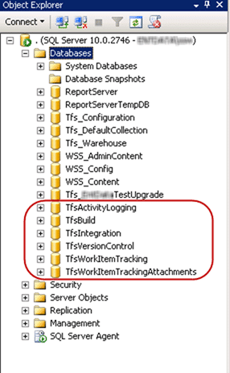
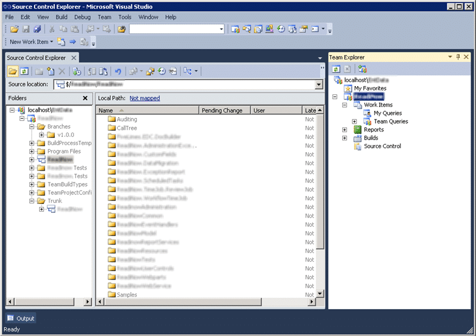
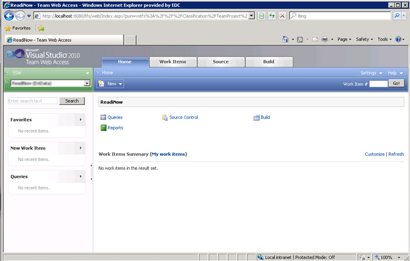

I am sure you will have seen my [posts on upgrading](http://blog.hinshelwood.com/archive/2010/04/12/_upgrading-from-tfs-2010-rc-to-tfs-2010-rtm-done.aspx) our internal Team Foundation Server from TFS2008 to TFS2010 Beta 2, RC and RTM, but what about a fresh upgrade of TFS2008 to TFS2010 using the RTM version of TFS. One of our clients is taking the plunge with TFS2010, so I have the job of doing the upgrade.
{ .post-img }

Update 4th May 2010

- [John Liu](http://johnliu.net/) – John can’t find his history after the Upgrade. This is not a feature of the upgrade and indeed all of the history is in tact on the original project. The problem is that you can’t actually change the process template that a project uses. Oh, you can make a really good stab at making it look like it has been upgraded, but under the covers there will be differences from a native project. So the plan is to migrate by creating a new project on the Agile5 template that has a branch of code from the old Conchnago project. This keeps the history in tact, if not in one place. If you look in the history and what you are looking for is before the upgrade data (same as the date of the branch) you need to follow the branch back to the old project and check there. I bet in 6 months you never need to look…
- [Allan Zhou](http://translate.google.com/translate?js=y&prev=_t&hl=en&ie=UTF-8&layout=1&eotf=1&u=http%3A%2F%2Fzlgcool.cnblogs.com%2F&sl=zh-CN&tl=en) – I am going to cover the project upgrade process in a future post, but suffice to say you can not remove a template once it has been used. That data will be floating around in the warehouse and cube forever. You can do a certain amount of clean up, but that would require you to “destroy” all of the work item types and projects that use an old template and you would loose history.
- [Sam Abraham](http://www.geekswithblogs.net/wildturtle) – You can indeed connect just fine from Visual Studio 2010 to a Team Foundation Server 2008.

---

It is sometimes very useful to have a team member that starts work when most of the Sydney workers are heading home as I can do the upgrade without impacting them. The down side is that if you have any blockers then you can be pretty sure that everyone that can deal with your problem is asleep 
{ .post-img }

I am starting with an existing blank installation of TFS 2010, but Adam Cogan let slip that he was the one that did the install so I thought it prudent to make sure that it was OK.

### Verifying Team Foundation Server 2010

We need to check that TFS 2010 has been installed correctly. First, check the Admin console and have a root about for any errors.

  
{ .post-img }
**Figure: Even the SQL Setup looks good. I don’t know how Adam did it!**

### Backing up the Team Foundation Server 2008 Databases

As we are moving from one server to another ([recommended method](http://sharepoint.ssw.com.au/Standards/TFS/RulesToBetterTFS2010Migration)) we will be taking a backup of our TFS2008 databases and resorting them to the SQL Server for the new TFS2010 Server. Do not just detach and reattach. This will cause problems with the version of the database. If you are running a test migration you just need to create a backup of the TFS 2008 databases, but if you are doing the live migration then you should stop IIS on the TFS 2008 server before you backup the databases. This will stop any inadvertent check-ins or changes to TFS 2008.

{ .post-img }

**Figure: Stop IIS before you take a backup to prevent any TFS 2008 changes being written to the database.**

It is good to leave a little time between taking the TFS 2008 server offline and commencing the upgrade as there is always one developer who has not finished and starts screaming. This time it was [John Liu](http://sharepoint.ssw.com.au/AboutUs/Employees/Pages/John.aspx) that needed 10 more minutes to make his changes and check-in, so I always give it 30 minutes and see if anyone screams.

> John Liu \[SSW\] said:  
>   are you doing something to TFS :-O  
> MrHinsh \[SSW UK\]\[VS ALM MVP\] said:  
>   I have stopped TFS 2008 as per my emails  
> John Liu \[SSW\] said:  
>   haven't finish check in @\_@  
>   can we have it for 10mins? :)  
> MrHinsh \[SSW UK\]\[VS ALM MVP\] said:  
>   TFS 2008 has been started  
> John Liu \[SSW\] said:  
>   I love you!
>
> \-IM conversation at TFS Upgrade +25 minutes

After John confirmed that he had everything done I turned IIS off again and made a cup of tea. There were no more screams so the upgrade can continue.

  
{ .post-img }
**Figure: Backup all of the databases for TFS and include the Reporting Services, just in case.**

  
{ .post-img }
**Figure: Check that all the backups have been taken**

Once you have your backups, you need to copy them to your new TFS2010 server and restore them. This is a good way to proceed as if we have any problems, or just plain run out of time, then you just turn the TFS 2008 server back on and all you have lost is one upgrade day, and not 10 developer days.

As per the rules, you should [record the number of files and the total number of areas and iterations](http://sharepoint.ssw.com.au/Standards/TFS/RulesToBetterTFS2010Migration/Pages/DogfoodStatsBefore.aspx) before the upgrade so you have something to compare to:

> TFS2008
>
> File count:
>
> <table border="0" cellspacing="0" cellpadding="2" width="400"><tbody><tr><td valign="top" width="200"><strong>Type</strong></td><td valign="top" width="200"><strong>Count</strong></td></tr><tr><td valign="top" width="200">1</td><td valign="top" width="200">1845</td></tr><tr><td valign="top" width="200">2</td><td valign="top" width="200">15770</td></tr></tbody></table>
>
> Areas & Iterations:
>
> 139

You can use this to verify that the upgrade was successful. it should however be noted that the numbers in TFS 2010 will be bigger. This is due to some of the sorting out that TFS does during the upgrade process.

### Restore Team Foundation Server 2008 Databases

Restoring the databases is much more time consuming than just attaching them as you need to do them one at a time. But you may be taking a backup of an operational database and need to restore all your databases to a particular point in time instead of to the latest. I am doing latest unless I encounter any problems.

  
{ .post-img }
**Figure: Restore each of the databases to either a latest or specific point in time.**

  
{ .post-img }
**Figure: Restore all of the required databases**

Now that all of your databases are restored you now need to upgrade them to Team Foundation Server 2010.

### Upgrade Team Foundation Server 2008 Databases

This is probably the easiest part of the process. You need to call a fire and forget command that will go off to the database specified, find the TFS 2008 databases and upgrade them to 2010. During this process all of the 6 main TFS 2008 databases are merged into the TfsVersionControl database, upgraded and then the database is renamed to TFS\_\[CollectionName\]. The rename is only the database and not the physical files, so it is worth going back and renaming the physical file as well. This keeps everything neat and tidy.

If you plan to keep the old TFS 2008 server around, for example if you are doing a test migration first, then you will need to change the TFS GUID. This GUID is unique to each TFS instance and is preserved when you upgrade. This GUID is used by the clients and they can get a little confused if there are two servers with the same one.

To kick of the upgrade you need to open a command prompt and change the path to “C:Program FilesMicrosoft Team Foundation Server 2010Tools” and run the “import” command in  “tfsconfig”.

> TfsConfig import /sqlinstance:<Previous TFS Data Tier>  
>                  /collectionName:<Collection Name>  
>                  /confirmed
>
> Imports a TFS 2005 or 2008 data tier as a new project collection.
>
> Important: This command should only be executed after adequate backups have been performed.
>
> After you import, you will need to configure portal and reporting settings via the administration console.
>
> EXAMPLES  
> \--------
> TfsConfig import /sqlinstance:tfs2008sql /collectionName:imported /confirmed  
> TfsConfig import /sqlinstance:tfs2008sqlInstance /collectionName:imported /confirmed
>
> OPTIONS:  
> \--------
> sqlinstance         The sql instance of the TFS 2005 or 2008 data tier. The TFS databases at that location will be modified directly and will no longer be usable as previous version databases.  Ensure you have back-ups.
>
> collectionName      The name of the new Team Project Collection.
>
> confirmed           Confirm that you have backed-up databases before importing.

This command will automatically look for the TfsIntegration database and verify that all the other required databases exist.

In this case it took around 5 minutes to complete the upgrade as the total database size was under 700MB. This was unlike the upgrade of SSW’s production database with over 17GB of data which took a few hours. At the end of the process you should get no errors and no warnings.

> The Upgrade operation on the ApplicationTier feature has completed. There were 0 errors and 0 warnings.

As this is a new server and not a pure upgrade there should not be a problem with the GUID.

If you think at any point you will be doing this more than once, for example doing a test migration, or merging many TFS 2008 instances into a single one, then you should go back and rename the physical TfsVersionControl.mdf file to the same as the new collection. This will avoid confusion later down the line.

To do this, detach the new collection from the server and rename the physical files. Then reattach and change the physical file locations to match the new name.

You can follow [http://www.mssqltips.com/tip.asp?tip=1122](http://www.mssqltips.com/tip.asp?tip=1122 "http://www.mssqltips.com/tip.asp?tip=1122") for a more detailed explanation of how to do this.

  
{ .post-img }
**Figure: Stop the collection so TFS does not take a wobbly when we detach the database.**

When you try to start the new collection again you will get a conflict with project names and will require to remove the Test Upgrade collection. This is fine and it just needs detached.

  
{ .post-img }
**Figure: Detaching the test upgrade from the new Team Foundation Server 2010 so we can start the new Collection again.**

You will now be able to start the new upgraded collection and you are ready for testing.

Do you remember the stats we took off the TFS 2008 server?

> TFS2008
>
> File count:
>
> <table border="0" cellspacing="0" cellpadding="2" width="400"><tbody><tr><td valign="top" width="200"><strong>Type</strong></td><td valign="top" width="200"><strong>Count</strong></td></tr><tr><td valign="top" width="200">1</td><td valign="top" width="200">1845</td></tr><tr><td valign="top" width="200">2</td><td valign="top" width="200">15770</td></tr></tbody></table>
>
> Areas & Iterations:
>
> 139

Well, now we need to [compare them to the TFS 2010 stats](http://sharepoint.ssw.com.au/Standards/TFS/RulesToBetterTFS2010Migration/Pages/RunDogFoodStatsAfter.aspx), remembering that there will probably be more files under source control.

> TFS2010
>
> File count:
>
> <table border="0" cellspacing="0" cellpadding="2" width="400"><tbody><tr><td valign="top" width="200"><strong>Type</strong></td><td valign="top" width="200"><strong>Count</strong></td></tr><tr><td valign="top" width="200">1</td><td valign="top" width="200">19288</td></tr></tbody></table>
>
> Areas & Iterations:
>
> 139

Lovely, the number of iterations are the same, and the number of files is bigger. Just what we were looking for.

### Testing the upgraded Team Foundation Server 2010 Project Collection

Can we connect to the new collection and project?

  
{ .post-img }
**Figure: We can connect to the new collection and project.**

  
{ .post-img }
**Figure: make sure you can connect to The upgraded projects and that you can see all of the files.**

  
{ .post-img }
**Figure: Team Web Access is there and working.**

Note that for Team Web Access you now use the same port and URL as for TFS 2010. So in this case as I am running on the local box you need to use [http://localhost:8080/tfs](http://localhost:8080/tfs) which will redirect you to [http://localhost:8080/tfs/web](http://localhost:8080/tfs/web) for the web access.

If you need to connect with a Visual Studio 2008 client you will need to use the full path of the new collection, http://\[servername\]/tfs/\[collectionname\] and this will work with all of your collections.

With Visual Studio 2005 you will only be able to connect to the Default collection and in both VS2008 and VS2005 you will need to install the forward compatibility updates.

- [Visual Studio Team System 2005 Service Pack 1 Forward Compatibility Update for Team Foundation Server 2010](http://www.microsoft.com/downloads/details.aspx?FamilyID=22215e4c-af6f-4e2f-96df-20e94d762689&displaylang=en)
- [Visual Studio Team System 2008 Service Pack 1 Forward Compatibility Update for Team Foundation Server 2010](http://www.microsoft.com/downloads/details.aspx?familyid=CF13EA45-D17B-4EDC-8E6C-6C5B208EC54D&displaylang=en)
  To make sure that you have everything up to date, make sure that you run [SSW Diagnostics](http://www.ssw.com.au/ssw/Diagnostics) and get all green ticks.
  **Upgrade Done!**
  At this point you can send out a notice to everyone that the upgrade is complete and and give them the connection details. You need to remember that at this stage we have 2008 project upgraded to run under TFS 2010 but it is still running under that same process template that it was running before. You can only “enable” 2010 features in a process template you can’t upgrade. So what to do? Well, you need to create a new project and migrate things you want to keep across.
  Souse code is easy, you can move or Branch, but Work Items are more difficult as you can’t move them between projects. This instance is complicated more as the old project uses the Conchango/EMC Scrum for Team System template and I will need to write a script/application to get the work items across with their attachments in tact.
  That is my next task!

Technorati Tags: [TFS 2010](http://technorati.com/tags/TFS+2010) [TFS 2008](http://technorati.com/tags/TFS+2008) [ALM](http://technorati.com/tags/ALM) [SSW](http://technorati.com/tags/SSW) [Scrum](http://technorati.com/tags/Scrum) [VS 2010](http://technorati.com/tags/VS+2010) [VS 2008](http://technorati.com/tags/VS+2008) [SP 2010](http://technorati.com/tags/SP+2010) [TFS](http://technorati.com/tags/TFS) [SharePoint](http://technorati.com/tags/SharePoint) [TFS 2005](http://technorati.com/tags/TFS+2005) [VS 2005](http://technorati.com/tags/VS+2005)
