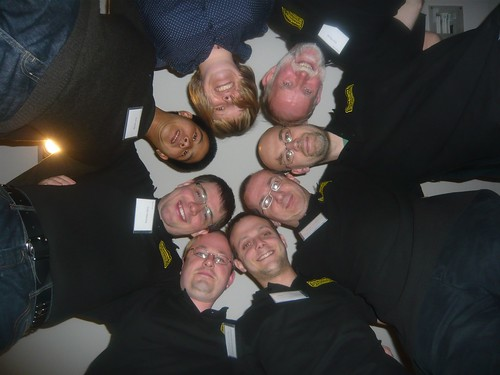

Since I have joined SSW as a Solution Architect its Chief Architect, Adam Cogan, has been mentoring me and pushing me to do better. One of the things that I have been wanting to do since the first DDD Scotland was to present a session. For DDD Scotland 2010 Adam suggested that I submit he double session on “Better project Management with Team Foundation Server 2010”.
{ .post-img }

So, with some apprehension I submitted two session as Part A and Part B.

  

* * *

**Download** [**DDD Scotland -  Scrum with Team Foundation Server 2010**](http://cid-57599e234f1ebc1c.skydrive.live.com/self.aspx/Public/Presentations/SSW^_Scrum%20with%20TFS%202010^_DDDScotland^_v1.1.pptx)

How surprised was I that after the attendees had finished casting their votes that both sessions would be in the top 20 one in the top 5. I an effort to promote diversity in sessions the DDD committee try to make sure that each presenter only have one session. I would have to compress SSW’s presentation into 1 hour.

Around this time SSW embarked on it continuing adventures with scrum an Microsoft started heavily investing in Scrum for its internal use. I decided to do a slightly different session, but one that would still meet the agenda and goal of the billed session to provide “Better project management with Team Foundation Server 2010”.

And so [Scrum with Team Foundation Server 2010](http://blog.hinshelwood.com/archive/2010/04/09/scrum-for-team-foundation-server-2010.aspx) was born. At this stage I really have to thank [Aaron Bjork](http://blogs.msdn.com/aaronbjork) who provided me with many of the slides and animations as I really can’t work Power Point.

On the 27th of April I presented the session for the Aberdeen Partner Group and then on 8th May I presented at [DDD Scotland](http://developerdeveloperdeveloper.com/scotland2010/).

  
{ .post-img }
**Figure: Some of the presenters and organisers of DDD Scotland**

I mentioned quite a few of SSW’s [Rules to better Scrum Using TFS](http://sharepoint.ssw.com.au/Standards/Management/RulesToBetterScrumUsingTFS) and I have uploaded my presentation to Skydrive.

**Download** [**DDD Scotland -  Scrum with Team Foundation Server 2010**](http://cid-57599e234f1ebc1c.skydrive.live.com/self.aspx/Public/Presentations/SSW^_Scrum%20with%20TFS%202010^_DDDScotland^_v1.1.pptx)

  

Technorati Tags: [Scrum](http://technorati.com/tags/Scrum) [TFS 2010](http://technorati.com/tags/TFS+2010) [ALM](http://technorati.com/tags/ALM) [DDD Scot](http://technorati.com/tags/DDD+Scot) [Live](http://technorati.com/tags/Live) [SSW](http://technorati.com/tags/SSW) [SP 2010](http://technorati.com/tags/SP+2010) [SharePoint](http://technorati.com/tags/SharePoint)

