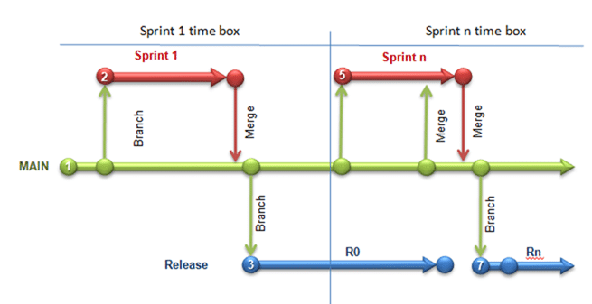
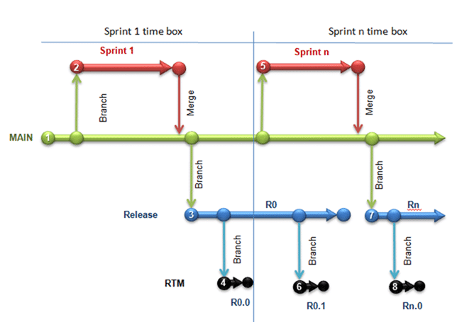
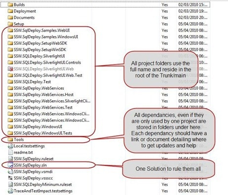

Creating a solution and having it maintainable over time is an art and not a science. I like being pedantic and having a place for everything, no matter how small.
{ .post-img }

For setting up the Areas to run Multiple projects under one solution see my post on  [When should I use Areas in TFS instead of Team Projects](http://blog.hinshelwood.com/archive/2010/03/09/when-should-i-use-areas-in-tfs-instead-of-team.aspx) and for an explanation of branching see [Guidance: A Branching strategy for Scrum Teams](http://blog.hinshelwood.com/archive/2010/04/14/guidance-a-branching-strategy-for-scrum-teams.aspx).

- Update 17th May 2010 – We are currently trialling running a single Sprint branch to improve our history.
- Update 20th May 2010 – Fixing Images
- Updated 4th August 2010 – There is now best practice guidance around this that supersedes this post.  
   [How To: Structure Your Source Control Folders in Team Foundation Server](http://msdn.microsoft.com/en-us/library/bb668992.aspx)

---

Whenever I setup a new Team Project I implement the basic version control structure. I put “readme.txt” files in the folder structure explaining the different levels, and a solution file called “\[Client\].\[Product\].sln” located at “$/\[Client\]/\[Product\]/DEV/Main” within version control.

Developers should add any projects you need to create to that solution in the format “\[Client\].\[Product\].\[ProductArea\].\[Assembly\]” and they will automatically be picked up and built automatically when you setup Automated Builds using Team Foundation Build.

All test projects need to be done using MSTest to get proper IDE and Team Foundation Build integration out-of-the-box and be named for the assembly that it is testing with a naming convention of “\[Client\].\[Product\].\[ProductArea\].\[Assembly\].Tests”

Here is a description of the folder layout; this content should be replicated in readme files under version control in the relevant locations so that even developers new to the project can see how to do it.

![clip_image002[3]](images/7129adaece20_EC32-clip_image0023_-2-2.jpg)  
{ .post-img }
**Figure: The Team Project level - at this level there should be a folder for each the products that you are building if you are** [**using Areas correctly**](http://blog.hinshelwood.com/archive/2010/03/09/when-should-i-use-areas-in-tfs-instead-of-team.aspx) **in [TFS](http://msdn2.microsoft.com/en-us/teamsystem/aa718934.aspx "Team Foundation Server") 2010.**

You should try very hard to avoided spaces as these things always end up in a URL eventually e.g. "Code Auditor" should be "CodeAuditor".

![clip_image004[4]](images/7129adaece20_EC32-clip_image0044_-3-3.jpg)  
{ .post-img }
**Figure: Product Level - At this level there should be only 3 folders (DEV, RELESE and SAFE) all of which should be in capitals.**

These folders represent the three stages of your application production line. Each of them may contain multiple branches but this format leaves all of your branches at the same level.

![clip_image006[4]](images/7129adaece20_EC32-clip_image0064_-4-4.jpg)  
{ .post-img }
**Figure: The DEV folder is where all of the Development branches reside.**

The DEV folder will contain the "Main" branch and all feature branches is they are being used. The DEV designation specifies that all code in every branch under this folder has not been released or made ready for release. And feature branches MUST merge (Forward Integrate) from Main and stabilise prior to merging (Reverse Integration) back down into Main and being decommissioned.

  
{ .post-img }
**Figure: In the Feature branching scenario only merges are allowed onto Main, no development can be done there.**

Once we have a mature product it is important that new features being developed in parallel are kept separate. This would most likely be used if we had more than one Scrum team working on a single product.

![clip_image008[4]](images/7129adaece20_EC32-clip_image0084_-5-5.jpg)  
{ .post-img }
**Figure: when we are ready to do a release of our software we will create a release branch that is then stabilised prior to deployment.**

This protects the serviceability of of our released code allowing developers to fix bugs and re-release an existing version.

  
{ .post-img }
**Figure: All bugs found on a release are fixed on the release.**

All bugs found in a release are fixed on the release and a new deployment is created. After the deployment is created the bug fixes are then merged (Reverse Integration) into the Main branch. We do this so that we separate out our development from our production ready code.

![clip_image010[4]](images/7129adaece20_EC32-clip_image0104_-6-6.jpg)  
{ .post-img }
**Figure: SAFE or RTM is a read only record of what you actually released. Labels are not immutable so are useless in this circumstance.**

When we have completed stabilisation of the release branch and we are ready to deploy to production we create a read-only copy of the code for reference. In some cases this could be a regulatory concern, but in most cases it protects the company building the product from legal entanglements based on what you did or did not release.

{ .post-img }

**Figure: This allows us to reference any particular version of our application that was ever shipped.**

In addition I am an advocate of having a single solution with all the Project folders directly under the “Trunk”/”Main” folder and using the full name for the project folders..

{ .post-img }

**Figure: The ideal solution**

If you must have multiple solutions, because you need to use more than one version of Visual Studio, name the solutions “\[Client\].\[Product\]\[VSVersion\].sln” and have it reside in the same folder as the other solution.

This makes it easier for Automated build and improves the discoverability of your code and its dependencies.

Send me your feedback!

Technorati Tags: [ALM](http://technorati.com/tags/ALM) [VS 2010](http://technorati.com/tags/VS+2010) [VS 2008](http://technorati.com/tags/VS+2008) [TFS 2010](http://technorati.com/tags/TFS+2010) [TFS 2008](http://technorati.com/tags/TFS+2008) [TFBS](http://technorati.com/tags/TFBS) [Scrum](http://technorati.com/tags/Scrum) [Branching](http://technorati.com/tags/Branching) [TFS](http://technorati.com/tags/TFS)
