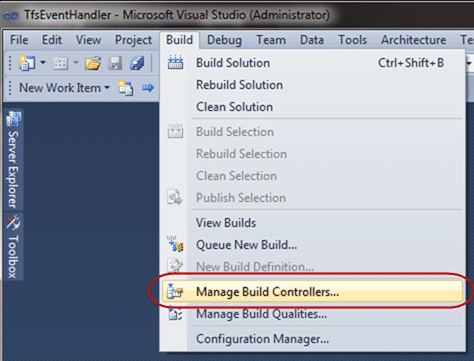
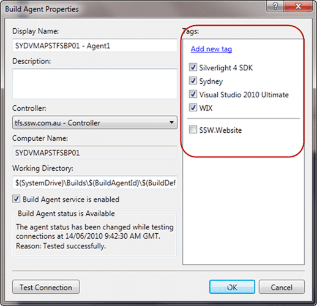
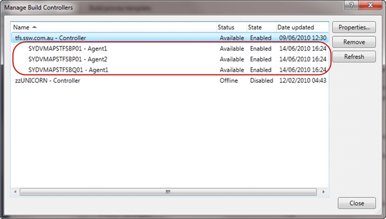

At SSW we use gated check-in for all of our projects. The benefits are based on the number of developers you have working on your project.
{ .post-img }

Lets say you have 30 developers and each developer breaks the build once per month. That could mean that you have a broken build every day! Gated check-ins help, but they have a down side that manifests as queued builds and moaning developers.

---

The way to combat this is to have more build servers, but with that comes complexity. Inevitably you will need to install components that you would expect to be installed on target computers, but how do you keep track of which build servers have which bits?

What about a geographically diverse team? If you have a centrally controlled infrastructure you might have build servers in multiple regions and you don’t want teams in Sydney copying files from Beijing and vice a versa on a regular basis.

So, what is the answer. Its Tags. You can add a set of Tags to your agents and then set which tags to look for in the build definition.

{ .post-img }

**Figure: Open up your Build Controller Manager**

Select “**Build | Manage Build Controllers…**” to get a list of all of your controllers and he build agents that are associated with them.

{ .post-img }

**Figure: the list of build agents and their controllers**

Each of these Agents might be subtly different. For example only one of these agents has FTP software installed. This software is required for only one of the many builds we have set up.

My ethos for build servers is to keep them as clean as possible and not to install anything that is not absolutely necessary. For me that means anything that does not add a \*.target file is suspect, and should really be under version control and called via the command line from there.

So, some of the things you may install are:

- Silverlight 4 SDK
- Visual Studio 2010
- Visual Studio 2008
- WIX
- etc

You should not install things that will not end up on the target users computer. For a website that means something different to a client than to a server, but I am sure you get the idea.

One thing you can do to make things easier is to create a tag for each of the things that you install. that way developers can find the things they need. We may change to using a more generic tagging structure (Like “Web Application” or “WinForms Application”) if this gets too unwieldy, but for now the list of tags is limited.

  
{ .post-img }
**Figure: Tags associated with one of our build agents**

Once you have your Build Agents all tagged up ALL your builds will start to fail 
{ .post-img }

This is because the default setting for a build is to look for an Agent that **exactly** matches the tags for the build, and we have not added any yet. The quick way to fix this is to change the “Tag Comparison Operator” from “ExactMatch” to “MatchAtLease” to get your build immediately working.

{ .post-img }

**Figure: Tag Comparison Operator changes to MatchAtLeast to get builds to run.**

The next thing to do is look for specific tags. You just select from the list of available tags and the controller will make sure you get to a build agent that uses them.

  
{ .post-img }
**Figure: I want Silverlight, VS2010 and WIX, but do not care about Location.**

And there you go, you can now have build agents for different purposes and regions within the same environment.

You can also use name filtering, so if you have a good Agent naming convention you can filter by that for regions. For example, your Agents might be “SYDVMAPTFSBP01” and “SYDVMAPTFSBP02” so a name filter of “SYD\*” would target all of the Sydney build agents.

  
{ .post-img }
**Figure: Agent names can be used for filtering as well**

This flexibility will allow you to build better software by reducing the likelihood of not having a certain dependency on the target machines.

  
{ .post-img }
**Figure: Setting the name filter based on server location**

Used in combination there is a lot of power here to coordinate tens of build servers for multiple projects across multiple regions so your developers get the most out of your environment.

Technorati Tags: [ALM](http://technorati.com/tags/ALM),[TFBS](http://technorati.com/tags/TFBS),[TFS 2010](http://technorati.com/tags/TFS+2010),[TFS Admin](http://technorati.com/tags/TFS+Admin)
