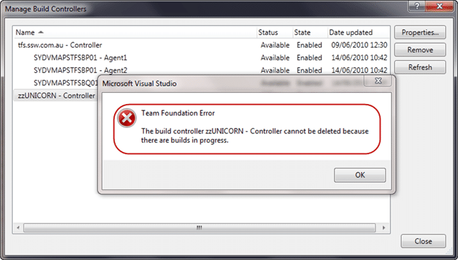
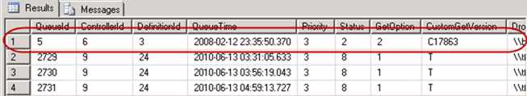

Have you ever seen ghost build controllers in Team Foundation Server that you just can't seam to delete no matter what you do? Sometime there are builds left over in the system that were queued but never completed.

- Update Ulf Jonson pointed out that the value for 'canceled' should be 16 and not 2 as I had stated. Thanks Ulf, updated.

Most of the time they are easy to delete, but sometimes it takes a little effort. Even rarer are those times when something just will not go away no matter how much you try. Indeed we have had a ghost (phantom) team build controller hanging around for a while now, and it had defeated my best efforts to get rid of it.

The build controller was from our old TFS server from before our [TFS 2010 beta 2 upgrade](http://blog.hinshelwood.com/deploying-visual-studio-2010-team-foundation-server-beta-2-done/) and was really starting to annoy me. Every time I try to delete it I get the message:

> Controller cannot be deleted because there are build in progress  
> \-Manage Build Controller dialog

   
{ .post-img }
**Figure: Deleting a ghost controller does not always work.**

I ended up checking all of our 172 Team Projects for the build that was queued, but did not find anything. [Jim Lamb](http://blogs.msdn.com/b/jimlamb/) pointed me to the “tbl_BuildQueue” table in the team Project Collection database and sure enough there was the nasty little beggar.

  
{ .post-img }
**Figure: The ghost build was easily spotted**

Adam Cogan asked me:

> “Why did you suspect this one?”

Well, there are a number of things that led me to suspect it:

- QueueId is very low: Look at the other items, they are in the thousands not single digits
- ControllerId: I know there is only one legitimate controller, and I am assuming that 6 relates to “zzUnicorn”
- DefinitionId: This is a very low number and I looked it up in “tbl_BuildDefinition” and it did not exist
- QueueTime: As we did not upgrade to TFS 2010 until late 2009 a date of 2008 for a queued build is very suspect
- Status: A status of 216 means that it is still queued

This build must have been queued long ago when we were using TFS 2008, probably a beta, and it never got cleaned up. As controllers are new in TFS 2010 it would have created the “zzUnicorn” controller to handle any build servers that already exist. I had previously deleted the Agent, but leaving the controller just looks untidy.

Now that the ghost build has been identified there are two options:

- **Delete the row**  
   I would not recommend ever deleting anything from the database to achieve something in TFS. It is _really_ not supported.
- **Set the Status to cancelled** (Recommended)  
   This is the best option as TFS will then clean it up itself

So I set the Status of this build to 2 (cancelled) and sure enough it disappeared after a couple of minutes and I was then able to then delete the “zzUnicorn” controller.

  
{ .post-img }
**Figure: Almost completely clean**

Now all I have to do is get rid of that untidy “zzBunyip” agent, but that will require rewriting one of our build scripts which will have to wait for now.
