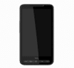

{ .post-img }

The rate at which vendors release new updates for the HD2 is ridiculously slow. You have to wait for Microsoft to release the new OS, then you wait for HTC to build it into a ROM, and then you have to wait up to 6 months for your operator to badly customise it for their network. Once Windows Phone 7 is released this problem should go away as Microsoft is likely to be able to update the phone over the air, but what do we do until then?

I want Windows Mobile 6.5.5 now!

---

I’m an early adopter. If there is a new version of something then that’s the version I want. As long as you accept that you are using something on a “let the early adopter beware” and accept that there may be bugs, sometimes serious crippling bugs the go for it.

**Note that I won't be responsible if you end up bricking your phone, unlocking or flashing your radio or ROM can be risky. If you follow the instructions then you should be fine, I've flashed my phones (SPV, M300, M1000, M2000, M3100, TyTN, TyTN 2, HD2) hundreds of times without any problems!**

I have been using Windows Mobile 6.5.5 before it was called 6.5.5 and for long enough that I don’t even remember when I first started using it. I was using it on my HTC TyTN 2 before I got an HD2 a couple of months before Christmas, and the first custom ROM’s for the HD2 were a couple of months after that.

I always update to the latest ROM that I like, and occasionally I go back to the stock ROM’s to have a look see, but I am always disappointed.

Terms:

- **Soft Reset**: Same as pulling out the battery, but is like a reboot for your phone
- **Hard Reset**: Reinstalls the Operating system from the Image that is stored on it
- **ROM**: This is Image that is loaded onto your phone and it is used to reinstall your phone whenever you do a “hard reset”.
- **Stock ROM**: A ROM from the original vendor… So HTC
- **Cook a ROM**: Referring to Cooking a ROM is the process a ROM developer goes through to take all of the parts (OS, Drivers and Applications) that make up a running phone and compiling them into a ROM.
- **ROM Kitchen**: A place where you get an SDK and all the component parts of the phone: OD, Drivers and Application. There are usually lots of Tools for making it easier to compile and build the image.
- **Flashing**: The process of updating one of the layers of your phone with a new layer
- **Bricked**: This is what happens when flashing goes wrong. Your phone is now good for only one thing… stopping paper blowing away in a windy place.

You can “cook” you own ROM using one of the many good “ROM Kitchens” or you can use a ROM built and tested by someone else. I have cooked my own ROM before, and while the tutorials are good, it is a lot of hassle.

You can only Flash new ROM’s that are specifically for your phone only so find a ROM for your phone and XDA Developers is the best place to look. It has a forum based structure and you can find your phone quite easily.

[XDA Developer Forum](http://forum.xda-developers.com/index.php)

Installing a new ROM does have its risks. In the past there have been stories about phones being “bricked” but I have not heard of a bricked phone for quite some years. if you follow the instructions carefully you should not have any problems.

note: Most of the tools are written by people for whom English is not their first language to you will need concentrate hard to understand some of the instructions. Have you ever read a manual that was just literally translated from another language? Enough said…

There are a number of layers on your phone that you will need to know about:

1. **SPL**: This is the lowest level, like a BIOS on a PC and is the Operating Systems gateway to the hardware
2. **Radio**: I think of this as the hardware drivers, and you will need a different Radio for CDMA than GSM networks
3. **ROM**: This is like your Windows CD, but it is stored internally to the Phone. Flashing your phone consists of replacing one Image with another and then wiping your phone and automatically reinstall from the Image.

Sometimes when you download an Image wither it is for a Radio or for ROM you only get a file called \*.nbh. What do you do with this? Well you need an RUU application to push that Image to your phone. The RUU’s are different per phone, but there is a CustomRUU for the HD2 that will update your phone with any \*.nbh placed in the same directory.

[Download and Instructions for CustomRUU](http://forum.xda-developers.com/showthread.php?t=575524 "http://forum.xda-developers.com/showthread.php?t=575524")

### #1 Flash HardSPL

An SPL is kind of like a BIOS, and the default one has checks to make sure that you are only installing a signed ROM. This would prevent you from installing one that comes from any other source but the vendor.

**NOTE: Installing a HARD SPL invalidates your warranty so remember to Flash your phone with a “stock” vendor ROM before trying to send your phone in for repairs.**

Is the warranty reinstated when you go back to a stock ROM? I don’t know…

Updating your SPL to a HardSPL effectively unlocks your phone so you can install anything you like. I would recommend the HardSPL2.

[Download and Instructions for HardSPL2](http://forum.xda-developers.com/showthread.php?t=609477 "Download and Instructions for HardSPL2")

### #2 Task29

One of the problems that has been seen on the HD2 when flashing new ROM’s is that things are left over from the old ROM. For a while the recommendation was to Flash a stock ROM first, but some clever cookies have come up with “Task29” which formats your phone first. After running this your phone will be blank and will only boot to the white HTC logo and no further. You should follow the instructions and reboot (remove battery) and hold down the “volume down” button while turning you HD2 on to enter the bootloader. From here you can run CustomRUU once the USB message appears.

[Download and Instructions for Task29](http://forum.xda-developers.com/showthread.php?t=644781 "http://forum.xda-developers.com/showthread.php?t=644781")

### #2 Flash Radio

You may need to play around with this one, there is no good and bad version and the latest is not always the best. You know that annoying thing when you hit “end call” on your phone and nothing happens? Well that's down to the Radio. Get this version right for you and you may even be able to make calls. From a Windows Mobile as well 
{ .post-img }

[Download](http://www.pilotlogic.com/artemis/htc_hd2_radio "get it from here")

There are no instructions here, but they are the same as th ROM, but you use this \*.nbh file.

### #3 Flash ROM

If you have gotten this far then you are probably a pro by now  Just download the latest ROM below and Flash to your phone. I have been really impressed by the Artemis line of ROM’s but it is no way the only choice. I like this one as the developer builds them as close to the stock ROM as possible while updating to the latest of everything.
{ .post-img }

[Download and Instructions for  Artemis HD2 vXX](http://forum.xda-developers.com/showthread.php?t=612580 "http://forum.xda-developers.com/showthread.php?t=612580")

### Conclusion

While updating your ROM is not for the faint hearted it provides more options than the Stock ROM’s and quicker feature updates than waiting…

Technorati Tags: [WM6](http://technorati.com/tags/WM6)
