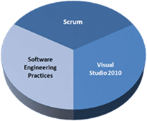

On the 26th - 30th July in Microsoft’s offices in London [Adam Cogan](http://courses.scrum.org/about/adam-cogan) from SSW will be presenting the first [Professional Scrum Developer](http://www.scrum.org/professionalscrumdeveloper/) course in the UK. I will be teaching this course along side Adam and it is a fantastic experience. You are split into teams and go head-to-head to deliver units of potentially shippable work in four two hour sprints.
{ .post-img }

Update 18th June 2010 – SSW Is offering a massive 50% discount to make this 5 day course only £1,168 but I have been told that this depends on availability so it may go back up.

Update 05th July 2010 – One lucky attendee will be getting a copy of MSDN Ultimate.

---

![ProfessionalScrumDeveloper_200px[3]](images/ProfessionalScrumDeveloperTraininginLond_CC39-ProfessionalScrumDeveloper_200px3_-6-6.png)
{ .post-img }

The Professional Scrum Developer course is the only course endorsed by both Microsoft and [Ken Schwaber](http://en.wikipedia.org/wiki/Ken_Schwaber) and they have worked together very effectively in brining this course to fruition. This course is the brain child of [Richard Hundhausen](http://blog.hundhausen.com/), a Microsoft Regional Director, and both Adam and I attending the Trainer Prep in Sydney when he was there earlier this year. He is a fantastic trainer and no matter where you do this course you can be safe in the knowledge that he has trained and vetted all of the teachers. A tools version of Ken if you will 
{ .post-img }

[![LondonCallToAction[1]](images/ProfessionalScrumDeveloperTraininginLond_CC39-LondonCallToAction1_-4-4.png)](http://www.ssw.com.au/ssw/events/Scrum-Training-Course.aspx?utm_source=MrHinsh&utm_medium=blog&utm_campaign=STLO01)
{ .post-img }

If you are outside the UK you can find out where this [course is being run near you](http://courses.scrum.org/). Make sure you have a look at the [scrum guide from Scrum.org](http://www.scrum.org/scrumguides/) and the [syllabus from Accentient](http://www.accentient.com/scrum.aspx).

With the launch of Visual Studio 2010 in April we have been furnished with a copy of MSDN Ultimate that will be given to the PSD that gets the highest score on the PSD  Now there is an incentive to do well…
{ .post-img }

---

# What is the Professional Scrum Developer course all about?

Professional Scrum Developer course is a unique and intensive five-day experience for software developers. The course guides teams on how to turn product requirements into potentially shippable increments of software using the Scrum framework, Visual Studio 2010, and modern software engineering practices. Attendees will work in self-organizing, self-managing teams using a common instance of Team Foundation Server 2010.
{ .post-img }

{ .post-img }

Figure: Sam and Ken discuss the PSD Course

## Who should attend this course?

This course is suitable for any member of a software development team – architect, programmer, database developer, tester, etc. Entire teams are encouraged to attend and experience the course together, but individuals are welcome too.

Attendees will self-organize to form cross-functional Scrum teams. These teams require an aggregate of skills specific to the selected case study. Please see the last page of this document for specific details.

Product Owners, ScrumMasters, and other stakeholders are welcome too, but keep in mind that everyone who attends will be expected to commit to work and pull their weight on a Scrum team.

## What should you know by the end of the course?

Scrum will be experienced through a combination of lecture, demonstration, discussion, and hands-on exercises. Attendees will learn how to do Scrum correctly while being coached and critiqued by the instructor, in the following topic areas:

- Form effective teams
- Explore and understand legacy “Brownfield” architecture
- Define quality attributes, acceptance criteria, and “done”
- Create automated builds
- How to handle software hotfixes
- Verify that bugs are identified and eliminated
- Plan releases and sprints
- Estimate product backlog items
- Create and manage a sprint backlog
- Hold an effective sprint review
- Improve your process by using retrospectives
- Use emergent architecture to avoid technical debt
- Use Test Driven Development as a design tool
- Setup and leverage continuous integration
- Use Test Impact Analysis to decrease testing times
- Manage SQL Server development in an Agile way
- Use .NET and T-SQL refactoring effectively
- Build, deploy, and test SQL Server databases
- Create and manage test plans and cases
- Create, run, record, and play back manual tests
- Setup a branching strategy and branch code
- Write more maintainable code
- Identify and eliminate people and process dysfunctions
- Inspect and improve your team’s software development process

## What does the week look like?

This course is a mix of lecture, demonstration, group discussion, simulation, and hands-on software development. The bulk of the course will be spent working as a team on a case study application delivering increments of new functionality in mini-sprints. Here is the week at a glance:

{ .post-img }

Monday morning and most of the day Friday will be spent with the computers powered off, so you can focus on sharpening your game of Scrum and avoiding the common pitfalls when implementing it.

## The Sprints

Timeboxing is a critical concept in Scrum as well as in this course. We expect each team and student to understand and obey all of the timeboxes. The timebox duration will always be clearly displayed during each activity. Expect the instructor to enforce it.

Each of the ½ day sprints will roughly follow this schedule:

<table border="1" cellspacing="0" cellpadding="0"><tbody><tr><td valign="top" width="162">
<b>Component</b>
</td><td valign="top" width="492">
<b>Description</b>
</td><td valign="top" width="66">
<b>Minutes</b>
</td></tr><tr><td valign="top" width="162">
Instruction
</td><td valign="top" width="492">
Presentation and demonstration of new and relevant tools &amp; practices
</td><td valign="top" width="66">
60
</td></tr><tr><td valign="top" width="162">
Sprint planning meeting
</td><td valign="top" width="492">
Product owner presents backlog; each team commits to delivering functionality
</td><td valign="top" width="66">
10
</td></tr><tr><td valign="top" width="162">
Sprint planning meeting
</td><td valign="top" width="492">
Each team determines how to build the functionality
</td><td valign="top" width="66">
10
</td></tr><tr><td valign="top" width="162">
The Sprint
</td><td valign="top" width="492">
The team self-organizes and self-manages to complete their tasks
</td><td valign="top" width="66">
120
</td></tr><tr><td valign="top" width="162">
Sprint Review meeting
</td><td valign="top" width="492">
Each team will present their increment of functionality to the other teams
</td><td valign="top" width="66">
≤ 30
</td></tr><tr><td valign="top" width="162">
Sprint Retrospective
</td><td valign="top" width="492">
A group retrospective meeting will be held to inspect and adapt
</td><td valign="top" width="66">
10
</td></tr></tbody></table>

Each team is expected to self-organize and manage their own work during the sprint. Pairing is highly encouraged. The instructor/product owner will be available if there are questions or impediments, but will be hands-off by default. You should be prepared to communicate and work with your team members in order to achieve your sprint goal. If you have development-related questions or get stuck, your partner or team should be your first level of support.

### Module 1: INTRODUCTION

This module provides a chance for the attendees to get to know the instructors as well as each other. The Professional Scrum Developer program, as well as the day by day agenda, will be explained. Finally, the Scrum team will be selected and assembled so that the [forming, storming, norming, and performing](http://en.wikipedia.org/wiki/Forming,_storming,_norming_and_performing) can begin.

- Trainer and student introductions
- Professional Scrum Developer program
- Agenda
- Logistics
- Team formation
- Retrospective

### Module 2: SCRUMDAMENTALS

This module provides a level-setting understanding of the Scrum framework including the roles, timeboxes, and artifacts. The team will then experience Scrum firsthand by simulating a multi-day sprint of product development, including planning, review, and retrospective meetings.

- Scrum overview
- Scrum roles
- Scrum timeboxes (ceremonies)
- Scrum artifacts
- Simulation
- Retrospective

It’s required that you read Ken Schwaber’s [Scrum Guide](http://www.accentient.com/downloads/ScrumGuide.pdf) in preparation for this module and course.

### MODULE 3: IMPLEMENTING SCRUM IN VISUAL STUDIO 2010

This module demonstrates how to implement Scrum in Visual Studio 2010 using a Scrum process template\*. The team will learn the mapping between the Scrum concepts and how they are implemented in the tool. After connecting to the shared Team Foundation Server, the team members will then return to the simulation – this time using Visual Studio to manage their product development.

- Mapping Scrum to Visual Studio 2010
- User Story work items
- Task work items
- Bug work items
- Demonstration
- Simulation
- Retrospective

### Module 4: THE CASE STUDY

In this module the team is introduced to their problem domain for the week. A kickoff meeting by the Product Owner (the instructor) will set the stage for the why and what that will take during the upcoming sprints. The team will then define the quality attributes of the project and their definition of “done.” The legacy application code will be downloaded, built, and explored, so that any bugs can be discovered and reported.

- Introduction to the case study
- Download the source code, build, and explore the application
- Define the quality attributes for the project
- Define “done”
- How to file effective bugs in Visual Studio 2010
- Retrospective

### Module 5: HOTFIX

This module drops the team directly into a [Brownfield](<http://en.wikipedia.org/wiki/Brownfield_(software_development)>) (legacy) experience by forcing them to analyze the existing application’s architecture and code in order to locate and fix the Product Owner’s high-priority bug(s). The team will learn best practices around finding, testing, fixing, validating, and closing a bug.

- How to use Architecture Explorer to visualize and explore
- Create a unit test to validate the existence of a bug
- Find and fix the bug
- Validate and close the bug
- Retrospective

### Module 6: PLANNING

This short module introduces the team to release and sprint planning within Visual Studio 2010. The team will define and capture their goals as well as other important planning information.

- Release vs. Sprint planning
- Release planning and the Product Backlog
- Product Backlog prioritization
- Acceptance criteria and tests
- Sprint planning and the Sprint Backlog
- Creating and linking Sprint tasks
- Retrospective

At this point the team will have the knowledge of Scrum, Visual Studio 2010, and the case study application to begin developing increments of potentially shippable functionality that meet their definition of done.

### Module 7: EMERGENT ARCHITECTURE

This module introduces the architectural practices and tools a team can use to develop a valid design on which to develop new functionality. The teams will learn how Scrum supports good architecture and design practices. After the discussion, the teams will be presented with the product owner’s prioritized backlog so that they may select and commit to the functionality they can deliver in this sprint.

- Architecture and Scrum
- Emergent architecture
- Principles, patterns, and practices
- Visual Studio 2010 modeling tools
- UML and layer diagrams
- **SPRINT 1**
- Retrospective

### Module 8: TEST DRIVEN DEVELOPMENT

This module introduces Test Driven Development as a design tool and how to implement it using Visual Studio 2010. To maximize productivity and quality, a Scrum team should setup Continuous Integration to regularly build every team member’s code changes and run regression tests. Refactoring will also be defined and demonstrated in combination with Visual Studio’s Test Impact Analysis to efficiently re-run just those tests which were impacted by refactoring.

- Continuous integration
- Team Foundation Build
- Test Driven Development (TDD)
- Refactoring
- Test Impact Analysis
- **SPRINT 2**
- Retrospective

### Module 9: AGILE DATABASE DEVELOPMENT

This module lets the SQL Server database developers in on a little secret – they can be agile too. By using the database projects in Visual Studio 2010, the database developers can join the rest of the team. The students will see how to apply Agile database techniques within Visual Studio to support the SQL Server 2005/2008/2008R2 development lifecycle.

- Agile database development
- Visual Studio database projects
- Importing schema and scripts
- Building and deploying
- Generating data
- Unit testing
- **SPRINT 3**
- Retrospective

### Module 10: SHIP IT

Teams need to know that just because they like the functionality doesn’t mean the Product Owner will. This module revisits acceptance criteria as it pertains to acceptance testing. By refining acceptance criteria into manual test steps, team members can execute the tests, recording the results and reporting bugs in a number of ways. Manual tests will be defined and executed using the Microsoft Test Manager tool. As the Sprint completes and an increment of functionality is delivered, the team will also learn why and when they should create a branch of the codeline.

- Acceptance criteria
- Testing in Visual Studio 2010
- Microsoft Test Manager
- Writing and running manual tests
- Branching
- **SPRINT 4**
- Retrospective

### Module 11: OVERCOMING DYSFUNCTION

This module introduces the many types of people, process, and tool dysfunctions that teams face in the real world. Many dysfunctions and scenarios will be identified, along with ideas and discussion for how a team might mitigate them. This module will enable you and your team to move toward independence and improve your game of Scrum when you depart class.

- Scrum-butts and flaccid Scrum
- Best practices working as a team
- Team challenges
- ScrumMaster challenges
- Product Owner challenges
- Stakeholder challenges
- Course Retrospective

## What will be expected of you and you team?

This is a unique course in that it’s technically-focused, team-based, and employs [timeboxes](http://en.wikipedia.org/wiki/Timeboxing). It demands that the members of the teams self-organize and self-manage their own work to collaboratively develop increments of software.

All attendees must commit to:

- Pay attention to all lectures and demonstrations
- Participate in team and group discussions
- Work collaboratively with other team members
- Obey the timebox for each activity
- Commit to work and do your best to deliver

All teams should have these skills:

- Understanding of Scrum
- Familiarity with Visual Studio 201
- C#, .NET 4.0 & ASP.NET 4.0 experience\*
- SQL Server 2008 development experience
- Software testing experience

\* Check with the instructor ahead of time for the exact technologies

## Self-organising teams

Another unique attribute of this course is that it’s a technical training class being delivered to _teams_ of developers, not pairs, and not individuals. Ideally, your actual software development team will attend the training to ensure that all necessary skills are covered. However, if you wish to attend an open enrolment course alone or with just a couple of colleagues, realize that you may be placed on a team with other attendees. The instructor will do his or her best to ensure that each team is cross-functional to tackle the case study, but there are no guarantees. You may be required to try a new role, learn a new skill, or pair with somebody unfamiliar to you. This is just good Scrum!

Who should NOT take this course?

Because of the nature of this course, as explained above, certain types of people should probably not attend this course:

- Students requiring command and control style instruction – there are no prescriptive/step-by-step (think traditional Microsoft Learning) labs in this course
- Students who are unwilling to work within a timebox
- Students who are unwilling to work collaboratively on a team
- Students who don’t have any skill in any of the software development disciplines
- Students who are unable to commit fully to their team – not only will this diminish the student’s learning experience, but it will also impact their team’s learning experience

---

[![LondonCallToAction[1]](images/ProfessionalScrumDeveloperTraininginLond_CC39-LondonCallToAction1_-5-5.png)](http://www.ssw.com.au/ssw/events/Scrum-Training-Course.aspx?utm_source=MrHinsh&utm_medium=blog&utm_campaign=STLO01)
{ .post-img }

If you are outside the UK you can find out where this [course is being run near you](http://courses.scrum.org/). Make sure you have a look at the [scrum guide from Scrum.org](http://www.scrum.org/scrumguides/) and the [syllabus from Accentient](http://www.accentient.com/scrum.aspx).

Technorati Tags: [Scrum](http://technorati.com/tags/Scrum),[SSW](http://technorati.com/tags/SSW),[Pro Scrum Dev](http://technorati.com/tags/Pro+Scrum+Dev)
