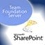

If you are unable to commit to the 5 day [Professional Scrum Developer](http://blog.hinshelwood.com/archive/2010/06/18/professional-scrum-developer-.net-training-in-london.aspx) course we are holding in London, [Adam Cogan](http://www.ssw.com.au/ssw/Employees/EmployeesProfile.aspx?EmpID=AC) is running his famous [Brain Quest](http://www.ssw.com.au/ssw/Events/Brain-Quest-VisualStudio2010-TFS2010-Sharepoint2010.aspx) 1 day session on Wednesday 21st July.
{ .post-img }

This full day training course brings developers up-to-speed on the new features and benefits of Visual Studio 2010 Ultimate, Team Foundation Server 2010 and SharePoint 2010. With detailed insight into project management, requirements gathering, user stories, testing, workflow, document management and Office integration, attendees will leave with a strong understanding of how to embrace [TFS](http://msdn2.microsoft.com/en-us/teamsystem/aa718934.aspx "Team Foundation Server") 2010 and SharePoint 2010 in their organization.

---

This course is split into two parts and you can attend one (£61.08) or both (£105.51). Sorry for the crazy prices, but you know these Aussies…

These two sessions are fantastic and for the price I think you will find it difficult to argue that it is over priced.

{ .post-img }

Here is a break down of the [SSW Brain Quest: Team Foundation Server and SharePoint 2010](http://www.ssw.com.au/ssw/Events/Brain-Quest-VisualStudio2010-TFS2010-Sharepoint2010.aspx) and agenda for the day.

#### Session 1: Team Foundation Server 2010

### Team Foundation Server 2010 (TFS) for Successful Project Management

Visual Studio Ultimate (formerly Visual Studio Team System (VSTS)) and Team Foundation Server (TFS) are the cornerstones of development on the Microsoft .NET platform. These are the best tools for a project manager to have successful projects and for the developers to have a focused and smooth software development process.

Come and see Adam Cogan, Microsoft Regional Director, [Visual Studio Team System](http://msdn2.microsoft.com/en-us/teamsystem/default.aspx "Visual Studio Team System") Champ and Chief Architect from SSW show you:

- How to successfully gather requirements with User stories
- The right way to use work items
- The way to complete a work items and send a 'done'
- How to use templates for your standard work items
- The extra work items that developers always forget
- What is good and bad about Excel and Project integration
- What you can use from the built in reporting as well as the Project portals available from the SharePoint dashboard
- The important reports to give your Project Manager

Walk away knowing how to see your project health and progress. Visual Studio Ultimate is designed to help address many of these traditional problems faced by project managers. It does so by providing a set of integrated tools to help teams improve their software development activities and to help project managers better support the software development processes.

During this session we will cover the lifecycle of creating work items and tracking of releases using Visual Studio Ultimate and Team Foundation Server.

### Visual Studio 2010 Team System - An Overview

Microsoft Visual Studio 2010 Team System is an integrated software development platform to build the mission-critical applications that businesses depend on. It extends Visual Studio's integrated and productive experience from the developer to the entire development team by delivering powerful new role-based tools for software architects, developers, testers and project managers. In this session you will see an overview of these tools and how they can improve your software development cycle.

### Visual Studio 2010 Testing with Team Foundation Server (TFS) 2010 - the life of a bug

Visual Studio 2010 makes up a large part of a .Net developers life. This session will delve into the 'life of a bug' by taking a walk in the shoes of an everyday bug from discovery to release (and the steps that make up the in between). Come along and check out the new features that will make you happier by making your code better, your job easier, and your team more productive by reducing the obstacles you face in your everyday coding life. Learn:

- What the new features for testers and developers
- How you now care - even if the tester can't reproduce the bug
- How to stop struggling to find the source of the bug in your code
- How can you streamline the testing process and make sure you don't repeat the same bugs
- How to automate more and reproduce bugs easier and discover problems sooner.

#### Session 2: SharePoint 2010

### What's new in SharePoint 2010

In this session Adam Cogan will provide information about what is new in SharePoint 2010 and his personal favourites. The SharePoint Team has invested in many including:

- UX support for Silverlight and Ajax
- Their Web Content Management System
- Digital Asset Management System (for videos)
- Visual Studio 2010 tools for SharePoint 2010
- Developer Platform
- Office 2010 integration
- RESTful Web API
- Tagging and Rating

Lets see what's good and what's not.

### Something About Mary (SharePoint and Office 2010)

Come see Adam Cogan explain what works well with SharePoint and Office for Mary and the other knowledge workers.

First you will get an overview of what is great about having SharePoint in your business. Then see real world examples of:

- Using SharePoint 2010 and Office 2010 together
- Where it fits with other important Microsoft products like CRM 4 and TFS
- Examples of how Word and Excel can be integrated into business processes (separate from SharePoint)
- Examples of how Word, Excel, PowerPoint can be combined with SharePoint to improve visibility/searchability/versioning across the company
- Overview of how data can be synchronized between SharePoint and external data sources (eg using Access and Excel)
- Overview of what 'workflow' (really!) means
- How Office can be incorporated into company workflows with SharePoint
- Extending SharePoint with Office SharePoint Designer 2010 (free!)
- Where VBA and VSTO fit in terms of how solutions can be developed
- Examples of other interesting Office/SharePoint integrations (eg the the Atlassian SharePoint Connector and Atlassian Office Connector)

This is a good chance for you to consider new ways of using Office in your company, along with pitfalls to avoid. Adam gets excited about this session because too often companies limit Office to just an email application, word processor and spreadsheet - completely missing the positive impact it can have on the entire business process.

#### Agenda

### Session 1: Team Foundation Server

9:00am – 1pm  with a 15 minute break

### Session 2: SharePoint 2010

2:00pm - 6:00pm  with a 15 minute break.

[![image[7]](images/SSWBrainQuestTeamFoundationServerandShar_955C-image7_-3-3.png)](http://www.ssw.com.au/ssw/Events/Brain-Quest-VisualStudio2010-TFS2010-Sharepoint2010.aspx)
{ .post-img }
