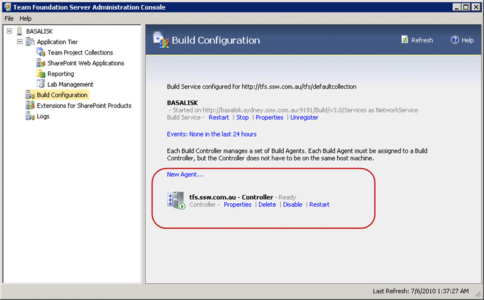
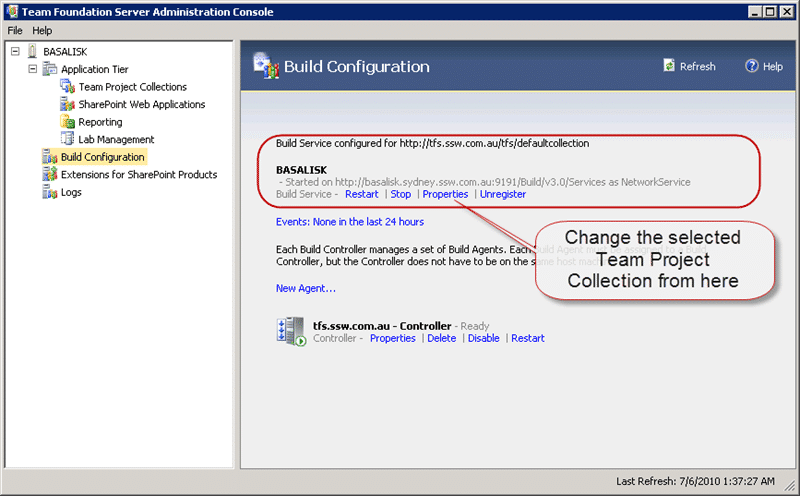

{ .post-img }

When you are doing demos or training for Team Foundation Server 2010 (TFS 2010) you may have multiple Team Project Collections (TPC) for different scenarios or process templates. You may even be attaching a pre-built TPC image so you can start from a particular point. If you try to do create a build you will find that it complains about there not being a Team Build Controller (TBC).

---

One thing you learn very quickly when working with TFS 2010 is that you can only attach ONE Team Build Controller to ONE Team Project Collection. This one-one relationship can cause issues if you have many Team Project Collections because there can only be one Team Project Collection configured per server.

  
{ .post-img }
**Figure: Two Team Project Collections**

This means that if you have 2 Team Project Collection you will need two serve to manage the builds. It can be the same server as your build server, but that depends on your throughput and load.

In the presentation scenario you will need to reconfigure your Team Build Controller on the fly. But how do you do this.

If you open the Team Foundation Server Administration Console you will see a “Build Configuration” node. If you select this it will show all of the configuration options for your build server on that box.

  
{ .post-img }
**Figure: Team Build Configuration screen shows the Controller and any Agents running on that server**

In this case this is our TFS server and we only have the Build Controller running with no Agent. We run all of the agents on another box as it takes lots of processor to do a build and we don’t want that impacting our TFS server.

In order to make the change, we need to alter the options not on the Controller instance itself, but on the Build Service Instance.

  
{ .post-img }
**Figure: Change the options on the service instance**

Select the “Properties” option on the Build service and then stop the service to make the changes.

  
{ .post-img }
**Figure: The Build Service Properties are only available when the service is stopped**

  
{ .post-img }
**Figure: Select any server and then Project Collection you want to bind to**

You need to select the server and then the Team Project Collection that you want to bind to. In fact you could have this Build Service bind to any Team Foundation Server even if the current server hosts TFS. I don’t know why you would want to, but it is possible.

Now that you have the Build Service configured to work against your new Team Project Collection the Build Controller and any Build Agents configured under it will now work for that collection.

You can now go forth and create builds…

Technorati Tags: [ALM](http://technorati.com/tags/ALM),[TFBS](http://technorati.com/tags/TFBS),[TFS 2010](http://technorati.com/tags/TFS+2010)
