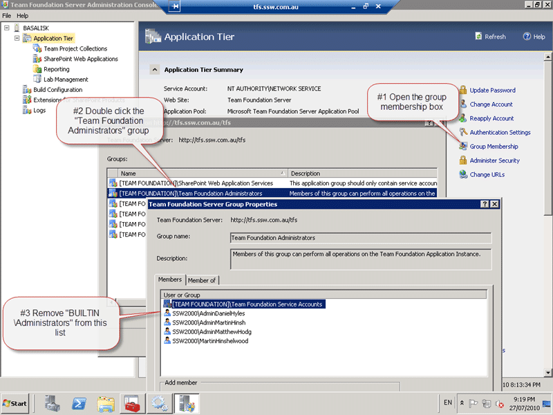

For a little while now I had been investigating an odd occurrence in Team Foundation Server. Users added to Active Directory groups have not been filtering back into the Team Foundation Server groups cache. The meant that we had to add users directly to Team Foundation Server in order to give them permission. While this was not ideal, it did not really inconvenience us that much, but we are now trying to streamline our security and need it fixed.
{ .post-img }

Updated 27th July 2010 – SOLUTION - Craig Harry spoke to a couple of the product team guys for both TFS and Active Directory and they came up with a temporary solution.

---

Although we do not have a high turnover of core staff, we take on a lot of developers for Work Experience and we now have three guys in the root Project Collection Administrators when we already have an Active Directory group the are in added at this level.


{ .post-img }

**Figure: These are all work experience, and are in the AD group, but don’t show in the AD group SSW2000Developers on the TFS server**

Snapshots from **the SSW2000Developers** groups (as records on the TFS server)


{ .post-img }


{ .post-img }


{ .post-img }

**Figure: TFS does not show these guys even though they are in AD**

Now, don’t get me started as to why all developers get Project Collection Admin! It better than in TFS 2008 when they all have Server admin, but we have not yet tackled the security model update that we need. We have over 170 Team Projects and I have not yet had the time to go through and add them all in. Yes I know I could build a tool for that, but again, I have not yet had the time.

The first thing to look at is the Event Log, but as you can see there are rather a lot of entries, over 13000 of them so applying a filter to just the TFS events is a good idea.

 **Figure: Check the event log for common errors**
{ .post-img }

You can see the hourly “TFS Services” errors, and in fact they reoccur every 24 hours. If you check the 3071 error you will see that the core error is TF53010 that is caused by a timeout in the “Team Foundation Server Identity Synchronization job”.

> The description for Event ID 3071 from source TFS Services cannot be found. Either the component that raises this event is not installed on your local computer or the installation is corrupted. You can install or repair the component on the local computer.
>
> If the event originated on another computer, the display information had to be saved with the event.
>
> The following information was included with the event:
>
> TF53010: The following error has occurred in a Team Foundation component or extension: Date (UTC): 7/07/2010 1:38:49 PM Machine: BASALISK Application Domain: TfsJobAgent.exe Assembly: Microsoft.TeamFoundation.Framework.Server, Version=10.0.0.0, Culture=neutral, PublicKeyToken=b03f5f7f11d50a3a; v2.0.50727 Service Host: fba54aae-87d6-47bf-a192-0e58693b9ade (TEAM FOUNDATION) Process Details: Process Name: TFSJobAgent Process Id: 7976 Thread Id: 9136 Account name: NT AUTHORITYNETWORK SERVICE
>
> Detailed Message: The Team Foundation Server Identity Synchronization job has timed out. Please restart the job service.
>
> the message resource is present but the message is not found in the string/message table **\-Event Log entry from TFS Server**

The next thing you want to look for is the job definition. Is it there and is it configured correctly. To do this you need to run some SQL on your TFS server. Please remember that you loose support if you make changes to the data without the aid of MSFT Support. Note that I am not doing this alone, Mr Craig Harry MSFT has my back on this one.

```
USING tfs_Configuration
SELECT TOP 1000 *
FROM [Tfs_Configuration].[dbo].[tbl_JobDefinition]
WHERE JobId='544DD581-F72A-45A9-8DE0-8CD3A5F29DFE'
```

You will likely get the following single entry returned by SQL Server.

<table border="0" width="590" cellspacing="0" cellpadding="4"><tbody><tr><td align="right" valign="top" width="116">JobId:</td><td valign="top" width="472">544DD581-F72A-45A9-8DE0-8CD3A5F29DFE</td></tr><tr><td align="right" valign="top" width="116">JobName:</td><td valign="top" width="472">Team Foundation Server Periodic Identity Synchronization</td></tr><tr><td align="right" valign="top" width="116">ExtensionName:</td><td valign="top" width="472">Microsoft.TeamFoundation.JobService.Extensions.Core.IdentitySyncJobExtension</td></tr><tr><td align="right" valign="top" width="116">Data:</td><td valign="top" width="472">NULL</td></tr><tr><td align="right" valign="top" width="116">EnabledState:</td><td valign="top" width="472">0</td></tr><tr><td align="right" valign="top" width="116">Flags:</td><td valign="top" width="472">0</td></tr><tr><td align="right" valign="top" width="116">LastExecutionTime:</td><td valign="top" width="472">NULL</td></tr></tbody></table>

**Figure: Job Definition returned from SQL for the AD Sync job**

Looks OK to me, and as I understand it is normal for the LastExecution to be NULL.

The next thing to check is the history for the Job runs.

```
USING tfs_Configuration
SELECT TOP 1000 *
FROM [Tfs_Configuration].[dbo].[tbl_JobHistory]
WHERE JobId='544DD581-F72A-45A9-8DE0-8CD3A5F29DFE'
```

You will hopefully not get the same result as me:

<table border="0" width="401" cellspacing="0" cellpadding="2"><tbody><tr><td align="right" valign="top" width="111">HistoryId:</td><td valign="top" width="288">519100</td></tr><tr><td align="right" valign="top" width="111">JobSource:</td><td valign="top" width="288">FBA54AAE-87D6-47BF-A192-0E58693B9ADE</td></tr><tr><td align="right" valign="top" width="111">JobId:</td><td valign="top" width="288">544DD581-F72A-45A9-8DE0-8CD3A5F29DFE</td></tr><tr><td align="right" valign="top" width="111">QueueTime:</td><td valign="top" width="288">2010-04-21 01:00:00.000</td></tr><tr><td align="right" valign="top" width="111">StartTime:</td><td valign="top" width="288">2010-04-21 01:00:00.597</td></tr><tr><td align="right" valign="top" width="111">EndTime:</td><td valign="top" width="288">2010-07-02 16:34:13.653</td></tr><tr><td align="right" valign="top" width="111">AgentId:</td><td valign="top" width="288">5D5939AB-4F76-4BDC-A518-FC09EC352152</td></tr><tr><td align="right" valign="top" width="111">Result:</td><td valign="top" width="288">7</td></tr><tr><td align="right" valign="top" width="111">ResultMessage:</td><td valign="top" width="288">NULL</td></tr><tr><td align="right" valign="top" width="111">QueuedReasons:</td><td valign="top" width="288">1</td></tr><tr><td align="right" valign="top" width="111">QueueFlags:</td><td valign="top" width="288">0</td></tr></tbody></table>

**Figure: Data from the Job History table shows something interesting**

Because of the timeout in the error message above the TFS Job Agent has marked the job as “Inactive” with a 7 above.

So, how do we figure out what can we do to try and identify where the problem is. Well its time to enable the built in tracing functionality and look at what is going on and where the error is occurring.

The job agent is located in “C:Program FilesMicrosoft Team Foundation Server 2010Application TierTFSJobAgent” and you need to edit the “TfsJobAgent.exe.config” file to enable the trace. This file is stored in a location that needs admin access to the folders, so start notepad in Administrator mode and find the trace section and uncomment the Listners.

```
<trace autoflush="false" indentsize="4">
  <!--To enable tracing to file, simply uncomment listeners section and set trace switch(es) below.
      Directory specified for TextWriterTraceListener output must exist, and job agent service account must have write permissions. -->
  <!--<listeners>
    <add name="myListener"
      type="System.Diagnostics.TextWriterTraceListener"
      initializeData="C:tempjobagent.log" />
    <remove name="Default" />
  </listeners>-->
</trace>
```

You can see on lines 4 and 9 there is the standard XML/HTML comments and you just need to remove them and set the “initializeData” attribute to a location that you can write to; this is usually “c:temp”.

Once you have that there is one more thing to do. Usually traces are broken up into categories and we want to enable verbose tracing on at least the “General”, “API” and “Authentication” switches.

```
<switches>
  <!-- Trace Switches
        Each of the trace switches should be set to a value between 0 and 4, inclusive.
          0: No trace output
          1-4: Increasing levels of trace output; see Systems.Diagnostics.TraceLevel-->
  <add name="API" value="0" />
  <add name="Authentication" value="0" />
  <add name="Authorization" value="0" />
  <add name="Database" value="0" />
  <add name="General" value="0" />
  <add name="traceLevel" value="0" />
</switches>
```

Set the “value” attribute to a 4 for “Verbose” for those switches and save the file.

After examining the logs Mr Harry sent me a little bit of code to run on the server… Rather innocuous looking in its terseness, but it helped isolate the issue.

```
using System;
using System.Collections.Generic;
using System.DirectoryServices;
using System.Linq;
using System.Text;

namespace ReadLocal
{
    class Program
    {
        static void Main(string[] args)
        {
            using (DirectoryEntry de = new DirectoryEntry())
            {
                de.Path = string.Concat("WinNT://./Administrators");
                Console.WriteLine(de.SchemaClassName);
                de.Path = string.Concat("WinNT://BUILTIN/Administrators");
                Console.WriteLine(de.SchemaClassName);
            }
        }
    }
}
```

This code have been running on the TFS server for nearly an hour with no sign of returning. The code is trying to resolve accounts against the local machine so as not to have to call out to Active Directory and make things a little faster. I am amazed that Craig was able to diagnose this over IM (Yes the code came through IM as well) and all credit should be sent in his direction.

This is an edge case code problem on our domain and the TFS product team is going to have to speak to the Active Directory guys and see if it is a domain setting change or a hotfix that is needed.

Craig spoke to the relevant guys and it seams that although they will be fixing the code and releasing a hotfix, there is a work around for the problem.

If you remove the “BUILTINAdministrators” group from the “Team Foundation Administrators” group the code takes a different path and does not encounter the hang.

 **Figure: Open “Team Foundation Server Administration Console | Application Tier | Group Membership | \[TEAM FOUNDATION\]Team Foundation Administrators” and remove the “BUILTINAdministrators” group.**
{ .post-img }

I then restarted the “Team Foundation Server Job Agent” service and after a few minutes the problem above had resolved itself correctly.

Technorati Tags: [TFS](http://technorati.com/tags/TFS),[TFS 2010](http://technorati.com/tags/TFS+2010)
