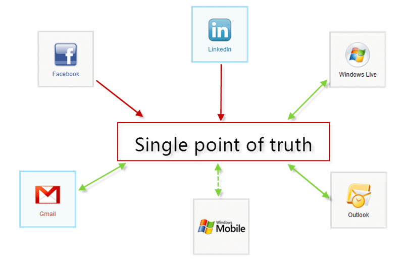
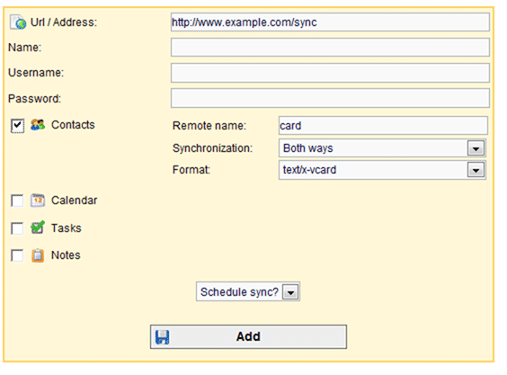
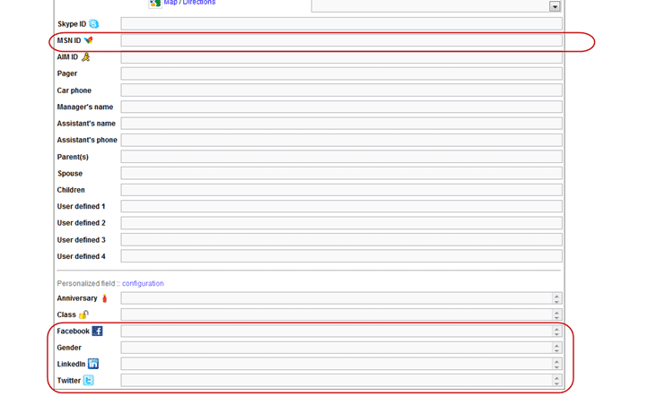

It may be a trivial matter to get your contacts on your phone, but if you do the social network thing, then you need to do a little jiggery pokery to get everything to sync so you have the same contacts everywhere. Over the last couple of weeks I have vowed to get them sorted.
{ .post-img }

\[Updated 7th July 2010\] – I found a client that works with Outlook 2010 [http://sourceforge.net/projects/syncmldotnet/](http://sourceforge.net/projects/syncmldotnet/ "http://sourceforge.net/projects/syncmldotnet/")

---

What we want is a “single point of truth” that will suck all of our contacts in and try and make sure that we have no duplicates.

{ .post-img }

**Figure: Target model of a single point of truth**

Before today I was a premium Plaxo user, but I have been steadily disenfranchised by their increase in social networking features and decrees in effort on the core Contact Sync features. I used to be able to sync my LinkedIn, Live Contacts, Google contacts and more. They provided a basic Windows Mobile application and a decent outlook client. If you are also a Plaxo user you will have seen a steady move from Sync points to Imports, which in my opinion sucks. It also does not sync pictures.

I have over 1700 contacts built up over a long time. Yes, some of them are crap, but it is very difficult to get rid of the crap in favour of the good stuff. Today I went looking for a solution.

I tried lots of local apps:

- **OutSync** – Invaluable for importing your Facebook pictures
- androgyny – Good Facebook app for getting the pictures into Google, but lacks stability.
- GO Contact Sync – Sucks... could not get it to work with Outlook 2010
- Xobni – No sync capability as it is just an overlay (to lock you in)

This is all well and good for Facebook, but what about LinkedIn or Live? I want all my contacts and pictures to be the same on all of my sites that “stores” contacts. So no Sync with LinkedIn or Facebook, but it should pull the valuable updates to details and pictures.

I tried re-doing Plaxo, but no luck. I used uber-google-fu to find very little and the I stumbled across some sites. But first lets look at what I want to sync. In an ideal world I want to be able to sync everything.

- Outlook
- Google Contacts
- Google Calander
- Facebook (One way)
- LinkedIn (One way)
- Windows Live Contacts
- Yahoo Contacts
- Twitter (Not sure how this would work)
- Windows Mobile
- Android
- Plaxo
- Soocial
- SheduleWorld
- UNYK
- Vodafone 360

You may be thinking, why the hell do you have so many services. Well, I have been on the internet a number of years and I have contacts and links and settings on services that I  have moved away from, but me contacts have not. I even still pull email from my old cable & wireless email account that I had pre 2000. Why, because people may only have my old email address and try to contact me. You know, old friends and family who are incapable of updating their contacts.

Its the same reason that I have had the same mobile phone number for 12 years and landline number for just as long even though I have moved house, district and providers. I like to be consistent.

Its not hard to do, it just takes a little effort, and I can’t understand why I get a new mobile number from some people every year when they change mobile.

What **_is_** that all about?

Lets look at a couple of the “sync your contacts” services.

### Plaxo – [http://plaxo.com](http://plaxo.com)

I used to consider this the best, but it seems to have gone backwards in features and is no longer useful as a single point of truth.
{ .post-img }

Used to sync with Google, Live and Facebook… now? Nothing…

Its still good for keeping the contacts you do have in there updated, and it is worth checking periodically if people have joined as you will get updated details automatically.

{ .post-img }

**Figure: Plaxo**

Syncing with Plaxo is a must…

### Soocial - [http://www.soocial.com/](http://www.soocial.com/ "http://www.soocial.com/")

Soocial provides good but limited functionality for syncing. After checking the feature requests and when they were requested there seems to be very little development going on. It has by far the nicest UI, but what use is a nice UI with no features.  
{ .post-img }

  
{ .post-img }
**Figure: Soocial**

So what does it sync with?

  
{ .post-img }
**Figure: Soocial syncs with a few, Yahoo, Gmail and Live**

This was the first service I tried after Plaxo, and with 1700 contacts I had to pay to prove that it was no use for me. Sucks, but true.

But where is Facebook? Well, I went looking and found a support thread that stated that they would have the feature within they next couple of months. Hmmm, dated 12 months ago… not good. I checked other threads and found a similar story.

If you are going to provide Sync you have to sync everything and do it well…

### Memotoo - [http://www.memotoo.com/](http://www.memotoo.com/ "http://www.memotoo.com/")

Memotoo has an initially unfriendly user interface, but boy do the features make up for it. Not only that but I reported 3 bugs and asked for 1 new feature and had them all implemented in under 24 hours. Its stable and fast as well.  
{ .post-img }

  
{ .post-img }
**Figure: Memotoo**

This is the only service that can act as the core of any single source of truth due to it breadth of connections.

  
{ .post-img }
**Figure: Could you imagine more connections?**

Well I can imagine more connection  But did you see the “Synchronize a SynML server”?
{ .post-img }

You would be surprised by how many services use SyncML. I was.

I remember reading an article in the mid naugties that talked about community sites. If you were building them, you just had to provide a method of getting peoples connection in and out in an easy standard manor. SyncML has grown to be this solution and there are some open source SyncML solutions out there. So there is no excuses for not using them.

  
{ .post-img }
**Figure: Built in SyncML settings**

Memotoo will let you add any other SyncML server that you want with a nifty form to setup the connections, but clicking the icon for your favourite service above will fill out the form for you, phew.

  
{ .post-img }
**Figure: Set up any SyncML settings you like.**

Memotoo is only £12 for a year, so it is not even that costly. It will even do files, calendar, email, tasks and notes.

Another nice thing that Memotoo does is to allow custom types and it matches your contacts on that basis. There is a field for the Facebook URL and one for LinkedIn. This allows the background sync system to know that it should match your “one way” syncs to there particular contacts. Most of the other services will probably do this behind the scenes, but you cant configure it, nor identify which contact is which without it.

When adding a contact you have the usual Home and Work details, but the real magic happens on the “Other” tab.

  
{ .post-img }
**Figure: Built-in and added fields**

If you have the MSN ID fields filled out that will make sure you don’t get duplicates from you Live Messenger contacts, I assume that it is the same for AIM ID. In the configured fields at the bottom it matches and updated information and pictures from Facebook and LinkedIn buy using the profile URL.

  
{ .post-img }
**Figure: Custom field definitions**

I had added my own twitter field and then emailed Thomas (The genius behind Memotoo) and within 6 hours not only had he added it as a standard, but he has written a basic Twitter sync point.

So if you use an obscure profile service, or even want to add the profile of your internal corporate intranet you can…

{ .post-img }

The only problem I have is that Office 2010 is not currently supported by the Funambol Sync software that Memotoo recommends.

\[Updated 7th July 2010\]

I have found a SyncML client that does support Outlook 2010, and it is even written in .NET

  
{ .post-img }
**Figure: SyncML.NET client will not win a beauty pageant**

[http://sourceforge.net/projects/syncmldotnet/](http://sourceforge.net/projects/syncmldotnet/ "http://sourceforge.net/projects/syncmldotnet/")

### Putting it all together

In order to get this to work, you are going to get duplicates that you are going to have to deal with. If like me you have gazillions of contacts you could end up with lots of duplicates. In fact I ended up with over 1200 duplicate matches, but once I had merged the ones I really cared about and deleted the rest of the duplicates it all fell in to place.

{ .post-img }

**Figure: MrHinsh’s Single point of truth – \[Updated 7th July 2010\]**

You will occasionally get duplicates over time, but sorting them often will keep them at bay. This pretty much covers all of your bases and I am sure that any new services will be added by Thomas (Mr Memotoo) very quickly.

I am very happy with my contact syncing setup 
{ .post-img }

Technorati Tags: [Sync](http://technorati.com/tags/Sync),[LinkedIn](http://technorati.com/tags/LinkedIn),[Live](http://technorati.com/tags/Live)
