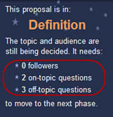

{ .post-img }

A few weeks ago I proposed a new community for StackExchange and it has been growing at an exponential rate. We are about half way there, but we need **your** help to make this community a success.

- Update 16th August 2010 – The Proposal has now moved from Proposed to the Committed stage and we need your commitment.  
   [http://area51.stackexchange.com/proposals/15894/visual-studio-alm?referrer=vtx1N5_bjYysH8mQCaDCxQ2](http://area51.stackexchange.com/proposals/15894/visual-studio-alm?referrer=vtx1N5_bjYysH8mQCaDCxQ2 "http://area51.stackexchange.com/proposals/15894/visual-studio-alm?referrer=vtx1N5_bjYysH8mQCaDCxQ2")

---

### Monday 16th August 2010 – Commit to Visual Studio ALM on Area51

If you are not familiar with StackExchange, it has a community driven voting system for creating new sites like Stack Overflow.

Thanks everyone for your efforts and excellent questions. Although we suffered a little from question overload at the Proposal stage I think this is a good omen for the future beta.

{ .post-img }

We are now in the Commitment stage and need a score of 2000 user points (which gets us to 100%) to proceed to the Beta. This is apparently calculated based on a user’s reputation:

> _To get a feel for it:_
>
> - _A user with no reputation gets a score of 1_
> - _A user with 200 reputation on 1 site gets a score of 1.7_
> - _A user with 200 reputation on 3 sites gets a score of 3.1_
> - _A user with 10000 reputation on 1 site gets a score of 7.2_
> - _A user with 10000 reputation on 3 sites gets a score of 19.6 (these are extremely rare)  
>    \_\_Source [http://meta.stackoverflow.com/questions/53650/area-51-commit-percent](http://meta.stackoverflow.com/questions/53650/area-51-commit-percent)_

So if you are interested in Visual Studio ALM or any of its features, be sure to Commit and send this to anyone you know who might be interested.

[Commit to Visual Studio ALM](http://area51.stackexchange.com/proposals/15894/visual-studio-alm?referrer=vtx1N5_bjYysH8mQCaDCxQ2)

### Friday 13th August 2010 – Vote for Visual Studio ALM on Area51

[Visual Studio ALM StackExchange Proposal](http://area51.stackexchange.com/proposals/15894/visual-studio-alm?referrer=vtx1N5_bjYysH8mQCaDCxQ2 "http://area51.stackexchange.com/proposals/15894/visual-studio-alm?referrer=vtx1N5_bjYysH8mQCaDCxQ2")

We have now reached 1 of the three milestones required to get the site to the “commit” stage.

  
{ .post-img }
**Figure: We have enough followers but not enough votes**

We now have question overload and need to concentrate on getting those top 5 On Topic and 5 Off Topic questions to have 20 votes each.

##### Top 5 On-Topic

- What’s a backup and recovery process for Team Foundation Server 2010?
- How can I automatically version my assemblies in TFS Build 2010?
- How can I sync two Team Foundation Servers?
- How do I do branching if I want to be able to create hotfixes?
- Default value: Are they assigned only when a work item is created?

##### Top 5 Off-Topic

- Do I need to purchase additional Client access Licenses for TFS 2010?
- How do I migrate my TFS content to Visual SourceSafe?
- What and who are the ALM Rangers and what role do they play within Microsoft?
- How do you install Visual Studio 2003?
- How do I debug my WPF application?

**If everyone can concentrate their votes in at least the current top 10 we should have enough! If you currently have a vote on a question with fewer than 10 votes it may be worth removing it and adding it to one of the questions higher up.**

[Visual Studio ALM StackExchange Proposal](http://area51.stackexchange.com/proposals/15894/visual-studio-alm?referrer=vtx1N5_bjYysH8mQCaDCxQ2 "http://area51.stackexchange.com/proposals/15894/visual-studio-alm?referrer=vtx1N5_bjYysH8mQCaDCxQ2")  
You have 5 on-topic and 5 off-topic votes to cast.
