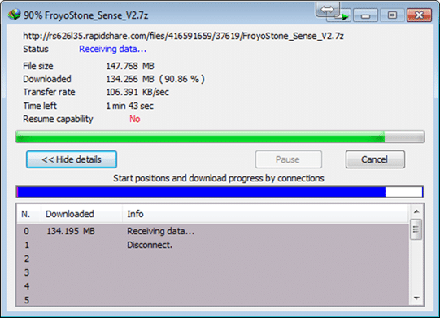
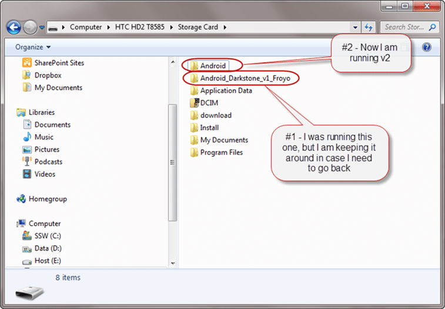

While my HD2 was away getting fixed I had to slum it using an Android phone from Vodafone. It was a small cheap Vodafone 845 running Android 2.1 and you know what… I loved it.
{ .post-img }

Don’t get me wrong… the phone was crap… but Android is good.

While I wait to get my hands on Windows Phone 7 I would rather use Android than Windows Mobile 6, but how can I do that without buying a new phone?

- **Update: 8th September 2010** – Make sure that you have HSPL 2 and Radio 2.12.\* installed otherwise you may encounter freezing when you phone wakes from standby.
- **Update: 8th September 2010** – You may also want to get a hold of SetCPU to change the 800mhz cap on your device. make sure you are careful though as increasing the min cap can reduce battery life.  
   [http://www.xda-developers.com/android/setcpu-for-android-root-users/](http://www.xda-developers.com/android/setcpu-for-android-root-users/ "http://www.xda-developers.com/android/setcpu-for-android-root-users/")

---

Running Android on your HD2 is not the easiest thing to wrap your head around. Basically you start Android from Windows, but it turns off Windows Mobile during the process. This means that you can start any version of Android, or even Ubuntu you want.

It is worth mentioning is that the entire OS runs from your SD card, which does impact battery life but the performance is very close to native.

I started by finding a version of Android that I liked on the  [HD2 Android Development](http://forum.xda-developers.com/forumdisplay.php?f=735) forum. I have been running [FroyoStone Sense - V1 from darkstone](http://forum.xda-developers.com/showthread.php?t=747492) for about 24 hours without a problem. While writing this post I noticed that they have just released v2, so I will be updating to that.

If you are going down this road then you are going to have to accept that there are some things that just do not work, and others that mostly work. However if you keep an eye on the forums you will see that they release updates quite regularly and more things work with every version.

  
{ .post-img }
**Figure: Downloading may take some time unless you have a premium account**

Once you have it downloaded you need to copy it to SD card. It is best to keep each version in its own folder so you can easily switch if you are not happy with the new one.

  
{ .post-img }
**Figure: Always keep the old version around until you are happy**

I like to use the default “Android” folder as it causes me a lot less pain than trying to use a custom folder. If you are a more advanced user I am sure you could solve the problems, but I could not be bothered. I just want something that works…

Make sure you read the “readme” to get the latest information, but you can now just run the “CLRCAD.exe” and then the “haret.exe” applications. However I have found this to be problematic and I guess other have as well as there is now a little runner application for Windows Mobile.

Install [Exceller Multiple Build Loader for Android/Ubuntu 2.1](http://forum.xda-developers.com/showthread.php?t=737001) on your windows mobile so you can choose the version you want. You can also use this application to Auto-Run the version of Android you want, which is nice.

  
{ .post-img }
**Figure: I have added the Loader application to the home screen**

There is really no requirement to do this, it just makes it quicker to launch after booting into Windows.

  
{ .post-img }
**Figure: You need to tap to change the version of Android you want to load**

You can see the Auto boot options at the bottom that allow you to just turn on your phone and have it ultimately running Android.

  
{ .post-img }
**Figure: You can tap anywhere around the Android logo to run this version**

Once you start Android you will have to wait for a while  and even longer if this is the first time you have booted that version. In fact it could take as long as 5-10 minutes on first boot, but you just need to wait. With this new v2 it creates a 1gb data file which takes a while and eats your battery. This is normal, and will only happen the first time you boot.
{ .post-img }

If you notice the message “failed to find rootfs.img on SD card” then you probably have an issue. Similarly if you notice that your phone has been “Booting” for over 30 minutes its probably configured incorrectly. If this is the case then you should retry and watch the boot sequence. You will see an “Error with XXX” or a “Could not access XXX” and just Google the exact message to find the problem. This is why I went back to using just the “Android” folder.

  
{ .post-img }
**Figure: Running Android on your HD2 is very nice on the 4.2” screen.**

I really do like Android, and if Windows Phone 7 does not live up to its expectations this is probably the OS I will run. I had first exposure to it when my wife got her first Android (HTC Tattoo) and recently I used a Vodafone 845. These phones are small, but they still offer a far better experience than Windows Mobile 6.

Running Android on my HD2 is such a superior experience that Windows Phone 7 will need to be almost perfect beat it; I really hope it is…

Technorati Tags: [Android](http://technorati.com/tags/Android),[HD2](http://technorati.com/tags/HD2),[WM6](http://technorati.com/tags/WM6)
