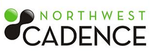

Over the last 11 months, I have worked for a fantastic group of people at SSW and on a fantastic array of projects. However, the time has now come to specialise in one specific area. I have worked with Visual Studio ALM since its launch in 2005 and more recently with Scrum and the Professional Scrum Developer course that launched in April. Therefore, to this end I am leaving my job as a Solution Architect at [SSW](http://ssw.com.au) for an ALM Consultant role at [Northwest Cadence](http://nwcadence.com).   
 As you may or may not know, my last day at SSW is Friday 10th September and I want to express my thanks to Adam, Anastasia and the rest of the guys for making me welcome, even with the disability of being Scottish.

During the last 11 months, Adam Cogan and the rest of the people at SSW have coached me to be a better developer, implementer, integrator and trainer. We have surmounted many issues and problem within the company to forge an effective ALM and Scrum strategy that has earned SSW soaring accolades from its customers.

## What did I learn?

There are four main things that I learned at SSW:

1. **Rules** – Rules and standards are arguably more important in software than anywhere else is. SSW’s rules, while initially overbearing represent the standard approach that everyone at the company take. The dedication to and the maintenance of the rules is core to the corporate identity and helps define that identity. I played a part in many of the rule sets, and here are the highlights:

   - [Rules to Better Email](http://sharepoint.ssw.com.au/Standards/Communication/RulesToBetterEmail/Pages/default.aspx)
   - [Rules to Better Social Networking](http://sharepoint.ssw.com.au/Standards/Communication/RulesToBetterSocialNetworking/Pages/default.aspx)
   - [Rules to Better Twitter](http://sharepoint.ssw.com.au/Standards/Communication/RulesToBetterTwitter/Pages/Default.aspx)
   - [Rules to Better Scrum using TFS](http://sharepoint.ssw.com.au/Standards/Management/RulesToBetterScrumUsingTFS/Pages/default.aspx)
   - [Rules to Better Source Control With TFS](http://www.ssw.com.au/ssw/Standards/Rules/RulesToBetterSourceControlwithTFS.aspx)
   - [Rules to Better TFS 2010 Migration](http://sharepoint.ssw.com.au/Standards/TFS/RulesToBetterTFS2010Migration/Pages/default.aspx)

   I remember speaking to Matt Nunn after a presentation he did in Glasgow and he commented

   > “You SSW guys are everywhere.”  
   > \-Matt Nunn in Edinburgh

   See Rules to better branding #8: [Do you brand your employees?](http://www.ssw.com.au/ssw/Standards/Rules/#BrandingEmployees)

2. **Process** – Since I started my quest to learn and implement Scrum at SSW earlier this year I have learned the importance of process in what we do. I knew it was important, but I had little idea of how imperative it was to being able to deliver software. In my time at SSW I have become both a Certified ScrumMaster and a Professional Scrum Developer Trainer, not to mention all the other processes and practices that I now have familiarity with:

   - Scrum
   - Agile
   - Lean
   - Kanban
   - TDD
   - BDD
   - Continuous Integration
   - Continuous Deployment

   These are all pieces of the same puzzle and if you get the right combination, you can ship quality code quickly that meets the customers’ needs, which is ultimately the goal of all software projects.

3. **Technology** – Boy does SSW keep to the cutting edge. No sooner is something released than they pushing it to clients and they already have people fully qualified and familiar with all of its inner workings. This is key to keeping at the top of the game, and long-time clients are happy to be Guiney pigs as they know that all the guys are ready and able to fix any problems. With two Regional Directors and three MVP’s it can be hard to argue with their expertise and confidence. Technologies I have used in anger:

   - Silverlight 4
   - Visual Studio 2010
   - Dynamics CRM 4
   - SharePoint 2010
   - Team Foundation Build 2010
   - Microsoft Test Manager
   - Microsoft .NET 4

   It always surprises me the number of developers that are not technologists and in this ever-changing world only the technologists float to the top of the pile. The obscure things that sort the good developers from the bad and having an understanding of things that are not strictly in their field of view sets them apart.

4. **Communication** – If I took nothing else from SSW it would be the [Rules to better Email](http://www.ssw.com.au/ssw/Standards/Rules/RulesToBetterEmail.aspx) which, along with other things, helped me function as a member of all the teams over 10 hours and 10,000 miles distant. You may also have noticed that around ten months ago my blog started getting a lot better.

   Look back at blog posts I made over a year ago and you will see the influence that Adam Cogan had over my blogging style. Adam can make your posts go from [this](http://blog.hinshelwood.com/archive/2009/07/30/finding-features-calendar-preview.aspx), to [this](http://blog.hinshelwood.com/archive/2010/07/07/active-directory-groups-not-syncing-with-team-foundation-server-2010.aspx) in no time at all using nothing but his critical eye and direct Australian attitude. I have really appreciated all of his help.

## Who did I learn from?

- **Adam Cogan** – Adam has mentored me into a lean mean ALM machine and I would not have the courage to do the things I have done over the last year without his support. It can be painfully frustrating at times always being corrected and referred to rules, but his unwavering quest to better everyone that works for him pays off.
- **Paul Neumeyer** – I worked with Paul on many subjects around process and technical implementations. When you have a parallel processing Ph.D. this stuff must be easy. Paul has been instrumental in implementing Scrum within SSW and has paved the way with fantastic recommendations from the customers he has worked with. His knowledge of the finer details of project management and where the failing have been in the past has lead him to enthusiastically adopt Scrum at SSW and the results are amassing. If I was ever wanting to bounce an idea off someone or just to gain advice in incite on anything from client engagement to market interest in a product then Paul always had well though out answers that always made sense. I would love to get a chance to work with Paul in the future…
- **Allan Zhou** – Although Allan no longer works at SSW \[he may be going back\] working with him was a pleasure and while overcoming the language barrier was not easy at times his skills with technology more than made up for it.
- **Lei Xu** – What can I say about the first Regional Director in China? Lei as always works hard to make the integration between Beijing and Sydney run a slickly as possible. He even managed to accommodate some strange fellow in Glasgow.
- **Mark Hetherington** – The King of process if ever there was one. Mark took to Scrum like a fish in water as fits his background in Process. He helped me get to grips with Scrum early on and was a fantastic sounding block for all things Process.

> Sae lang an' cheers fur aw th' fesh.

## Where am I going?

{ .post-img }

Over the last year, I have been steadily heading towards a point that converges on ALM. I have always had an interest in how developers work and in supporting those developers to increase their productivity and efficiency. This is what ALM is all about and unfortunately, SSW is not an ALM shop. Although I have worked with SharePoint and CRM, Silverlight and MVC, and all manner of other interesting things, I really want to concentrate on that witch has been termed Application Lifecycle Management.

To this end, I have been looking for work in the dedicated ALM space. I had resigned myself to the fact that I would have to leave my hometown Glasgow but I had thought it would be for London or Reading in the UK. During an attempt at “inbox to 0”, I chanced upon an email from one Steven Borg way back in February on the ALM Champs group looking for [their next great ALM Consultant](http://blog.nwcadence.com/2010/02/now-hiring-our-next-great-alm-consultant/). I took a chance and sent him an email asking if they were still looking and this was the response:

> Perfect timing!  We’d love to talk with you!…\[removed for terseness\]…By the way, you have one of the most useful blogs in existence!  Great information on there, and a common reference point for me (and I suppose everyone else in the [TFS](http://msdn2.microsoft.com/en-us/teamsystem/aa718934.aspx "Team Foundation Server") business!)  
> **\-Steven Borg**

There is very little as fulfilling as notoriety, especially when it is positive.

To cut a long story short, [Northwest Cadence](http://www.nwcadence.com) has offered me a job as an ALM Consultant in **Seattle, Washington, USA**. This is a big move, as we will be moving not only a Husband and Wife, but also two small children and a dog.

This is not the beginning however as we still have to apply for and receive an H1b visa for the US which will allow me to work there for three years. This process is slow and expensive for North West Cadence and they wanted to make sure we would be happy, so they flew my wife and I out to Seattle last week. Jadie and I only had 3 days in Seattle, but it was a packed 3 days. I met with most of the people at North West Candace and Steven Borg spent lots of time with us showing off Seattle and the surrounding areas. We even had a day looking around houses for rent and two evenings out for dinner on our own, once in Bellevue and once in Renton.

Both Jadie and I loved Seattle and for some reason everyone at North West Cadence liked us. Although Jadie was very upset when on the first day a shop assistant though she was German, she had a complex about that for the rest of the trip.

We should move in November, depending on when the visas come back, but the lawyer said that the best reassurance she could give was 50%. Although this is low, I can’t think of any reason that I would be refused and I guess it is all down to wither the person vetting my visa likes my face.

Northwest Cadence is the A-Team of the ALM world and they have a heck of a lot of big clients. If you look at their [blog](http://blog.nwcadence.com/) you can see that it has not been updated in while and this is due to a lack of slack in their schedule. They want me to introduce some of that slack so they have time to look at new technologies, blog and most importantly be able to service more of their customers quickly.

Northwest Cadence work heavily in areas of Process with a solid foundation in the technical facets of the Visual Studio ALM toolset and although I have a technical depth of knowledge in Visual Studio ALM I am only just starting my journey into the world of process. Although I am familiar with some of the concepts of other methods I only have deep knowledge of Scrum and even that knowledge is only 8 months old. It will take time for me to learn the other indicate processes that will help me shape and improve the delivery of software for teams around the world and [Steven Borg](http://blog.nwcadence.com/author/stevenborg/) and [Jeff Levinson](http://blog.nwcadence.com/author/jefflevinson/) are the best people to teach me.

The whole family is now really looking forward to this, but for to all the things we have to do between now and then.

## What now?

I will have a couple of months between leaving SSW and starting at Northwest Cadence, and I need some work to fill that gap. SSW has offered 1-2 days per week which I am gladly taking, but I am also looking for anyone who is:

- Upgrading to TFS 2010
- Migrating to TFS 2010
- Installing TFS 2010
- Integrating with SharePoint 2007/2010
- Migrating from one Process template to another
- Private [Professional Scrum Developer](http://msdn.microsoft.com/en-us/vstudio/ff433643.aspx) courses
- Anything else you can think of that is TFS related

**If you know of anyone who is looking for a TFS/ALM Consultant and no one else can help, if you can find me. Then call… (doot do dodoot doooo, do doot doooo…)**

Technorati Tags: [Northwest Cadence](http://technorati.com/tags/Northwest+Cadence),[ALM](http://technorati.com/tags/ALM),[SSW](http://technorati.com/tags/SSW),[TFS 2010](http://technorati.com/tags/TFS+2010),[Visual Studio](http://technorati.com/tags/Visual+Studio)
