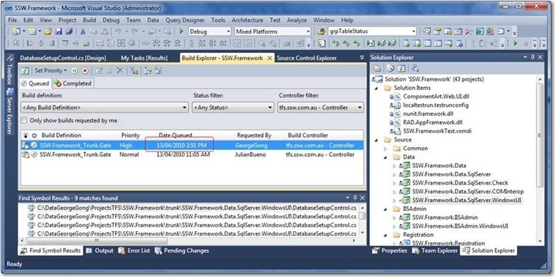
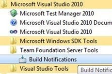
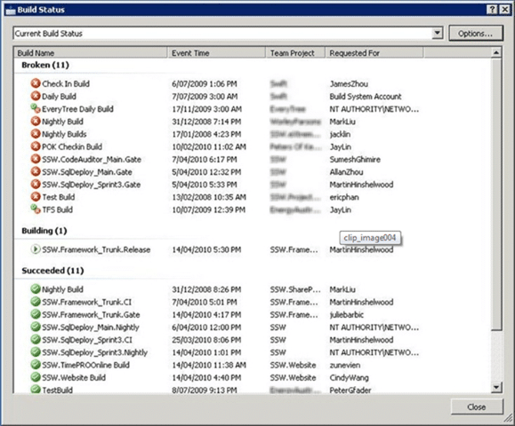
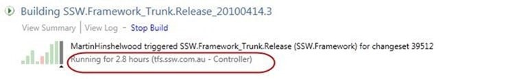
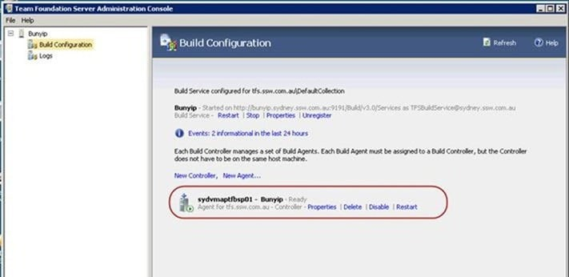
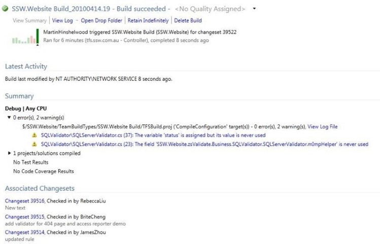

{ .post-img }

Team Foundation Build can be a difficult beast, but not usually because of itself. Although people do experience problems when adding solutions that have been around for a while with no build run, it really does do a fantastic job.

On occasion I have seen what I call a “Stuck Build” which is a build that never completes, this tends to only happen on builds setup on large codebases that have never been built before. It also usually also occurs at the point in the build after everything has been built and Team Foundation Build is trying to upload the data it has collected to Team Foundation Server.

---

Developers should always make sure that any builds they queue complete in a timely fashion.

> _I queued a build at 3:51. It is still there at 4:21. It seems stuck._
>
> _\_
> { .post-img }
>
> _**\-George Gong, SSW**_

If you see a Queued build that never completes then there is probably a stuck build somewhere. George;s build has not even run yet, it is still waiting in the queue.

> I created a new build for SSW.Website and now it stays in the queue for over 30 minutes.
>
> ![clip_image002[4]](images/Howtodealwithastuckorinfinitelyqueuedbui_D645-clip_image0024_-4-4.jpg)
> { .post-img }
>
> But the [TFS](http://msdn2.microsoft.com/en-us/teamsystem/aa718934.aspx "Team Foundation Server") build controller is ok.
>
> ![clip_image004[4]](images/Howtodealwithastuckorinfinitelyqueuedbui_D645-clip_image0044_-5-5.jpg)
> { .post-img }
>
> ![clip_image006[4]](images/Howtodealwithastuckorinfinitelyqueuedbui_D645-clip_image0064_-7-7.jpg)
> { .post-img }
>
> I have just installed the VS2010 RTM and Team Explorer. Did I miss something?
>
> **\-Brite Cheng, SSW**

Again, this build is queued, it never started. It is queued as there is another build running. Evan though we now have more than one build server queues will always exist. All it takes is for one more build than we have capacity for to be sent to the controller at the same time. Someone will always have to wait. But they should not have to wait for long. We should probably have something line [http://buildmonitor.codeplex.com/](http://buildmonitor.codeplex.com/) setup so we can quickly look and see what builds are running J but in the mean time you can run the “Build Notifications” application to see what builds are running.

  
{ .post-img }
**Figure: Where to find the build monitor on the Start menu**

Sometimes a build can get Stuck. They usually get stuck when they are uploading assets into TFS. This could be a communication problem or purely a size problem, or a little of both. One thing to look at is how many data collectors you have running during the build and maybe reduce them to get a consistent pass.

You can log onto the server and kill the running build, but make sure it is stuck first… No build should take longer than 30 minutes (Unless it always does).

I would expect any developer to follow the process that comes next:

#### How to Debug a stuck build:

In this case there is a stuck build of SSW.Framework running:

{ .post-img }

**Figure: Build list**

I can tell that it is stuck by looking at the running time:

  
{ .post-img }
**Figure: A very stuck build**

After cancelling the build, it did not free up the Build Service (stuck) so I need to restart the build service.

Launch the Admin Console on the build server and restart the build service

{ .post-img }

**Figure: Restart the build service**

Then we need to queue another build.

{ .post-img }

**Figure: build is now successful**

Done

Technorati Tags: [TFBS](http://technorati.com/tags/TFBS),[TFS 2010](http://technorati.com/tags/TFS+2010)
