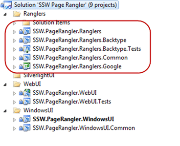
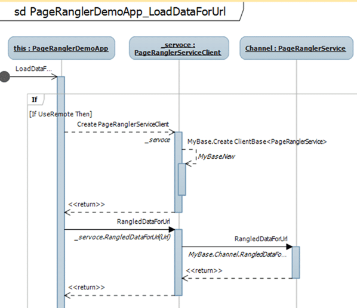
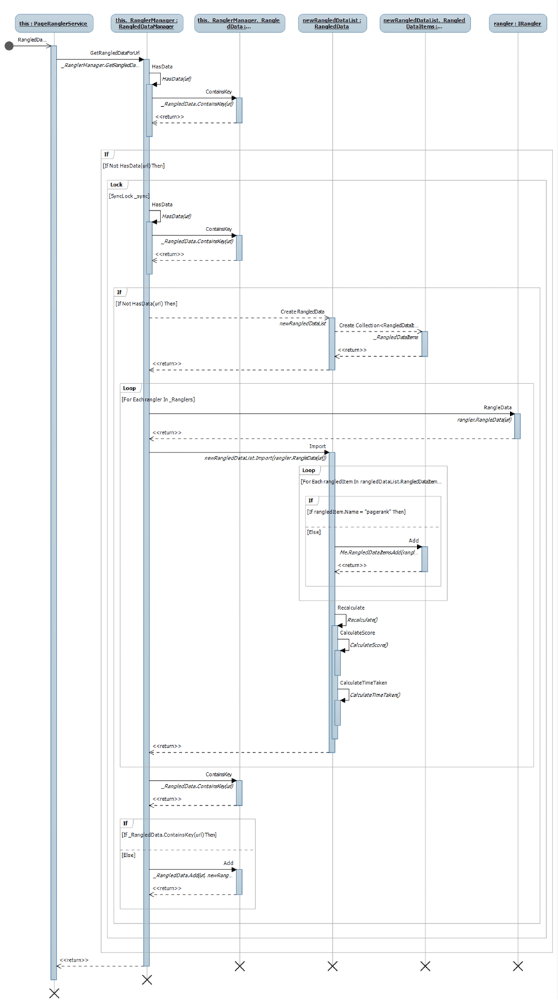
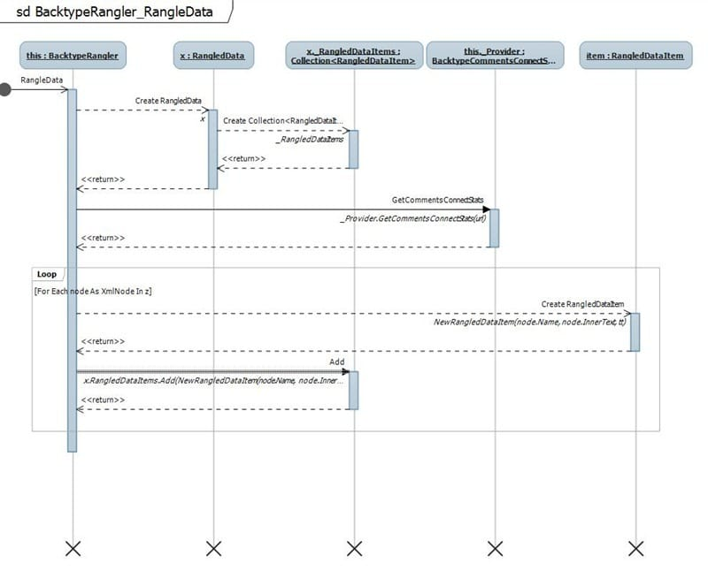

I had an idea to have blog posts, or Rules listed not in date order, or an arbitrary order, but in some sort of calculated order. For this I would need to get data from somewhere and I fancied using; Number of Comments, Number of Trackbacks, Reddit, Digg, FriendFeed Twitter and Google Page rank. In this sample I use the term Rangler as a cross between Wrangler and Rank, but they are really Data Collectors.
{ .post-img }

---

This is really an exploratory brain dump and proof-of-concept, so please excuse any bad code or practices 
{ .post-img }

## What is the goal?

The idea is to call some external services and pull the data locally. Then calculate based on an algorithm:

```
Rank = ([Facebook Likes] + [Tweets] + [Digs] + [Pingbacks/Trackbacks]) * [Google Rank]
```

**Figure: Proposed Algorithm**

I would then be able to order the content based on this value and see what the most popular content is. You could also augment this by adding Views as well, but I did not have that data readily available.

I only really have time time to create a proof-of-concept and there are lots of data services out there that you could call, so I am picking two data feeds. There are lots of data services out there, but BackType gives quite a few bits of data and Google Page Rank is a well know quality indicator.

##### What is the result?

I built a really simple interface that I could use to test the concept with all the core functionality sitting behind a web service.


{ .post-img }

**Figure: This blog post gets a rank of 2460**

As you can see my UI skills are fantastic 
{ .post-img }


{ .post-img }

**Figure: Only 1 tweet for this rule**

If you rank your pages this way then you can see which pages are lost causes and which it is worth spending some time keeping up to date and augmenting. Or visa-versa if you are looking for content that has not had much love in a while and you want to try and increase its standing.

##### How was it done?

It was implemented as a WPF application that calls a web service to get the data. It is only POC, but it is extensible:


{ .post-img }

**Figure: Adding a new “Rangler” is a matter of adding a new assembly to the bin folder. No need to touch existing code.**

As you can see I don’t have many tests and I really just used them to test each layer prior to getting the UI up and running. I think I wrote 4 tests in total.


{ .post-img }

**Figure: Ranglers are loaded dynamically if they are placed in the Bin directory of the website.**

I wanted a rudimentarily extensible platform even at this stage as I like to switch code in and out to see which performs best. One of the first improvements I would use at this stage is to hand the calculating of the score over to the individual Ranglers as you may want to have some crazy calculation changes at a later date.

There are a number of ways to load things dynamically, and I think this is the quick and dirty way.

```
Private Sub LoadRanglers()
    ' Load all ranglers contained within asseblies available localy.
    Dim path As String = Assembly.GetExecutingAssembly.CodeBase.Replace("file:///", "")
    path = System.IO.Path.GetDirectoryName(path)
    For Each file In System.IO.Directory.EnumerateFiles(path, "*rangler*.dll", IO.SearchOption.AllDirectories)
        Dim ass = System.Reflection.Assembly.LoadFile(file)
        Dim ranglers = From x In ass.GetTypes Where x.GetInterfaces.Contains(GetType(IRangler))
        ranglers.ToList.ForEach(Sub(y) _Ranglers.Add(Activator.CreateInstance(y)))
    Next
End Sub
```

**Figure: This is the code that searches through the types in all the assemblies for classes that implement IRangler**

You can also use MEF and other frameworks to make this even more extensible in the future.


{ .post-img }

**Figure: The UI calls the Service**

The reason I used a web service is that I can see a more generic use for this capability in the future. It allows you to get quite a lot of statistical information just now, but it could be extended to allow the retrieval of all the Tweets, comments and other bits of information that make up the stats.


{ .post-img }

**Figure: Which does all of the calculation and calls for all of the Ranglers that it finds**

The web service calls the RanglerManager which is responsible for looking after the Ranglers and caching the data to make subsequent calls a lot faster for the same URL.


{ .post-img }

**Figure: The BackType Rangler pulls back an XML feed from BackType’s servers with lots of data**

The BackType Rangler calls the BackType API and parses out the returned statistics in a custom data class.


{ .post-img }

**Figure: The Google Rangler does some scary mumbo jumbo to get the Page Rank**

The Google Page Rank Rangler is a little bit of a trickier one as you can’t just get the data, but it implemented just fine and you can see the results in the UI shots above.

See [Request Google's Page-rank Programmatically](http://www.codeproject.com/KB/aspnet/Google_Pagerank.aspx) to see how all the internals work.

## Conclusion

Although this is just a small proof-of-concept you can imagine this applied to hundreds of pages on your site, and I think you would be surprised what floats to the top. If I was perusing this further I would like to implement a lot more data collectors

Calculation for [http://www.ssw.com.au/SSW/Standards/Rules/RulestoBetterEmail.aspx](http://www.ssw.com.au/SSW/Standards/Rules/RulestoBetterEmail.aspx) (yes I know it is not one rule, but it is one page) would be based on:

- Facebook Likes: 0  
   ([http://www.backtype.com/page/www.ssw.com.au%2FSSW%2FStandards%2FRules%2FRulestoBetterEmail.aspx](http://www.backtype.com/page/www.ssw.com.au%2FSSW%2FStandards%2FRules%2FRulestoBetterEmail.aspx))

- Tweets: 9  
   ([http://www.backtype.com/page/www.ssw.com.au%2FSSW%2FStandards%2FRules%2FRulestoBetterEmail.aspx](http://www.backtype.com/page/www.ssw.com.au%2FSSW%2FStandards%2FRules%2FRulestoBetterEmail.aspx))

- Digs: 16  
   ([http://digg.com/tech_news/SSW_Rules_to_Better_Email)](http://digg.com/tech_news/SSW_Rules_to_Better_Email))

- Links: 56  
   ([http://www.google.co.uk/#hl=en&source=hp&q=links%3Ahttp%3A%2F%2Fwww.ssw.com.au%2FSSW%2FStandards%2FRules%2FRulestoBetterEmail.aspx&btnG=Google+Search&rlz=1R2GGLL_enAU343&aq=f&aqi=&aql=&oq=links%3Ahttp%3A%2F%2Fwww.ssw.com.au%2FSSW%2FStandards%2FRules%2FRulestoBetterEmail.aspx&gs_rfai=&fp=abea52fcfe603f61)](http://www.google.co.uk/#hl=en&source=hp&q=links%3Ahttp%3A%2F%2Fwww.ssw.com.au%2FSSW%2FStandards%2FRules%2FRulestoBetterEmail.aspx&btnG=Google+Search&rlz=1R2GGLL_enAU343&aq=f&aqi=&aql=&oq=links%3Ahttp%3A%2F%2Fwww.ssw.com.au%2FSSW%2FStandards%2FRules%2FRulestoBetterEmail.aspx&gs_rfai=&fp=abea52fcfe603f61))

- Google: **3/10  
   ([http://www.prchecker.info/check_page_rank.php](http://www.prchecker.info/check_page_rank.php))**

The whole purpose of this is to surface content on your site that is popular, and to identify where you should spend your time; be it at the bottom or the top.

- **What do you think of this approach?**

- **What other data collectors would you like to see?**

Technorati Tags: [Links](http://technorati.com/tags/Links),[.NET](http://technorati.com/tags/.NET),[WCF](http://technorati.com/tags/WCF)
