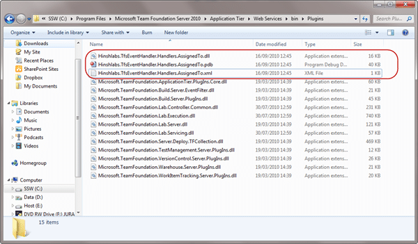
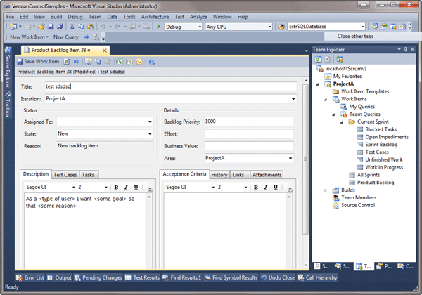

There is a lot of references and blog posts on how to handle SOAP events raised by Team Foundation Server 2005, 2008 and 2010 but is there anything new in 2010 that supersedes this? Even though I knew it was there, n o amount of google-fu brought back any results relevant to anything new, so hopefully this will fill that gap.
{ .post-img }

---

In Team Foundation Server (TFS) 2010 you can write event subscribers that are called and run within the context of the TFS server itself. This means that you have access to all the goodies within TFS directly without having to call back to the TFS server.

This is the first proof-of-concept handler I have written in a process leading to rewriting the TFS Event Handler to use this method of handling events as it will be much slicker with the ability to write much more complex handlers.

In order for your new Event Handler to be loaded and run you need to put it somewhere that TFS knows to look. As TFS is primarily made up of a bunch of web services you would be putting any output assemblies into the “**%Program Files%Microsoft Team Foundation Server 2010Application TierWeb ServicesbinPlugins**” directory. TFS will look through any assemblies in this folder and load any classes that implement any of the extension interfaces.

In this case we are extending TFS using the **ISubscriber** interface.

```
Public Interface ISubscriber
    ' Methods
    Function ProcessEvent(ByVal requestContext As TeamFoundationRequestContext, _
			  ByVal notificationType As NotificationType, _
			  ByVal notificationEventArgs As Object, _
			  <Out> ByRef statusCode As Integer, _
			  <Out> ByRef statusMessage As String, _
			  <Out> ByRef properties As ExceptionPropertyCollection) As EventNotificationStatus
    Function SubscribedTypes() As Type()

    ' Properties
    ReadOnly Property Name As String
    ReadOnly Property Priority As SubscriberPriority
End Interface
```

The **ISubscriber** interface can be found in the “**Microsoft.TeamFoundation.Framework.Server**” assembly and gives you the basics for wiring up to a particular Event.

```
Imports Microsoft.TeamFoundation.Framework.Server
Imports Microsoft.TeamFoundation.WorkItemTracking.Server

Public Class AssignedToHandler
    Implements ISubscriber

    Public ReadOnly Property Name As String Implements ISubscriber.Name
        Get

        End Get
    End Property

    Public ReadOnly Property Priority As SubscriberPriority Implements ISubscriber.Priority
        Get

        End Get
    End Property

    Public Function ProcessEvent(ByVal requestContext As TeamFoundationRequestContext, _
			      ByVal notificationType As NotificationType, _
			      ByVal notificationEventArgs As Object, _
			      ByRef statusCode As Integer, _
			      ByRef statusMessage As String, _
			      ByRef properties As ExceptionPropertyCollection) As EventNotificationStatus Implements ]ISubscriber.ProcessEvent

    End Function

    Public Function SubscribedTypes() As System.Type() Implements ISubscriber.SubscribedTypes

    End Function

End Class
```

Once you have implemented the interface your method stubs will be created for you.

```
Public ReadOnly Property Name As String Implements Microsoft.TeamFoundation.Framework.Server.ISubscriber.Name
    Get
        Return "Hinshlabs test handler 1"
    End Get
End Property
```

Although the name does not immediately look like it is useful I would assume that any error output would include the name as a reference so it would probably be best to pick something that is easily recognisable.

```
Public ReadOnly Property Priority As SubscriberPriority Implements ISubscriber.Priority
    Get
        Return SubscriberPriority.Normal
    End Get
End Property
```

I am really not sure of the impact of changing the Priority, but I think it would influence the order in which any Subscribers are executed, with the higher priority subscribers getting first dibs. This would be important if we were implementing the Decision points ability that has been built into events.

```
Public Enum SubscriberPriority
    ' Fields
    AboveNormal = 3
    BelowNormal = 1
    High = 4
    Low = 0
    Normal = 2
End Enum
```

Some of the events allow you to cancel or change the action mid stride. Think of cancelling a Check-in if your company policy is not met.

You can find a full list of events and which ones support Decision points on my previous [post](http://blog.hinshelwood.com/archive/2010/07/07/tfs-event-handler-for-team-foundation-server-2010.aspx).

```
Public Function SubscribedTypes() As System.Type() Implements ISubscriber.SubscribedTypes
    Return New Type() {GetType(WorkItemChangedEvent)}
End Function
```

As the Subscribers can handle any type of event this is were you can start the filtering process and only have events you are interested in passed your way. This is also where you have to pull in other assemblies to reference the specific events as they are peppered all over the assemblies for TFS.

In this case we need to reference the “**Microsoft.TeamFoundation.WorkItemTracking.Server.DataAccessLayer.dll**” assembly as it contains the **WorkItemChangedEvent** under the “**Microsoft.TeamFoundation.WorkItemTracking.Server**” namespace. I am not really sure why it is hidden away in this assembly, but I think there were many things that were not finished before RTM and probably moving these classes did not make the cut.

All you need to do is pass back an array of the types of events you want to handle.

```
Public Function ProcessEvent(ByVal requestContext As TeamFoundationRequestContext, _
			  ByVal notificationType As NotificationType, _
			  ByVal notificationEventArgs As Object, _
			  ByRef statusCode As Integer, _
			  ByRef statusMessage As String, _
			  ByRef properties As ExceptionPropertyCollection) As EventNotificationStatus Implements ISubscriber.ProcessEvent
    statusCode = 0
    properties = Nothing
    statusMessage = String.Empty
    If (notificationType = notificationType.Notification) AndAlso (TypeOf notificationEventArgs Is WorkItemChangedEvent) Then
       'TODO: Do something with the recieved event
    End If
    Return EventNotificationStatus.ActionPermitted
End Function
```

Now that we have told TFS what events we want to process when we implement the **ProcessEvent** method we can be reasonably certain that it is the right one, but it is always prudent to do an additional test so you don’t process any non event specific code by accident.

The **requestContext** has many of the options and information you will be familiar with on a **TeamFoundationServer** or **TeamProjectCollection** object, but without the thing that are really only relevant when you are accessing a remote server. This is an object with many properties and functions that will let you access almost any facet of your TFS server from security to version control.

```
Public Enum NotificationType
    ' Fields
    DecisionPoint = 0
    Notification = 1
End Enum
```

The notification Type can be used to identify which call you want to handle. For those events that have a decision point as well ProcessEvent would likely be called twice, once for the decision and if the process is permitted to complete once for the notification.

```
Public Enum EventNotificationStatus
    ' Fields
    ActionApproved = 2
    ActionDenied = 0
    ActionPermitted = 1
End Enum
```

Once you have completed any tasks that you want to action you would then pass back the ActionPermited by default. I am not sure yet of the implications of the other options, but all of the built in subscribers pass that back as the default so I will as well.

```
Imports Microsoft.TeamFoundation.Framework.Server
Imports Microsoft.TeamFoundation.WorkItemTracking.Server

Public Class AssignedToHandler
    Implements ISubscriber

    Public ReadOnly Property Name As String Implements ISubscriber.Name
        Get
            Return "test handler"
        End Get
    End Property

    Public ReadOnly Property Priority As SubscriberPriority Implements ISubscriber.Priority
        Get
            Return SubscriberPriority.Normal
        End Get
    End Property

    Public Function ProcessEvent(ByVal requestContext As TeamFoundationRequestContext, _
				 ByVal notificationType As NotificationType, _
				 ByVal notificationEventArgs As Object, _
				 ByRef statusCode As Integer, _
				 ByRef statusMessage As String, _
				 ByRef properties As ExceptionPropertyCollection) As EventNotificationStatus Implements ISubscriber.ProcessEvent
        Try
            statusCode = 0
            properties = Nothing
            statusMessage = String.Empty
            If (notificationType = notificationType.Notification) AndAlso (TypeOf notificationEventArgs Is WorkItemChangedEvent) Then
                Dim objWriter As New System.IO.StreamWriter("c:tempAssignedToHandler.txt")
                objWriter.WriteLine("Recieved WorkItemChangedEvent ")

                objWriter.Close()
            End If
        Catch ex As Exception
            My.Application.Log.WriteException(ex)
        End Try
        Return EventNotificationStatus.ActionPermitted
    End Function

    Public Function SubscribedTypes() As System.Type() Implements ISubscriber.SubscribedTypes
        Return New Type() {GetType(WorkItemChangedEvent)}
    End Function


End Class
```

All I am doing here is writing an event received acknowledgements to a text file, but it is enough for me to prove that the event is captured. All I have to do is copy the assembly output to the right place and make a change to a work item.


{ .post-img }

**Figure: Putting the assembly in the right place is very strait forward**


{ .post-img }

**Figure: Make any sort of change to a work item and save it**

Now lets look into the output file:

```
Recieved WorkItemChangedEvent
```

As you can see we received the event with our event receiver, handled it successfully and wrote some useless text to a file.

## Conclusion

This is a heck of a lot easier than subscribing to events through web services, but you need access to the TFS server locally to be able to add the DLL’s. If you are looking for a zero touch approach you can achieve this through WCF web service soap calls from TFS, but if you want a little more intimacy and structure then you should be using server side events.

**Which method will you be using?**

Technorati Tags: [TFS Customisation](http://technorati.com/tags/TFS+Customisation),[TFS 2010](http://technorati.com/tags/TFS+2010),[CodeProject](http://technorati.com/tags/CodeProject)
