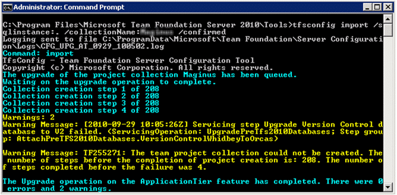

Today I was on-site to do a test upgrade of TFS 2005 to TFS 2010 and we encountered an error that would have caused major delays while we investigated and perhaps requiring additional help from Microsoft.
{ .post-img }

---

Everything progressed smoothly until we tried to run the actual upgrade command and I encountered a message I had not seen before.

```
Warning Message:
[2010-09-29 10:05:26Z] Servicing step Upgrade Version Control database to V2 failed. (ServicingOperation: UpgradePreTfs2010Databases; Step group: AttachPreTFS2010Databases.VersionControlWhidbeyToOrcas)
```

This perplexing message talks about not being able to connect to the SQL Server database. But were we not just doing that for steps 1 to 4.


{ .post-img }

**Figure: At least it got to step 4**

At the beginning of the command you can see the location of the log file that will be used during the running of the command. Looking in that log file we see the actual error that occurred.

```
[Info   @10:29:30.956] [2010-09-29 10:29:27Z][Error] upd_ToV2.sql Block #22 Error: TF246017: Team Foundation Server could not connect to the database. Verify that the server that is hosting the database is operational, and that network problems are not blocking communication with the server. (4 of 208)
[Info   @10:29:30.956] [2010-09-29 10:29:27Z][Informational] Microsoft.TeamFoundation.Framework.Server.CollectionServicingException: upd_ToV2.sql Block #22 Error: TF246017: Team Foundation Server could not connect to the database. Verify that the server that is hosting the database is operational, and that network problems are not blocking communication with the server. ---> Microsoft.TeamFoundation.Framework.Server.DatabaseRuntimeException: TF246017: Team Foundation Server could not connect to the database. Verify that the server that is hosting the database is operational, and that network problems are not blocking communication with the server. ---> System.Data.SqlClient.SqlException: Warning: Fatal error 824 occurred at Sep 29 2010 11:29AM. Note the error and time, and contact your system administrator.
Could not drop constraint. See previous errors.
Dropping PK_tbl_LocalVersion
   at System.Data.SqlClient.SqlConnection.OnError(SqlException exception, Boolean breakConnection)
   at System.Data.SqlClient.TdsParser.ThrowExceptionAndWarning()
   at System.Data.SqlClient.TdsParser.Run(RunBehavior runBehavior, SqlCommand cmdHandler, SqlDataReader dataStream, BulkCopySimpleResultSet bulkCopyHandler, TdsParserStateObject stateObj)
   at System.Data.SqlClient.SqlCommand.RunExecuteNonQueryTds(String methodName, Boolean async)
   at System.Data.SqlClient.SqlCommand.InternalExecuteNonQuery(DbAsyncResult result, String methodName, Boolean sendToPipe)
   at System.Data.SqlClient.SqlCommand.ExecuteNonQuery()
   at Microsoft.TeamFoundation.Framework.Server.TeamFoundationSqlResourceComponent.Execute(ExecuteType executeType, CommandBehavior behavior)
   --- End of inner exception stack trace ---
   at Microsoft.TeamFoundation.Framework.Server.TeamFoundationSqlResourceComponent.TranslateException(Int32 errorNumber, SqlException sqlException, SqlError sqlError)
   at Microsoft.TeamFoundation.Framework.Server.TeamFoundationSqlResourceComponent.TranslateException(SqlException sqlException)
   at Microsoft.TeamFoundation.Framework.Server.TeamFoundationSqlResourceComponent.MapException(SqlException ex, QueryExecutionState queryState)
   at Microsoft.TeamFoundation.Framework.Server.TeamFoundationSqlResourceComponent.HandleException(SqlException ex)
   at Microsoft.TeamFoundation.Framework.Server.TeamFoundationSqlResourceComponent.Execute(ExecuteType executeType, CommandBehavior behavior)
   at Microsoft.TeamFoundation.Framework.Server.TeamFoundationSqlResourceComponent.ExecuteNonQuery(Boolean bindReturnValue)
   at Microsoft.TeamFoundation.Framework.Server.SqlScriptResourceComponent.ExecuteSql(String sqlScriptResourceName, String[] lines, SqlParameter[] sqlParameters)
   --- End of inner exception stack trace ---
   at Microsoft.TeamFoundation.Framework.Server.SqlScriptResourceComponent.ExecuteSql(String sqlScriptResourceName, String[] lines, SqlParameter[] sqlParameters)
   at Microsoft.TeamFoundation.Framework.Server.SqlScriptResourceComponent.ExecuteSql(Stream sqlScriptResource, String sqlScriptResourceName, SqlParameter[] sqlParameters, Boolean retryIfLostConnection)
   at Microsoft.TeamFoundation.Server.Servicing.TFCollection.FrameworkStepPerformer.ExecuteSql(String stepData, ServicingContext servicingContext, Boolean validateOnly)
   at Microsoft.TeamFoundation.Framework.Server.TeamFoundationStepPerformerBase.Microsoft.TeamFoundation.Framework.Server.IStepPerformer.PerformStep(String servicingOperation, String stepType, String stepData, ServicingContext servicingContext)
   at Microsoft.TeamFoundation.Framework.Server.ServicingStepDriver.PerformServicingStep(ServicingStep step, ServicingContext servicingContext, ServicingStepGroup group, ServicingOperation servicingOperation, Boolean validateOnly) (4 of 208)
```

If you Google TF246017 you will find a bunch of knowledge base articles and forum posts, most of which don’t really relate to the problem that we have been experiencing. The only thing that stood out was on of the additional questions to a post that the poster answered for themselves. They found that they had a corrupted database and much like running chkdisk on your PC when you have a corrupted disk there is such a command on SQL for bad databases.

```
dbcc checkdb
```

If you run this command in the context of a database it will give you a report and sure enough there were corruptions in the page file of the database.

```
dbcc checkdb ('TfsVersionControl',repair)
```

Having identified the problem running the command again with the “repair” will fix the issue. With the upgrade successful we are good to go for a production upgrade on Monday.

Technorati Tags: [TFS](http://technorati.com/tags/TFS),[TFS 2005](http://technorati.com/tags/TFS+2005),[TFS 2010](http://technorati.com/tags/TFS+2010)
