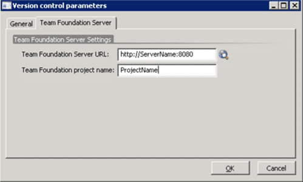
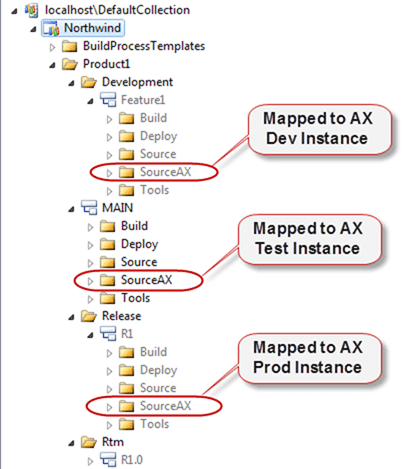
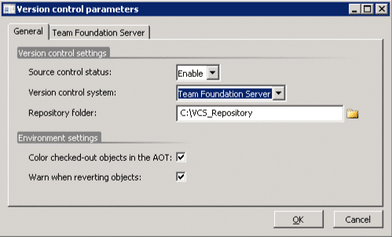

I have been working with a customer who had been frustrated with the need to have new Team Project for every instance of AX that they use. In fact with 3 instances per customer and lots of customers it can very quickly get complicated and I wanted to see if there was a solution for them.  
{ .post-img }

---

There is a White Paper for configuring AX 2009 to connect to TFS 2008 which will allow you to get all of the basics right. I suggest you follow that first.

[Microsoft Dynamics AX 2009 White Paper: Team Foundation Server Version Control Setup](http://www.microsoft.com/downloads/en/details.aspx?FamilyId=EFC24EDC-522E-40AA-8F36-6367ED7AB92D&displaylang=en)

AX 2009 uses the Team Explorer 2008 API to connect to TFS. You can’t just get it to use the 2010 API, but there is a big push to make this sort of interaction version independent in future versions. However for now, you need to use Team Explorer 2008.

On your AX server you will need to install the following components:

1. [Visual Studio Team System 2008 Team Explorer](http://www.microsoft.com/downloads/en/details.aspx?FamilyID=0ed12659-3d41-4420-bbb0-a46e51bfca86&displaylang=en)
2. [Microsoft Visual Studio 2008 Service Pack 1](http://www.microsoft.com/downloads/en/details.aspx?FamilyId=FBEE1648-7106-44A7-9649-6D9F6D58056E&displaylang=en)
3. [Visual Studio Team System 2008 Service Pack 1 Forward Compatibility Update for Team Foundation Server 2010](http://www.microsoft.com/downloads/en/details.aspx?FamilyID=cf13ea45-d17b-4edc-8e6c-6c5b208ec54d&displaylang=en)

Once you have these products installed you can quite happily store the source code for AX Dynamics in TFS 2010 by linking between an AX instance and a Team Project.

  
{ .post-img }
**Figure: Select the TFS server and the local workspace path that is bound to you TFS Team Project**

  
{ .post-img }
**Figure: Set the Server name and the Team Project name**

This gets you started, but if you are a consultancy that has many clients and you have the usual Development, Testing and Production instances of AX for each client you can see how this could quickly become difficult to manage on TFS. If you had 10 clients this would leave you with 30 team projects all linked to different instances of TFS with separate work item queues.

The first things you would need to have done is have a good naming strategy for your projects as you CAN NOT rename a team project. You can see how this could very quickly get messy…

One option to mitigate the work item problem would be to have a single team project for the work items for all of your project. You can categorise them using the “Area” tree and only have AX store the source in the individual Team Projects

  
{ .post-img }
**Figure: Using Area to categorise your work items in a single Team Project**

This works pretty well, but still leaves you with 30 odd Team Projects to manage including your single work item repository project.

## Solution: Have all your AX code under a single Team Project

There are actually a few ways to configure this, including the way described in the white paper:

1. One Team Project per AX instance (As per the white paper)
2. One Team Project per Customer
3. One Team Project.

Options #2 and #3 are setup in the same way, so I am only going to discuss #3 as it conforms to me previous guidance on [when should I use Areas in TFS instead of Team Projects in Team Foundation Server 2010](http://blog.hinshelwood.com/hinshelm/archive/2010/03/09/when-should-i-use-areas-in-tfs-instead-of-team.aspx).

  
{ .post-img }
**Figure: Ideally map to sub folders**

Laying out your source in this way allows you to have a single Team Project to manage while keeping each of your Products/Customers separate. it also means that you can easily merge features from a Feature branch into Main and from there create new Release branches that go to the customer.

  
{ .post-img }
**Figure: Main Branch hierarchy should be replicated for each customer**

Tip: If you are only ever going to have one Feature branch that you continue to work in then you could call it “Current” instead of a feature name.

Lets go back to one of the setting windows for AX 2009.

  
{ .post-img }
**Figure: The Repository folder links to a TFS Mapped folder locally**

AX saves a copy of the customisations in a fixed structure to the path specified in the “Repository folder” textbox. This folder is mapped to TFS and it syncs with that mapping.

  
{ .post-img }
**Figure: Cheating AX into mapping to a specific folder**

In this case if you change the “Repository folder” value to be “c:WorkspacesNorthwindProduct1Feature1” then AX will sync with the correct folder and you have no need to have separate team projects for each instance.

## Advantages

In addition to those listed in [when should I use Areas in TFS instead of Team Projects in Team Foundation Server 2010](http://blog.hinshelwood.com/hinshelm/archive/2010/03/09/when-should-i-use-areas-in-tfs-instead-of-team.aspx).

- **Ease of branching and merging –** Branching and merging can be confusing at the best of times, but without a consistent folder layout it can quickly become a confusing disaster

## Disadvantages

In addition to those listed in [when should I use Areas in TFS instead of Team Projects in Team Foundation Server 2010](http://blog.hinshelwood.com/hinshelm/archive/2010/03/09/when-should-i-use-areas-in-tfs-instead-of-team.aspx).

- **You need to configure Workspaces carefully –** Although this is not difficult it does add a level of complexity that does not exist in option #1.

## Conclusion

The advantages of this approach far out way the slight added complexity in setup and will allow a company to manage all of their source under one roof. They can also easily move work items from one project to another and make it easy for developers to identify where they are working and what effect it will have without them having to refer to documentation.

Ultimately keeping everything under a single format across the company regardless of team or topic allows everyone to understand the source and the impact of changes a little better. And that is never a bad thing…

Technorati Tags: [TFS](http://technorati.com/tags/TFS),[AX](http://technorati.com/tags/AX),[AX2009](http://technorati.com/tags/AX2009),[TFS2010](http://technorati.com/tags/TFS2010)
