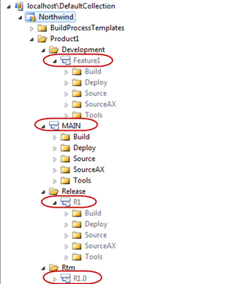
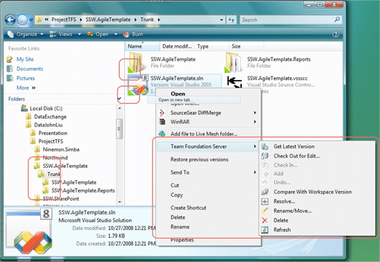

I spotted a good comparison of [TFS vs. Subversion](http://dotnet.dzone.com/news/tfs-vs-subversion) by [Jarosław Dobrzański](http://dobrzanski.net) on DZone (you can also read the [original post](http://dobrzanski.net/2010/04/17/tfs-subversion/)) but I feel that a couple of the points were either out of date, or borne out of a lack of knowledge of the product, or even more likely I just missed the point. This article was taken from the perspective of an SVN user who has moved to TFS, and I am not in that category.
{ .post-img }

- **Updated 15th October 2010**
  - [Adam Cogan](http://www.adamcogan.com/) provided some very useful fixes to make this a little more readable.
  - [Sven Hubert](http://blogs.msdn.com/b/willy-peter_schaub/archive/2010/07/20/introducing-the-visual-studio-alm-rangers-sven-hubert.aspx) wanted some advantages as well, but with this post I wanted to specifically target the issues and problems that an SVN user had encountered which is why I only targeted weaknesses.
  - [Bahadir ARSLAN](http://www.maxiasp.net/) wanted to call out the shell integration provided by the Power Tools.
- **Updated 18th October 2010**
  - [Jeroen Haegebaert](http://jeroen.haegebaert.com/) provided some useful comments on Checking out which I have answered inline.
- **Updated 19th October 2010**
  - [Ben Day](http://blog.benday.com/) provided some useful updates
  - Simon Bromberger made some excellent points about rollback being a little hidden, but any TFS Admin with his salt can use a command line

---

I want to take a look at each of the “Weak points” mentioned and see if there is anything in them. There are numerous things that TFS does that are not even possible in SVN as SVN is just a source control system and not a full ALM platform. The goal of this post is specifically to dispel myths and target issues that users have moving from SVN to TFS.

## #1 – Branch confusion

> \>>Subversion promotes a very clear view (similar to CVS) on the files tree on the server: trunk, branches, tags. In TFS everything is in one bag – branches are simple directories among the other content of ‘the trunk’. It still looks messy to me.  
> \-[Jarosław Dobrzański](http://dobrzanski.net)

Fixed in TFS 2010: This was the case in versions prior to TFS 2010, but with the new branching features it is easy to both see where your branches are and what change sets have been merged to which branches.

  
{ .post-img }
**Figure: Branches are easy to identify**

If you have your branches setup as just directories in the trunk then it is probably the case that your company is just doing it wrong. You should have a standard layout as I have shown above, and indeed this is the format that is recommended in the [TFS Branching Guidance](http://tfsbranchingguideiii.codeplex.com/) and I would recommend that you read it before you just dive into branching.

## #2 – Checking out

> \>>If you want to edit a file you need to check it out for edit so that it’s listed in _Pending Changes_ window after it’s changed. If you edit a file directly in Visual Studio it checks it out for edit automatically; however, if you make the changes outside Visual Studio (you need to change Read-only property prior to that) and forget to check it out for edit in Visual Studio the file is not listed in _Pending Changes_ window. Consequently, the risk of not including that item while making a check-in increases (I personally experienced that a couple of times….)  
> \-[Jarosław Dobrzański](http://dobrzanski.net)

Having never used SVN and having come from a Visual SourceSafe background I have not had this problem, but I have heard this from many other SVN users and I completely agree and understand the perspective. Although I find it difficult to understand how you know which files you have checked out when you don’t have this, it looks like all the source control products are going in this distributed direction and I will just have to go with the flow.

> But if he will setup TFS Power Tools, he has doesn't need to use Visual Studio. At Window Explorer, he can see which files are binded to a source control or he can check-out or check-in. Just install Power Tools..  
> \-Bahadir ARSLAN

> \>>Subversion simply gives you an easy way to determine which files have \*changed\* against their repository version. This is MUCH more useful than the VSS/TFS counterpart, which only gives a view of "which files I have touched since my last checkin".  
> \- [Jeroen Haegebaert](http://jeroen.haegebaert.com/)

This does not help me if I did not check out the file and have no access to the disk it was checked out on:

- As the TFS admin or Project Manager I want to be able to see which files you have been working on so I can make sure I understand the depth and complexity of something I thought was a simple change.
- As a developer I want to check who else has a file checked out so I can coordinate me efforts with them. I don’t want to make sweeping refactor changes if you are also making a bunch of changes that will be irrelevant once I check in.

> \>>Qny edited file stay checked out, even if you (manually) revert your changes (think CTRL-Z). So in the end the "checked out files" list is often not very useful anymore.  
> \- [Jeroen Haegebaert](http://jeroen.haegebaert.com/)

This is really just a difference in the products. Just like VSS users needed to get used to the lack of Sharing and the differences in labelling, there will be habits that work weak for SVN, but not so much for TFS.

With TFS you should be using the tools provided so this never happens. If you call “Undo Checkout” it will automatically revert to the server version. You never know the server version may have changed since you last checked out

{ .post-img }

**Figure: Using Windows Explorer you never get your checkout’s out of sync**

## #3 – Windows only

> \>>It’s dedicated to Windows platforms only, but this is hardly a problem for a team who uses Visual Studio.  
> \-[Jarosław Dobrzański](http://dobrzanski.net)

Fixed in TFS 2010: This one is just plain wrong. I don’t blame the author, I would be much more inclined to blame the marketing team a Microsoft for not making this as big a deal as it should be. Can you say “[Team Explorer Everywhere](http://www.microsoft.com/downloads/en/details.aspx?FamilyID=af1f5168-c0f7-47c6-be7a-2a83a6c02e57&displaylang=en)”.
{ .post-img }

This was originally a third party product called Teamprise that integrated Eclipse into TFS, but with its purchase by Microsoft and the launch of TFS 2010 they have beefed it up so that it supports:

- Apple Mac OS X
- HP-UX
- IBM AIX
- Linux
- Solaris
- Unix
- Windows

On top of that it also supports :

- Eclipse
- IBM Rational Application Developer
- Adobe Flex Builder
- Aptana Studio
- others

This is a massive move by Microsoft to increase the reach of TFS to other platforms, and with the TFS application model being completely service based more diverse support will be coming in the future.

## #4 – Reverting changes

> \>>Weak support for reverting changes  
> \-[Jarosław Dobrzański](http://dobrzanski.net)

I don’t know if weak is the correct word, but yes it is difficult. It was designed to be difficult as you don’t want your developers thinking that it is OK to check-in crap because they can always revert it. I don’t know about you, but I do not want to ever have to revert a change. If I do, it shows a failing in a quality gate somewhere that needs fixed.

- [Rollback Command (Team Foundation Version Control)](http://msdn.microsoft.com/en-us/library/dd380776.aspx) (I need to rollback and entire change set)
- [How to revert changes checked into TFS Version Control](http://msmvps.com/blogs/vstsblog/archive/2009/01/10/how-to-revert-changes-checked-into-tfs-version-control.aspx "http://msmvps.com/blogs/vstsblog/archive/2009/01/10/how-to-revert-changes-checked-into-tfs-version-control.aspx") (I just need to rollback one file)

> Seems a red-herring because it does already work, but developers don’t need to use this feature as they use history and annotate to see what happened only.  
> \-Adam Cogan, Chief Architect at SSW

I like this being hard…

## #5 – Cost

> \>>It’s not a free tool

This is really only partly true. Anyone with a MSDN subscription has a license to both run a TFS server and to connect to any TFS instance, couple that with SQL Server Standard being included in the definition of a TFS License then you can pretty much run TFS for free. If you have some business users that do not have MSDN, then yes, you will need to buy some retail CAL’s, but with the retail TFS 2010 at £500 that includes 5 users without CAL’s price is not an excuse not to use TFS.  
{ .post-img }

If you are an open source developer with no MSDN subscription then you can use [Codeplex](http://www.codeplex.com/) which is completely free from end to end.  
{ .post-img }

One thing I always think about for cost is the on-going support cost. With SVN you are at the mercy of forums and community support that, while often good, is not always timely. TFS is a fully supported retail product, and with the addition of Work Items, Build and Lab all from the same product you don't even need to think about nor support the communication between them.

## #6 – Difficult to install

> \>>Complex installation  
> \-[Jarosław Dobrzański](http://dobrzanski.net)

Fixed in TFS 2010: This was VERY true in TFS 2005 and TFS 2008, but in TFS 2010 the installation is so easy my Dad could do it. I blogged about this during the beta and managed to install and configure TFS 2010 in under 30 minutes.

- [Installing Visual Studio 2010 Team Foundation Server on Windows Vista in 3 minutes](http://blog.hinshelwood.com/archive/2009/10/20/installing-visual-studio-2010-team-foundation-server-on-windows-vista.aspx)
- [Configuring Visual Studio 2010 Team Foundation Server on Vista in 12 minutes](http://geekswithblogs.net/hinshelm/archive/2009/10/20/configuring-visual-studio-2010-team-foundation-server-on-vista-in.aspx)

## #7 – Switching between branches

> \>>Lack of switching feature. With Subversion I could easily switch between trunk and branches / tags, still using the same source directory. The action was straightforward and quick. On TFS you need to make a full check out of the other branch, which is longer and requires additional actions (e.g. IIS settings for new virtual directories)  
> \-[Jarosław Dobrzański](http://dobrzanski.net)

I don’t really see this as a product issue but a source control issue. And since you would always use source control and have this problem the point is moot.

However I do see that this is kind of true as TFS enforces folder/source parity. So I can agree with this, but I also agree with the way that TFS does things. I do not want developers to be under any ambiguity of which branch they are working with, nor do I want them to be able to mistakenly check into the wrong branch.

I always run each branch separately on my local development computer and the minor setup of IIS or other stuff is really just that, minor.

## #8 – Reverting changes again

> \>>Poor support for revert (roll back). It’s not that easy to revert a check in (especially if it includes lots of files). [Official roll back instruction](http://msdn.microsoft.com/en-us/library/ms194956%28VS.80%29.aspx) sounds like a workaround…  
> \-[Jarosław Dobrzański](http://dobrzanski.net)

Duplicate? Having covered this already I don’t know why it is in here twice, but never mind. The official link above while for VS 2005 is a good solution for rolling back a single file. Remember that there is high fidelity between files checked in at the same time and a check-in becomes an atomic unit. If you want to rollback a single file, then this is the easiest and least painful way. There are methods for rolling back whole change sets, but again these are things you do not really want your developers doing.

I should also note that in my 3 years as an ALM MVP and 9 years using source control I have only had to do a rollback on one occasion. It should be an edge case with edge case support so developers learn to do things correctly in the first place.

> \>>I'm not sure that it is reasonable to say that rolling back change sets in TFS should be a pain because your developers are doing it wrong. Unfortunately this has been a requirement several times for at crucial project points.  
> \-Simon B

When I said difficult I was being a little facetious :). I do like that it is not an obvious feature, and in fact you need elevated permissions to run the tf.exe rollback command, not just any developer has the power.

> \>>I would argue that it is clearly a missing feature and that making the process byzantine in its complexity is not helpful and if it is intentional, the intention must have been to cause pain.
>
> When we are dealing with complex builds against non-MS data sources and the only way to verify fully that builds are working is to check in code. With the best will in the world inconsistencies occur between developer and build machines, between development and staging/live database environments. You might say that in TFS 2010 we can simply use gated check-ins. However this is not quite the "magic bullet" it appears. As far as I understand this requires the server to carry out on-the-fly automated merges which even if you've done a forward integration beforehand may present you with merge issues  
> \-Simon B

Regardless of the reason I do not want developers to check-in anything that has not passed a build and test. I agree that Gated Check-in is not a silver bullet (nothing is) but with the right amount of effort in the build and test stages there is nothing you can’t do. You are right that it is possible for a gated Check-in to fail because you were piped-at-the-post by another developer, but is that any different than multiple feature teams merging into the same Main branch. This is just the cost of doing business for developers and I would posit that it would be worse if the first developer checked-in something that broke the build and prevented the other developers from checking in. I am not saying that this could never happen, but minimising this is key.

With TFS 2010 if you really want to kick that nut in the head then enable Gated Check-in’s on all of your branches. Then developers can’t check-in until the build with all of the tests pass.

> \>>Developer do make mistakes, please let TFS admins undo them with the minimum of pain.  
> \-Simon B

We can all make mistakes and it could not be easier for a TFS Admin to undo a developer change with the power of TF.exe

## Conclusion

I really liked this post by [Jarosław Dobrzański](http://dobrzanski.net), and I hope my response clears up some of the misconceptions surrounding TFS. It is always good when people that have had to move from SVN to TFS describe the differences once they have worked with it for a while.

Technorati Tags: [TFS](http://technorati.com/tags/TFS),[TFS 2010](http://technorati.com/tags/TFS+2010),[Version Control](http://technorati.com/tags/Version+Control)
