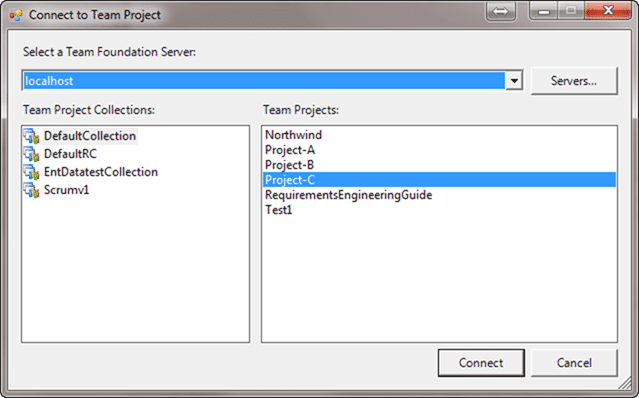
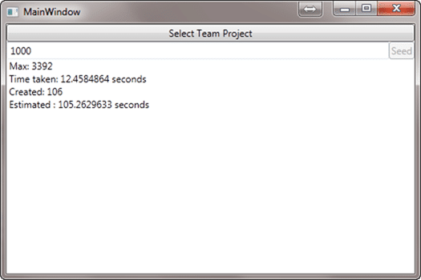
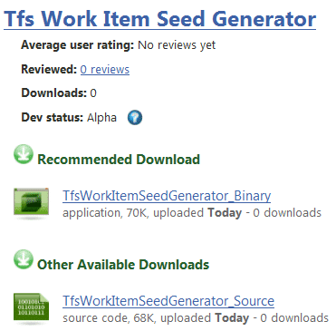

This week my customer had a requirement to have all new work items created to have an ID greater than 40,000. They have another system that stores tickets and they don’t want any conflict.

There have been a number of ways to achieve this through a database change, but it is not supported by Microsoft. This means that if you make the change and mess it up you are on your own.

- [Start TFS Work Item system.id at a predefined number](http://social.msdn.microsoft.com/Forums/en-US/tfsprocess/thread/d84b451c-6963-4099-ad1a-11a9527a62b9)
- [Set TFS 2010 Work Item ID Seed](http://social.msdn.microsoft.com/Forums/en/tfssetup/thread/21ebaf41-2e4f-43eb-87f6-5d301a4b6bff)

In order to provide a supported way of doing this you need to use the API, and that is an interesting problem. We are going to have to use the API to create a specific number of work items, but we don’t really want those work items hanging around.

We could:

1. Create new Team Project
2. Add 40,000 work items
3. Delete the Team Project

But there should be a neater way and to that end, lets connect to a Team Project that we can use to create the work items in.

```
Dim projectPicker As New TeamProjectPicker(TeamProjectPickerMode.SingleProject, False)
projectPicker.ShowDialog()

If Not projectPicker.SelectedTeamProjectCollection Is Nothing Then

    projectPicker.SelectedTeamProjectCollection.EnsureAuthenticated()

    _Store = projectPicker.SelectedTeamProjectCollection.GetService(Of WorkItemStore)()
    _ProjectInfo = projectPicker.SelectedProjects(0)

End If
```

We can use the TeamProjectPicker class that the product team kindly provided to show the built in dialog to select a Team Project Collection and a a Team Project.


{ .post-img }

**Figure: Getting the user to select a Team Project could not be easyer**

This dialog has some different modes depending on what you are trying to achieve. You can set it to select either a Team Project Collection, one Team Project or many Team Projects.

```
Public Enum TeamProjectPickerMode
    ' Fields
    MultiProject = 2
    NoProject = 0
    SingleProject = 1
End Enum
```

Now that we have access to a WorkItemStore and know what Team Project to use to create the work items, we can start creating work items.

```
Dim wi As WorkItem = project.WorkItemTypes(0).NewWorkItem
wi.Title = String.Format("Seedgen {0} : Created by Hinshlabs TFS Work Item Seed Generator", i)
wi.Description = String.Format("As a TFS Admin I want to have all new work items start at a number {0} larger than the current number", _WorkItemCount)
wi.Save()
```

This may fail as all I am doing is picking the first work item type that is available. A better solution would be to select the first work item type in the “Requirement” category, or to give the user a list to select whatever he wants. This is just a throw away, one time bit if code, so as long as it works…

Just in case any of these work items are left at the end I have added a default Title and Description.

Once we have created this work item, we need to immediately delete it. Now, this is something that can’t be done using the UI, but can be done in code.

```
Dim WioError As IEnumerable(Of WorkItemOperationError)
Dim ids As Integer() = {Convert.ToInt32(wi.Id)}
WioError = _Store.DestroyWorkItems(ids)
```

A tiny bit of code that solves a big problem. In versions before TFS 2010 this could only be done using the Power Tool, but the product team have seen the light and added it into the core product. Remember that Deleting a Work Item CAN’T be undone and once it is gone, it is gone.

I have wrapped all of this into a ViewModel that can be used in an MVVM WPF application.

```
Imports Microsoft.TeamFoundation.Client
Imports Microsoft.TeamFoundation.WorkItemTracking.Client
Imports Microsoft.TeamFoundation.Server
Imports GalaSoft.MvvmLight.Command
Imports GalaSoft.MvvmLight.Threading
Imports System.Windows.Threading
Imports System.Threading

''' <summary>
''' Seeding View Model using the MVVM Light framework
''' </summary>
''' <remarks></remarks>
Public Class WorkItemSeedViewModel
    Inherits GalaSoft.MvvmLight.ViewModelBase

    Private _SelectServerCommand As RelayCommand
    Private _SeedWorkItemIdCommand As RelayCommand
    Private _Store As WorkItemStore
    Private _ProjectInfo As ProjectInfo
    Private _WorkItemCount As Integer = 0
    Private _IsProcessing As Boolean = False
    Private _LastWorkItemId As Integer = 0
    Private _CurrentlyProcessingItem As Integer = 0

    Public ReadOnly Property SelectTeamProjectCommand As RelayCommand
        Get
            Return _SelectServerCommand
        End Get
    End Property

    Public ReadOnly Property SeedWorkItemIdCommand As RelayCommand
        Get
            Return _SeedWorkItemIdCommand
        End Get
    End Property

    Public Property IsProcessing As Boolean
        Get
            Return _IsProcessing
        End Get
        Set(ByVal value As Boolean)
            If Not value.Equals(_IsProcessing) Then
                Dim oldValue As Integer = _IsProcessing
                _IsProcessing = value
                MyBase.VerifyPropertyName("IsProcessing")
                MyBase.RaisePropertyChanged(Of Boolean)("IsProcessing", oldValue, value, True)
            End If
        End Set
    End Property

    Public Property WorkItemCount As Integer
        Get
            Return _WorkItemCount
        End Get
        Set(ByVal value As Integer)
            If Not value.Equals(_WorkItemCount) Then
                Dim oldValue As Integer = _WorkItemCount
                _WorkItemCount = value
                MyBase.VerifyPropertyName("WorkItemCount")
                MyBase.RaisePropertyChanged(Of Integer)("WorkItemCount", oldValue, value, True)
            End If
        End Set
    End Property

    Public Property LastWorkItemId As Integer
        Get
            Return _LastWorkItemId
        End Get
        Set(ByVal value As Integer)
            If Not value.Equals(_LastWorkItemId) Then
                Dim oldValue As Integer = _LastWorkItemId
                _LastWorkItemId = value
                MyBase.VerifyPropertyName("LastWorkItemId")
                MyBase.RaisePropertyChanged(Of Integer)("LastWorkItemId", oldValue, value, True)
            End If
        End Set
    End Property

    Public Property CurrentlyProcessingItem As Integer
        Get
            Return _CurrentlyProcessingItem
        End Get
        Set(ByVal value As Integer)
            If Not value.Equals(_CurrentlyProcessingItem) Then
                Dim oldValue As Integer = _CurrentlyProcessingItem
                _CurrentlyProcessingItem = value
                MyBase.VerifyPropertyName("CurrentlyProcessingItem")
                MyBase.RaisePropertyChanged(Of Integer)("CurrentlyProcessingItem", oldValue, value, True)
            End If
        End Set
    End Property

    Public Sub New()
        ' Create and wire up the Commands that I will be using
        _SelectServerCommand = New GalaSoft.MvvmLight.Command.RelayCommand(AddressOf OnSelectServerCommandExecute)
        _SeedWorkItemIdCommand = New GalaSoft.MvvmLight.Command.RelayCommand(AddressOf OnSeedWorkItemIdCommandExecute, Function() Not _ProjectInfo Is Nothing And Not IsProcessing)
    End Sub

    ''' <summary>
    ''' Calls the TFS 2010 API Dialog for selecting a Single Team Project and saves the WorkItemStore and ProjectInfo instances
    ''' </summary>
    ''' <remarks>Called by the Command object</remarks>
    Private Sub OnSelectServerCommandExecute()
        Dim projectPicker As New TeamProjectPicker(TeamProjectPickerMode.SingleProject, False)
        projectPicker.ShowDialog()

        If Not projectPicker.SelectedTeamProjectCollection Is Nothing Then

            projectPicker.SelectedTeamProjectCollection.EnsureAuthenticated()

            _Store = projectPicker.SelectedTeamProjectCollection.GetService(Of WorkItemStore)()
            _ProjectInfo = projectPicker.SelectedProjects(0)

        End If

        _SeedWorkItemIdCommand.RaiseCanExecuteChanged()

    End Sub

    ''' <summary>
    ''' Starts the Work Item generating method on a thread
    ''' </summary>
    ''' <remarks></remarks>
    Private Sub OnSeedWorkItemIdCommandExecute()
        Dim thread As New System.Threading.Thread(New ParameterizedThreadStart(Sub() ProcessWorkItems(_WorkItemCount)))
        thread.Start()
    End Sub

    ''' <summary>
    ''' Generates and then deletes each work item for the count specified by the value of Count
    ''' </summary>
    ''' <param name="count"></param>
    ''' <remarks></remarks>
    Private Sub ProcessWorkItems(ByVal count As Integer)
        ' These calls martial the action code back onto the UI thread
        DispatcherHelper.CheckBeginInvokeOnUI(New Action(Sub() IsProcessing = True))

        Dim project As Project = _Store.Projects(_ProjectInfo.Name)

        For i As Integer = 0 To count - 1
            DispatcherHelper.CheckBeginInvokeOnUI(New Action(Sub() CurrentlyProcessingItem = i))

            Dim wi As WorkItem = project.WorkItemTypes(0).NewWorkItem

            wi.Title = String.Format("Seedgen {0} : Created by Hinshlabs TFS Work Item Seed Generator", i)
            wi.Description = String.Format("As a TFS Admin I want to have all new work items start at a number {0} larger than the current number", _WorkItemCount)
            wi.Save()

            DispatcherHelper.CheckBeginInvokeOnUI(New Action(Sub() LastWorkItemId = wi.Id))


            Dim WioError As IEnumerable(Of WorkItemOperationError)

            Dim ids As Integer() = {Convert.ToInt32(wi.Id)}

            WioError = _Store.DestroyWorkItems(ids)
            If WioError.Count > 0 Then
                ' Currently eats and failures to delete. Not good, but easy to fix
                'MessageBox.Show(String.Format("Failed to delete Work Item {0}", wi.Id))
                Exit For
            Else
                DispatcherHelper.CheckBeginInvokeOnUI(New Action(Sub() WorkItemCount = WorkItemCount - 1))

            End If
        Next
        DispatcherHelper.CheckBeginInvokeOnUI(New Action(Sub() IsProcessing = False))
    End Sub


End Class
```

I have tried to comment at least some of this, but again this is proof-of-concept code with no warranty and could do with lots of improving.

This is a supported method of incrementing the Work Item ID to any number you like. It will take a while to get to 40,000 but I have added a “Time taken” calculation and it looks like you can increment the top ID by around 600 every minute.


{ .post-img }

**Figure: As you can see, I am an artist**

I have been running this with a local TFS running on my Windows 7 laptop with SQL Express so actual times may not be as advertised.

How stable is this? Well, to be honest, not very. I threw this together quickly, but with all my debugging, killing and general mashing it only left 1 erroneous work item that will need to be deleted manually.


{ .post-img }

**Figure: One lonely work item that did not get destroyed**

To delete this errant work item you can:

- [Deleting Work Items in TFS – a UI](http://devmatter.blogspot.com/2009/04/deleting-work-items-in-tfs-ui.html)

- [TFS API Part 21: Delete Work Item using WorkItemStore](http://blogs.microsoft.co.il/blogs/shair/archive/2010/02/19/tfs-api-part-21-delete-work-item-using-workitemstore-demo-application.aspx)

## Conclusion

You can get your work item ID from 0 to 40000 in around 40 minutes with this app which solves the immediate problem.

[](http://hinshlabs.codeplex.com/releases/view/54305 "TFS Work item Seed Generator Download")
{ .post-img }

Technorati Tags: [TFS](http://technorati.com/tags/TFS),[TFS 2010](http://technorati.com/tags/TFS+2010),[API](http://technorati.com/tags/API)
