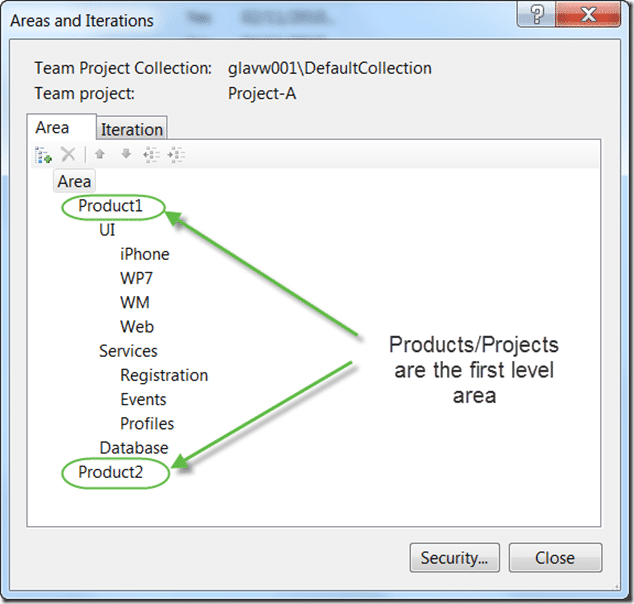
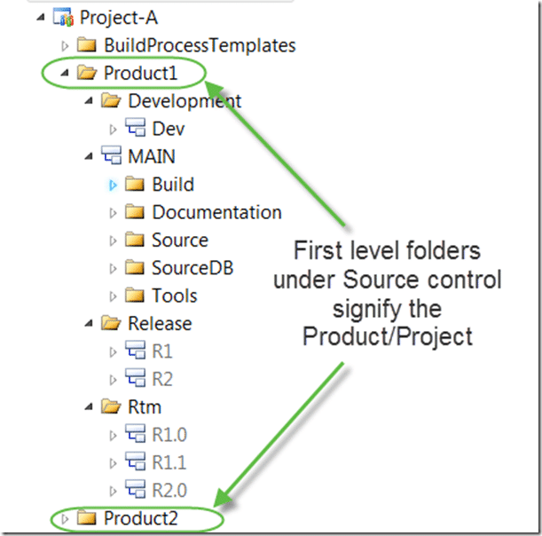
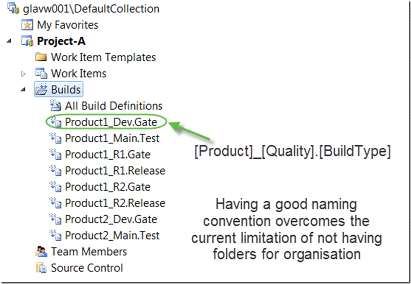

It is pretty much [accepted that you should use Areas](http://blog.hinshelwood.com/archive/2010/03/09/when-should-i-use-areas-in-tfs-instead-of-team.aspx) instead of having many small Team Projects when you are using Team Foundation Server 2010. I have implemented this scenario many times and this is the current iteration of layout and considerations.

[Updated 2012-08-06](#collapseOne)

I have updated this as [One Team Project for Visual Studio 2012](http://blog.hinshelwood.com/one-team-project/ "One Team Project with Visual Studio 2012").

If like me you work with many customers you will find that you get into a grove for how to set these things up to make them as easily understandable for everyone, while giving the best functionality. The trick is in making it as intuitive as possible for both you and the developers that need to work with it.

There are five main places where you need to have the Product or Project name in prominence of any other value.

- Area
- Iteration
- Source Code
- Work Item Queries
- Build

Once you decide how you are doing this in each of these places you need to keep to it religiously. Evan if you have one source code file to keep, make sure it is in the right place. This makes your developers and others working with the format familiar with where everything should go, as well as building up mussel memory. This prevents the neat system degenerating into a nasty mess.

### Areas

Areas are traditionally used to separate out parts of your product / project so that you can see how much effort has gone into each.

  
{ .post-img }
**Figure: The top level areas are for reporting and work item separation**

There are massive advantages of using this method. You can:

- move work from one project to another
- rename a project / product

It is far more likely that a project or product gets renamed than a department.

Tip: If you have many projects, over 100, you should consider categorising them here, but make sure that the actual project name always sits at the same level so you know which is which.

  
{ .post-img }
**Figure: Always keep things that are the same at the same level**

Note: You may use these categories only at the Area/Iteration level to make it easier to select on drop down lists. You may not want to use them everywhere. On the other hand, for consistency it would be better to.

### Iterations

Iterations are usually used to some sort of time based consideration. Here I am splitting into Iterations with periodic releases.

  
{ .post-img }
**Figure: Each product needs to be able to have its own cadence**

The ability to have each project run at its own pace and to enable them to have their own release schedule is often of paramount importance and you don’t want to fix your 100+ projects to all be released on the same date.

### Source Code

Having a good structure for your source even if you are not branching or having multiple products under the same structure is always a good idea.

  
{ .post-img }
**Figure: Separate out your products source**

You need to think about both your branches as well as the structure of your source. All your code should be under “Source” and everything you need to build your solution including Build Scripts and 3rd party tools should be under your “Main” (branch) folder. This should them be branched by “Quality”, “Release” or both to get the most out of your branching structure.

The important thing is to make sure you branch (or be able to branch) everything you need to build, test and deploy your application to an environment. That environment may be development, test or even production, but I can’t stress the importance of having everything your need.

_Note: You usually will not be able to install custom software on your build server. Store any \*.dll’s or \*.exe’s that you need under the “ToolsTool1” folder._

_Note: Consult the_ [_Branching Guidance for Team Foundation Server 2010_](http://tfsbranchingguideiii.codeplex.com/) _for more on branching_

  
{ .post-img }
**Figure: Adding category may be a necessary evil**

Even if you have to have a couple of categories called “Default”, it is better than not knowing the difference between a folder, Product and Branch.

### Work Item Queries

Queries are used to load lists of Work Items out of TFS so you can see what work you have. This means that you want to also separate queries out by Product / project to make it easier to find the correct data for a particular product.

  
{ .post-img }
**Figure: Again you have the same first level structure**

Having Folders also in Work Item Tracking we do the same thing. We put all the queries under a folder named for the Product / Project and change each query to have “AreaPath=\[TeamProject\]\[ProductX\]” in the query instead of the standard [“Project=@Project](mailto:“Project=@Project)”.

_Tip: Don’t have a folder with new queries for each iteration. Instead have a single “Current” folder that has queries that point to the current iteration. Just change the queries as you move from one iteration to another._

_Tip: You can ctrl+drag the “Product1” folder to create your “Product2” folder._

### Builds

You may have many builds both for individual products but also for different quality's. This can be further complicated by having some builds that action “Gated Check-In” and others that are specifically for “Release”, “Test” or another purpose.

  
{ .post-img }
**Figure: There are no folders, yet, for the builds so you need a good naming convention**

Its a pity that there are no folders under builds, some way to categorise would be nice. In lue of that at the moment you can use a functional naming convention that at least allows you to find what you want.

### Conclusion

It is really easy to both achieve and to stick to this format if you take the time to do it. Unless you have 1000+ builds or 100+ Products you are unlikely

run into any issues. Even then there are things you can do to mitigate the issues and I have describes some of them above.

**Let me know if you can think of any other things to make this easier.**
